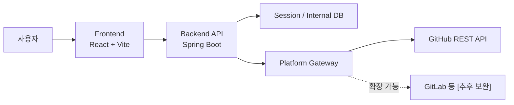

# GitHub Issue Manager

GitHub 이슈 관리로 시작했지만, 장기적으로는 GitLab 등 다른 플랫폼까지 확장할 수 있도록 백엔드 공통화 구조를 설계한 프로젝트입니다.

## 1. 프로젝트 소개

- GitHub 저장소, 이슈, 댓글을 조회·수정하는 프로젝트
- 단순 CRUD보다 `플랫폼 API 비종속 구조` 설계에 초점
- 현재는 GitHub 연동만 구현
- 백엔드는 이후 GitLab 같은 플랫폼 확장을 고려해 설계

| 항목 | 내용 |
| --- | --- |
| 프로젝트 성격 | 개인 백엔드 중심 프로젝트 |
| 현재 연동 플랫폼 | GitHub |
| 핵심 목표 | GitHub 전용 구현 → 플랫폼 공통 구조로 전환 |
| 강조 포인트 | 기능 구현보다 구조 개선과 리팩토링 과정 |

## 2. 프로젝트를 시작한 이유

- 이슈는 작업 단위이면서 동시에 플랫폼 종속 데이터라는 점에 주목
- GitHub 중심으로 시작하더라도 구조까지 GitHub 전용으로 굳히고 싶지 않았음
- 한 프로젝트 안에서 아래 내용을 함께 정리하고 싶었음
- GitHub API 연동 경험
- PAT 기반 인증 처리
- Spring Boot REST API 설계
- 프론트/백엔드 분리 배포 경험
- 구현을 진행할수록 핵심 학습 포인트가 기능보다 구조 문제라는 점이 분명해짐
- 결론: "GitHub 이슈 관리 앱"보다 "확장 가능한 플랫폼 연동 백엔드"가 더 중요한 주제가 됨

## 3. 문제 정의

- 초기 구조는 GitHub 전용 구현에 강하게 결합
- 인증 엔티티, API 클라이언트, 캐시 필드명, 서비스 계층이 모두 GitHub 중심
- 빠른 구현에는 유리했지만 확장성과 유지보수성에 한계 존재

| 문제 | 설명 |
| --- | --- |
| 서비스 결합도 | 서비스 계층이 GitHub 구현 세부사항을 직접 앎 |
| 식별자 고정 | `githubRepositoryId`, `githubIssueId` 같은 이름이 모델에 고정 |
| 확장 비용 증가 | GitLab 등 추가 시 기능 추가보다 구조 변경 비용이 커짐 |
| 계약 전파 범위 | 프론트/백엔드가 GitHub 전용 명세를 함께 공유 |

- 핵심 문제: GitHub CRUD 구현 자체보다 `외부 플랫폼 의존성을 어떻게 격리할 것인가`

## 4. 해결 전략

- 한 번에 뒤엎지 않고, 기존 GitHub 흐름을 유지한 상태로 점진적 리팩토링 진행
- 백엔드에 공통 포트 계층 도입
- 서비스 계층의 의존 방향을 GitHub 구현체에서 공통 인터페이스로 전환

| 전략 요소 | 역할 |
| --- | --- |
| `PlatformType` | 플랫폼 종류 일반화 |
| `Remote*` DTO | 외부 리소스 응답 모델 일반화 |
| `PlatformGateway` | 플랫폼 API 연동 포트 |
| Resolver 구조 | 플랫폼별 구현체 선택 |

- 핵심 원칙
- 서비스는 GitHub API 클라이언트가 아니라 공통 게이트웨이에 의존
- 외부 리소스 식별은 장기적으로 `platform + externalId` 구조로 전환
- 개인 프로젝트 특성상 완성형 추상화보다 `구현 복잡도와 학습 효과의 균형`을 우선

## 5. 시스템 아키텍처

- 프론트와 백엔드를 분리한 구조
- 프론트: 화면, 라우팅, 서버 상태 조회
- 백엔드: 인증 검증, 세션 처리, 외부 API 호출, 캐시 관리, 도메인 로직

| 계층 | 역할 |
| --- | --- |
| `controller` | HTTP 요청/응답 처리 |
| `service` | 유스케이스, 동기화 흐름 처리 |
| `repository` | 내부 DB 접근 |
| `core/platform` | 공통 포트, 타입, 리졸버 |
| `github` | GitHub 전용 게이트웨이와 매핑 |

- 현재 실제 연동은 GitHub만 지원
- 아키텍처의 핵심은 `서비스 계층이 GitHub API 상세를 직접 알지 않도록 분리`한 점

## 6. 주요 기능

| 구분 | 구현 내용 |
| --- | --- |
| 인증 | GitHub PAT 등록, 연결 상태 확인, 연결 해제 |
| 세션 | PAT 검증 후 세션 기반 연결 상태 유지 |
| 저장소 | 접근 가능한 저장소 목록 조회, 새로고침 |
| 이슈 | 목록 조회, 상세 조회, 생성, 수정, 닫기 |
| 댓글 | 댓글 조회, 작성 |
| 동기화 | 외부 데이터 캐시 및 재동기화 흐름 지원 |

- 현재 범위는 GitHub 중심 기능에 한정
- 미구현 항목
- GitLab 실제 연동
- GitHub App / OAuth 인증
- 마일스톤, 라벨, 우선순위 정책
- 다중 플랫폼 UI

## 7. 기술 스택

| 영역 | 기술 |
| --- | --- |
| Backend | Java 17, Spring Boot, Spring MVC, Spring Data JPA, Validation |
| Database | H2 |
| Frontend | React 19, TypeScript, Vite, React Router, TanStack Query |
| Infra | AWS EC2, 프론트 별도 배포 |
| External API | GitHub REST API |
| Auth/Session | PAT 검증 + 서버 세션 |

## 8. 기술 선택 이유

| 선택 | 이유 | 비교 관점 |
| --- | --- | --- |
| Spring Boot | 계층 분리, 세션 처리, JPA 모델링에 적합 | Node.js/NestJS도 가능하지만 이번 프로젝트는 객체 모델과 백엔드 설계 훈련에 더 집중 |
| PAT 기반 인증 | 구현 복잡도를 통제하면서 인증 검증·저장·세션 연계를 학습 가능 | OAuth/GitHub App은 더 실전적이지만 초기 비용이 큼 |
| 서버 세션 유지 | 프론트가 매 요청마다 토큰을 들고 다니지 않도록 단순화 | 완전한 해법은 아니지만 현재 범위에서 복잡도 대비 효율적 |
| 공통 포트/게이트웨이 | GitHub 전용 구조가 서비스와 데이터 모델을 잠식하는 문제 완화 | 단순 인터페이스 분리보다 확장 가능한 구조 확보에 유리 |
| EC2 백엔드 + 프론트 별도 배포 | 런타임 설정과 정적 프론트 배포를 분리 관리 가능 | 배포 지점은 늘지만 운영 구조를 더 명확히 이해 가능 |

## 9. 트러블슈팅

| 문제 | 원인 | 해결 | 결과 |
| --- | --- | --- | --- |
| GitHub 전용 식별자가 모델 전반에 확산 | 초기 구현 속도를 우선하며 GitHub 중심 이름 사용 | `Remote*` DTO와 공통 포트 우선 도입 | 현재 기능 유지 + 일반화 가능한 기반 확보 |
| 공통화 과정에서 기존 흐름이 깨질 위험 | 프론트/백엔드가 GitHub 전용 계약 공유 | 백엔드 공통화 → 계약 안정화 → 프론트 정리 순서로 분리 | 중간 단계마다 동작 유지 가능 |
| PAT 처리와 운영 설정 관리 부담 | 인증 정보가 기능보다 먼저 안전하게 다뤄져야 함 | 검증 후 저장, 암호화 키·CORS를 환경 변수로 분리 | 기능 구현과 운영 안전성 기준을 함께 확보 |

## 10. 향후 개선 방향

- GitHub 전용 캐시 모델을 `platform + externalId` 기준으로 완전 전환
- GitLab 어댑터 추가로 공통 게이트웨이 구조 검증
- PAT 외 OAuth 또는 GitHub App 방식 비교·확장
- H2에서 운영용 DB로 전환, 마이그레이션 체계 정리
- 캐시 동기화 정책과 예외 복구 전략 고도화
- 프론트 라우트와 화면 명명도 플랫폼 공통 구조로 정리
- 배포 URL, 시연 방식, 운영 구성 상세 문서화 `[추후 보완]`

## 11. 회고

- 시작점: GitHub 이슈 기능을 빠르게 구현하는 프로젝트
- 전환점: 기능이 늘수록 GitHub 전용 구조의 한계가 분명해짐
- 핵심 학습: 기능 추가보다 `외부 플랫폼 의존성을 어떻게 격리할 것인가`가 더 중요했음
- 현재 의미
- 단순 GitHub CRUD 프로젝트에 머무르지 않음
- GitHub 전용 구조를 공통 포트/게이트웨이 구조로 옮겨 가는 과정을 보여 줌
- 현재 한계
- 아직 GitLab 같은 다른 플랫폼을 실제로 붙인 단계는 아님
- 공통화 구조의 방향성과 기반을 먼저 확보한 상태
- 남은 과제: 다음 플랫폼을 붙일 때 수정 범위를 실제로 줄일 수 있는지 검증
