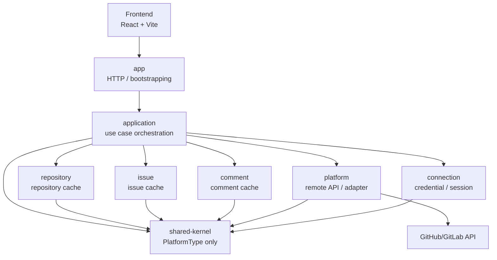

# GitHub Issue Manager

GitHub Issue Manager는 GitHub 저장소, 이슈, 댓글을 조회하고 관리하는 웹 애플리케이션이다. 기능 자체는 GitHub 이슈 관리에서 출발했지만, 프로젝트의 핵심은 외부 플랫폼 API 의존성을 백엔드 모듈 경계 뒤로 격리한 구조 개선 과정에 있다.

현재 기본 사용 플랫폼은 GitHub다. 백엔드는 `app`, `application`, `platform`, `connection`, `repository`, `issue`, `comment`, `shared-kernel` 모듈로 책임을 나누고, API는 `/api/platforms/{platform}/...` 형식의 플랫폼 공통 경로를 사용한다.

## 1. 프로젝트 핵심

| 항목 | 내용 |
| --- | --- |
| 프로젝트 성격 | 개인 백엔드 중심 포트폴리오 프로젝트 |
| 기본 플랫폼 | GitHub |
| 핵심 주제 | 외부 플랫폼 의존성 격리와 모듈 경계 설계 |
| 백엔드 구조 | Spring Boot + Gradle 멀티 모듈 |
| 프론트 구조 | React + Vite |
| 인증 방식 | 사용자 제공 PAT 검증 + 서버 세션 |

이 프로젝트는 단순 CRUD 앱보다 다음 질문에 초점을 둔다.

- GitHub API 상세를 업무 서비스가 직접 알지 않게 하려면 어떻게 나눌 것인가
- PAT 저장, 검증, 원격 호출 책임을 어디에 둘 것인가
- 저장소, 이슈, 댓글 캐시의 소유권을 어떻게 분리할 것인가
- 모듈 경계를 문서뿐 아니라 테스트로 어떻게 고정할 것인가

## 2. 주요 기능

- 플랫폼 PAT 등록, 연결 상태 조회, 연결 해제
- 세션 기반 현재 사용자 조회와 로그아웃
- 저장소 목록 조회와 원격 새로고침
- 저장소별 이슈 목록 조회, 상세 조회, 생성, 수정, 닫기
- 이슈 댓글 조회, 새로고침, 작성
- 저장소, 이슈, 댓글 동기화 상태 조회

현재 범위에서 OAuth / GitHub App, 라벨, 담당자, 우선순위, 마일스톤, sub-issue는 제외했다.

## 3. 아키텍처



모듈 책임은 다음과 같다.

- `app`: controller, exception handler, 실행 조립
- `application`: use case orchestration, token 조회, remote 호출, cache 반영, sync 상태 기록 조립
- `platform`: credential 검증, 원격 API gateway, GitHub/GitLab adapter 선택, remote DTO mapping
- `connection`: 사용자, 플랫폼 연결, PAT 암호화, 세션 상태
- `repository`: 저장소 캐시, 저장소 접근 확인, 원격 저장소 cache 반영
- `issue`: 이슈 캐시, 이슈 접근 확인, 원격 이슈 cache 반영
- `comment`: 댓글 캐시, 원격 댓글 cache 반영
- `shared-kernel`: `PlatformType`

## 4. 구조 개선 요약

초기 구현은 GitHub API client, GitHub 식별자, PAT 처리 흐름이 서비스와 캐시 모델 전반에 퍼진 구조였다. 기능 구현은 빠르게 가능했지만, GitLab 같은 다른 플랫폼을 붙이려면 기능 추가보다 구조 수정 비용이 먼저 커지는 문제가 있었다.

현재 구조에서는 다음 방식으로 책임을 분리했다.

- 외부 플랫폼 응답은 platform 모듈에서 `Remote*` 모델로 변환
- PAT 검증은 platform, 저장과 암호화는 connection이 담당
- application이 connection, platform, cache 모듈을 조립하는 유스케이스 경계 담당
- repository / issue / comment는 token, baseUrl, adapter 구현, 다른 업무 모듈을 직접 알지 않음
- 외부 리소스는 `platform + externalId` 기준으로 저장
- sync 상태는 application 모듈이 기록하고 조회
- shared-kernel은 `PlatformType`만 유지
- 모듈 의존 방향과 금지 import는 테스트로 검증

변화 과정은 [04-architecture-transition-history.md](docs/04-architecture-transition-history.md)에 따로 정리했다.

## 5. 기술 스택

| 영역 | 기술 |
| --- | --- |
| Backend | Java 17, Spring Boot, Spring MVC, Spring Data JPA, Validation |
| Backend Build | Gradle 멀티 모듈 |
| Database | H2 |
| Frontend | React 19, TypeScript, Vite, React Router, TanStack Query |
| External API | GitHub REST API |
| Auth / Session | PAT 검증 + 서버 세션 |
| CI / Deploy | GitHub Actions, EC2 backend deploy |

## 6. 실행 방법

### Backend

```powershell
cd backend
.\gradlew.bat :app:bootRun
```

기본 실행 주소는 `http://localhost:8080`이다.

### Frontend

```powershell
cd frontend
npm install
npm run dev
```

기본 실행 주소는 `http://localhost:5173`이다.

프론트는 `.env` 또는 `.env.example` 기준으로 백엔드 API 주소를 사용한다.

```text
VITE_API_BASE_URL=http://localhost:8080/api
```

## 7. 환경 변수

운영 환경 기준 주요 변수는 다음과 같다.

| 변수 | 설명 |
| --- | --- |
| `APP_CORS_ALLOWED_ORIGINS` | 허용할 프론트 Origin |
| `GITHUB_PAT_ENCRYPTION_KEY` | PAT 암호화 키 |
| `GITHUB_API_BASE_URL` | GitHub API base URL |
| `GITLAB_API_BASE_URL` | GitLab API base URL |

로컬 개발 기본값은 `backend/app/src/main/resources/application.yaml`에 정의되어 있다. 운영 환경에서는 암호화 키를 반드시 별도 값으로 설정해야 한다.

## 8. 검증

### Backend

```powershell
cd backend
.\gradlew.bat test
```

백엔드 테스트에는 다음 구조 검증이 포함된다.

- Gradle 모듈 의존 방향
- app 모듈의 public API 의존 제한
- public API 패키지의 타 모듈 internal import 차단
- repository / issue / comment의 connection 직접 의존 차단
- repository / issue / comment의 상호 직접 의존 차단
- platform의 connection 직접 의존 차단
- shared-kernel의 `PlatformType` only 기준
- 모듈별 Spring/JPA configuration과 entity scan 확인

### Frontend

```powershell
cd frontend
npm run build
```

## 9. 문서

현재 루트 문서는 최종 설명용이고, 과거 설계 초안은 `docs/archive/`에 보관한다. 학습용 리뷰 문서는 `docs/reviews`, 리뷰 결과물은 `docs/review-results`, 작업 기록은 `docs/tasks`에 유지한다.

| 문서 | 내용 |
| --- | --- |
| [01-prd.md](docs/01-prd.md) | 제품 범위와 목표 |
| [02-implementation-summary.md](docs/02-implementation-summary.md) | 현재 구현 요약 |
| [03-architecture.md](docs/03-architecture.md) | 현재 아키텍처 |
| [04-architecture-transition-history.md](docs/04-architecture-transition-history.md) | 구조 변화 과정 |
| [05-platform-module-service-structure.md](docs/05-platform-module-service-structure.md) | 모듈별 책임 |
| [06-data-model.md](docs/06-data-model.md) | 데이터 모델 |
| [07-api-spec.md](docs/07-api-spec.md) | API 명세 |
| [08-pat-management-flow.md](docs/08-pat-management-flow.md) | PAT 관리 흐름 |
| [09-core-use-cases.md](docs/09-core-use-cases.md) | 핵심 유스케이스 |
| [10-main-use-case-flow.md](docs/10-main-use-case-flow.md) | 메인 사용 흐름 |
| [11-use-case-sequence-diagrams.md](docs/11-use-case-sequence-diagrams.md) | 유스케이스 시퀀스 |
| [12-prod-runtime-config.md](docs/12-prod-runtime-config.md) | 운영 설정 |
| [13-architecture-improvement-plan.md](docs/13-architecture-improvement-plan.md) | application 중심 구조 개선 계획과 적용 상태 |

## 10. 현재 한계

- 기본 사용 흐름은 GitHub 기준이다.
- GitLab 실제 운영 사용성은 현재 포트폴리오 범위 밖이다.
- OAuth / GitHub App 기반 인증은 구현하지 않았다.
- 운영 DB 전환과 마이그레이션 체계는 별도 후속 과제다.
- 프론트 구조 공통화는 백엔드 계약 안정화 이후의 후속 후보로 둔다.
