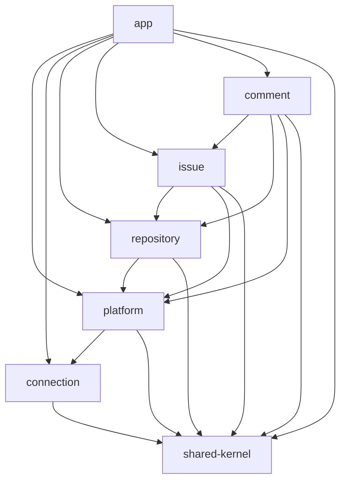

# Architecture

## 1. 개요

현재 시스템은 PAT 기반 외부 플랫폼 연동 구조를 사용한다.

- 기본 플랫폼은 GitHub다.
- API 경로는 `/api/platforms/{platform}/...` 형식을 사용한다.
- 외부 플랫폼 API 호출은 platform 모듈이 담당한다.
- PAT 저장, 암호화, 세션 연결 상태는 connection 모듈이 담당한다.
- repository / issue / comment 모듈은 로컬 캐시와 업무 유스케이스를 소유한다.
- 내부 DB는 사용자, 플랫폼 연결 정보, 캐시, 동기화 상태를 저장한다.

## 2. 구성 요소

### 2.1 Frontend

- React + Vite
- React Router, TanStack Query 기반 화면 흐름
- 플랫폼 연결, 저장소 목록, 이슈 목록, 이슈 상세 화면 제공
- 기본 플랫폼은 GitHub로 사용

### 2.2 Backend

- Spring Boot
- Gradle 멀티 모듈 구조
- 세션 기반 현재 사용자 식별
- 플랫폼 PAT 검증과 암호화 저장
- 원격 API 호출과 로컬 캐시 동기화

### 2.3 External Platform

- GitHub REST API를 기본 원격 API로 사용
- GitLab adapter 구조는 platform 모듈 내부에 격리
- 외부 API 응답은 `Remote*` 모델로 변환한 뒤 업무 모듈에 전달

## 3. 백엔드 모듈

- `app`: controller, exception handler, bootstrapping
- `platform`: credential 검증, 원격 API 호출, adapter 선택
- `connection`: 사용자, 플랫폼 연결, PAT 암호화, 세션 상태
- `repository`: 저장소 캐시, 저장소 refresh, 저장소 접근 확인
- `issue`: 이슈 캐시, 이슈 조회/생성/수정/닫기
- `comment`: 댓글 캐시, 댓글 조회/작성
- `shared-kernel`: 동기화 상태, 공통 예외, 공통 응답 DTO

## 4. 주요 처리 흐름

### 플랫폼 토큰 등록

1. 프론트가 `POST /api/platforms/{platform}/token`을 호출한다.
2. app controller가 platform 모듈에 토큰 검증을 요청한다.
3. platform 모듈이 원격 사용자 프로필을 조회한다.
4. connection 모듈이 사용자와 플랫폼 연결 정보를 저장한다.
5. connection 모듈이 PAT를 암호화하고 세션에 현재 사용자와 플랫폼을 기록한다.

### 저장소 새로고침

1. 프론트가 `POST /api/platforms/{platform}/repositories/refresh`를 호출한다.
2. repository 모듈이 platform 모듈에 원격 저장소 조회를 요청한다.
3. platform 모듈이 connection 모듈에서 token access를 얻는다.
4. platform 모듈이 원격 플랫폼 API를 호출한다.
5. repository 모듈이 `repository_caches`와 동기화 상태를 갱신한다.

### 이슈 생성/수정/닫기

1. 프론트가 이슈 API를 호출한다.
2. issue 모듈이 repository 모듈로 저장소 접근 가능 여부를 확인한다.
3. issue 모듈이 platform 모듈에 원격 이슈 변경을 요청한다.
4. platform 모듈이 원격 플랫폼 API를 호출한다.
5. issue 모듈이 `issue_caches`와 동기화 상태를 갱신한다.

### 댓글 조회/작성

1. 프론트가 댓글 API를 호출한다.
2. comment 모듈이 repository / issue 모듈로 상위 리소스 접근을 확인한다.
3. comment 모듈이 platform 모듈에 원격 댓글 조회 또는 작성을 요청한다.
4. comment 모듈이 `comment_caches`와 동기화 상태를 갱신한다.

## 5. 현재 제약

- 기본 사용 흐름은 GitHub 기준이다.
- 사용자 수는 사실상 1명 기준이다.
- 저장소 접근은 등록된 PAT 권한 범위에 의존한다.
- OAuth / GitHub App, 라벨, 담당자, 마일스톤, sub-issue는 현재 범위에서 제외한다.

## 6. 관련 문서

- 현재 모듈 책임: `05-platform-module-service-structure.md`
- 구조 변화 과정: `04-architecture-transition-history.md`
- 유스케이스: `09-core-use-cases.md`
- 시퀀스 다이어그램: `11-use-case-sequence-diagrams.md`
