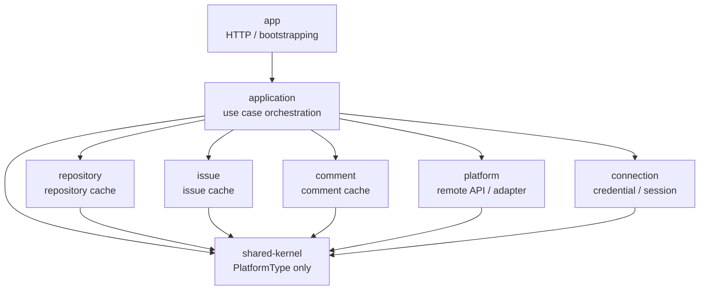

# Architecture Transition History

## Summary

- 목적: GitHub 전용 구조에서 플랫폼 공통 모듈 구조로 전환한 이유와 과정을 요약한다.
- 범위: 과거 구조의 상세 구현 설명이 아니라, 구조 변경의 문제 인식과 전환 방향을 정리한다.
- 기준: 현재 최종 구조 설명은 `05-platform-module-service-structure.md`를 따른다.
- 보존: 날짜별 작업 기록과 리뷰 문서는 별도 폴더에 유지하고, 이 문서는 포트폴리오용 변화 과정 설명에 집중한다.

## 1. 시작 구조

- 출발점: GitHub 이슈 관리 기능을 빠르게 구현하는 단일 백엔드 구조
- 주요 기능: PAT 등록, 저장소 조회, 이슈 조회/생성/수정/닫기, 댓글 조회/작성
- 데이터 기준: GitHub 저장소, 이슈, 댓글을 원본으로 사용하고 내부 DB에는 캐시와 연결 정보를 저장
- 구현 기준: 서비스 계층이 GitHub API client와 GitHub 중심 캐시 모델을 직접 사용

초기 구조는 기능을 빠르게 완성하기에는 단순했다. 하지만 GitHub API 응답, GitHub 식별자, PAT 처리 방식이 서비스와 데이터 모델 전반에 퍼지면서 외부 플랫폼 의존성이 커졌다.

## 2. 드러난 문제

- 문제: 서비스 계층이 GitHub 구현 세부사항을 직접 인식
- 문제: `githubRepositoryId`, `githubIssueId` 같은 이름이 모델 전반에 고정
- 문제: PAT 저장, 복호화, 원격 API 호출 절차가 업무 유스케이스에 섞임
- 문제: GitLab 같은 다른 플랫폼을 붙이려면 기능 추가보다 기존 구조 수정이 먼저 필요
- 문제: 프론트와 백엔드 계약도 GitHub 전용 경로와 명명에 의존

핵심 문제는 GitHub 기능 자체가 아니라, 외부 플랫폼 변경 가능성이 내부 업무 흐름에 그대로 전파되는 구조였다.

## 3. 변경 목표

- 목표: 기존 GitHub 기능을 유지한 채 내부 의존 방향을 정리
- 목표: 서비스가 GitHub client가 아니라 플랫폼 공통 API에 의존하도록 전환
- 목표: credential 저장과 원격 API 호출 책임을 분리
- 목표: repository / issue / comment 모듈이 token, baseUrl, adapter 구현을 모르게 함
- 목표: remote 호출 조립과 sync 기록 책임을 application 계층으로 이동
- 목표: 모듈 경계와 금지 의존을 테스트로 고정

이 프로젝트의 목표는 다중 플랫폼 기능을 완성하는 것이 아니라, 다중 플랫폼을 수용할 수 있는 백엔드 경계를 만드는 것이었다.

## 4. 전환 방향

### 4.1 플랫폼 공통 포트 도입

- 조치: `PlatformType`, `PlatformGateway`, `Remote*` DTO 도입
- 조치: GitHub 응답을 플랫폼 중립 모델로 변환
- 결과: 서비스가 GitHub API 응답 DTO를 직접 다루는 범위 축소

### 4.2 플랫폼 연결 책임 분리

- 조치: PAT 저장, 암호화, 세션 연결 상태를 connection 모듈로 이동
- 조치: token access를 connection public API 뒤로 제한
- 결과: credential 저장 방식이 업무 모듈에 노출되지 않음

### 4.3 원격 API adapter 격리

- 조치: GitHub/GitLab client, gateway, mapper를 platform 모듈 내부에 격리
- 조치: platform은 token 저장소나 cache 저장소를 모르는 adapter boundary로 축소
- 결과: GitHub/GitLab adapter와 baseUrl 처리 방식이 업무 모듈에 노출되지 않음

### 4.4 업무 캐시 모듈 분리

- 조치: repository / issue / comment 캐시와 유스케이스를 각 모듈로 이동
- 조치: 상위 리소스 확인은 다른 모듈 entity가 아니라 public API result로 처리
- 결과: 각 업무 모듈의 소유 데이터와 호출 경계가 명확해짐

### 4.5 application 계층 도입

- 조치: `application` Gradle 서브모듈 추가
- 조치: app controller는 application facade만 호출하도록 전환
- 조치: connection token 조회, platform gateway 호출, cache 반영, sync 기록을 application에서 조립
- 조치: repository / issue / comment의 remote 호출 직접 의존 제거
- 결과: HTTP 조립과 use case orchestration 경계를 분리

### 4.6 shared-kernel 축소

- 조치: SyncState 클러스터를 application으로 이동
- 조치: 공통 `ResourceNotFoundException`을 모듈별 not found 예외로 분리
- 조치: shared-kernel은 `PlatformType`만 유지
- 결과: 공통 모듈이 업무 규칙 저장소로 커지는 위험을 줄임

### 4.7 Gradle 멀티 모듈 전환

- 조치: `app`, `application`, `platform`, `connection`, `repository`, `issue`, `comment`, `shared-kernel` 모듈 구성
- 조치: app은 HTTP 조립과 bootstrapping 중심으로 축소
- 결과: 잘못된 모듈 import를 Gradle 의존성과 테스트로 함께 제한 가능

## 5. 현재 구조 요약

- `app`: controller, exception handler, 실행 조립
- `application`: 유스케이스 조립, remote 호출 순서, cache 반영 순서, sync 기록
- `platform`: 플랫폼 검증, 원격 API gateway, GitHub/GitLab adapter 선택
- `connection`: 토큰 저장, 암호화, 세션 기준 연결 상태 관리
- `repository`: 저장소 캐시와 접근 확인
- `issue`: 이슈 캐시와 접근 확인
- `comment`: 댓글 캐시
- `shared-kernel`: `PlatformType`

## 6. 검증 방식

- 검증: Gradle 모듈 의존 방향 테스트
- 검증: app이 업무 모듈의 public API만 참조하는지 확인
- 검증: public API 패키지가 다른 모듈 internal 구현을 참조하지 않는지 확인
- 검증: repository / issue / comment가 connection 모듈을 직접 참조하지 않는지 확인
- 검증: 모듈별 Spring/JPA configuration과 entity scan 상태 확인

구조 변경은 문서 설명에만 의존하지 않고, 테스트로 회귀를 막는 방향으로 고정했다.

## 7. 남긴 한계

- GitLab 실제 연동 완성은 현재 포트폴리오 범위 밖
- OAuth / GitHub App 인증은 현재 범위 밖
- 운영 DB 전환과 마이그레이션 체계는 현재 범위 밖
- 라벨, 담당자, 마일스톤, sub-issue 같은 협업 기능은 현재 범위 밖
- 프론트 구조 공통화는 백엔드 계약 안정화 이후의 후속 후보

이 한계는 미완성 기능 목록이라기보다, 이번 프로젝트가 백엔드 모듈 경계와 외부 플랫폼 의존성 격리에 집중했다는 범위 선언이다.

## 8. 관련 문서

- 현재 모듈 책임: `05-platform-module-service-structure.md`
- 현재 유스케이스: `09-core-use-cases.md`
- 전체 사용 흐름: `10-main-use-case-flow.md`
- 시퀀스 다이어그램: `11-use-case-sequence-diagrams.md`
- 운영 설정: `12-prod-runtime-config.md`
