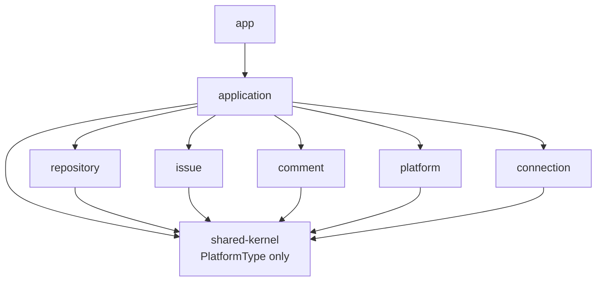
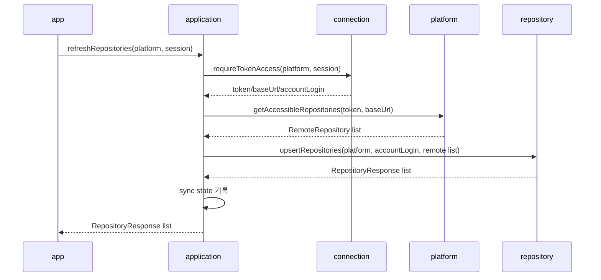

# Module Service Structure

## Summary

- 목적: 13번 아키텍처 개선 적용 이후의 현재 모듈 책임과 의존 방향을 정리한다.
- 기준: HTTP 조립은 `app`, use case orchestration은 `application`, 원격 adapter는 `platform`이 담당한다.
- 원칙: repository / issue / comment는 token, baseUrl, 원격 API client, 다른 업무 모듈을 직접 알지 않는다.
- 검증: `ModuleBoundaryTest`가 Gradle 의존성, public API import, shared-kernel 축소 기준을 확인한다.

## 1. 전체 의존 방향

- app: HTTP controller, exception handler, bootstrapping
- application: token 조회, remote 호출, cache 반영, sync 기록의 유스케이스 조립
- platform: credential 검증, gateway 선택, GitHub/GitLab API client, remote DTO mapping
- connection: token 저장, 암호화, 현재 연결 조회, token access 제공
- repository / issue / comment: 자기 cache와 cache 반영 public API 소유
- shared-kernel: `PlatformType`만 소유

## 2. app

- 주요 구성: controller 계층, `GlobalExceptionHandler`, bootstrapping
- 역할: REST 요청을 application public API로 연결
- PAT 등록: `AuthApplicationFacade` 호출
- 저장소/이슈/댓글 흐름: 각 application facade 호출
- 예외 처리: 모듈별 not found 예외를 HTTP 404로 변환
- 금지: 업무 모듈 internal 직접 접근
- 금지: platform gateway 또는 connection token access 직접 조립

## 3. application

- 주요 구성: `AuthApplicationFacade`, `RepositoryApplicationFacade`, `IssueApplicationFacade`, `CommentApplicationFacade`
- 역할: use case orchestration
- 역할: connection에서 current connection/token/baseUrl 조회
- 역할: platform gateway 호출
- 역할: repository / issue / comment cache 반영 API 호출
- 역할: `SyncStateService`로 sync 상태 기록과 조회
- 소유: `SyncState`, `SyncResourceType`, `SyncStatus`, `SyncStateRepository`, `SyncStateResponse`
- 설정: `ApplicationSyncConfig`가 sync entity/repository scan을 담당
- 금지: GitHub/GitLab client 직접 구현
- 금지: 업무 cache 저장 규칙을 직접 소유

### 대표 저장소 새로고침 흐름

## 4. platform

- 주요 구성: `PlatformCredentialFacade`, `PlatformGatewayResolver`, `PlatformGateway`
- `PlatformCredentialFacade`: PAT/baseUrl 검증, remote user profile 조회, GitLab baseUrl 정규화
- `PlatformGatewayResolver`: platform 값에 맞는 gateway 선택
- `PlatformGateway`: repository/issue/comment 원격 API 호출 계약
- 내부 구현: GitHub/GitLab client, gateway, response model, mapper
- 입력: accessToken, baseUrl, remote 요청 값
- 출력: `RemoteRepository`, `RemoteIssue`, `RemoteComment`, `RemoteUserProfile`
- 금지: connection token repository 접근
- 금지: session 접근
- 금지: repository/issue/comment cache 접근

## 5. connection

- 주요 서비스: `PlatformConnectionFacade`, `AuthService`, `PatCryptoService`
- `PlatformConnectionFacade`: 연결 등록, 상태 조회, logout, token access 공개 API
- `AuthService`: 연결 저장/조회, 세션 기준 현재 연결 확인
- `PatCryptoService`: token 암호화/복호화
- 제공: `TokenAccess`, `CurrentConnection`
- 금지: GitHub/GitLab adapter 호출
- 금지: repository/issue/comment 캐시 직접 접근

## 6. repository

- 주요 서비스: `RepositoryFacade`, `RepositoryService`
- 소유: `repository_caches`
- 역할: 현재 계정 기준 저장소 목록 조회
- 역할: 저장소 접근 가능 여부 확인
- 역할: remote repository list를 cache에 반영
- 예외: `RepositoryNotFoundException`
- 금지: platform gateway 직접 호출
- 금지: connection 직접 의존
- 금지: issue/comment 직접 의존

## 7. issue

- 주요 서비스: `IssueFacade`, `IssueService`
- 소유: `issue_caches`
- 역할: 이슈 목록/상세 조회
- 역할: 이슈 접근 가능 여부 확인
- 역할: remote issue를 cache에 반영
- 예외: `IssueNotFoundException`
- 금지: platform gateway 직접 호출
- 금지: connection 직접 의존
- 금지: repository/comment 직접 의존

## 8. comment

- 주요 서비스: `CommentFacade`, `CommentService`
- 소유: `comment_caches`
- 역할: 댓글 목록 조회
- 역할: remote comment를 cache에 반영
- 예외: `CommentNotFoundException`
- 금지: platform gateway 직접 호출
- 금지: connection 직접 의존
- 금지: repository/issue 직접 의존

## 9. shared-kernel

- 소유: `PlatformType`
- 이유: cache entity가 `platform + externalId` 식별자를 타입 안전하게 사용한다.
- 금지: sync 상태 entity/service/repository
- 금지: 공통 not found 예외
- 금지: API 응답 DTO
- 금지: 업무 규칙, 특정 플랫폼 정책, 편의 util 누적

## 10. 검증 기준

- app은 application public API만 호출한다.
- application만 connection, platform, 업무 cache 모듈을 함께 조립한다.
- repository / issue / comment는 connection 모듈에 Gradle 의존을 갖지 않는다.
- repository / issue / comment는 서로 직접 의존하지 않는다.
- platform은 connection 모듈에 Gradle 의존을 갖지 않는다.
- shared-kernel 소스는 `PlatformType.java`만 포함한다.
- 전체 검증 명령: `.\gradlew.bat test`
