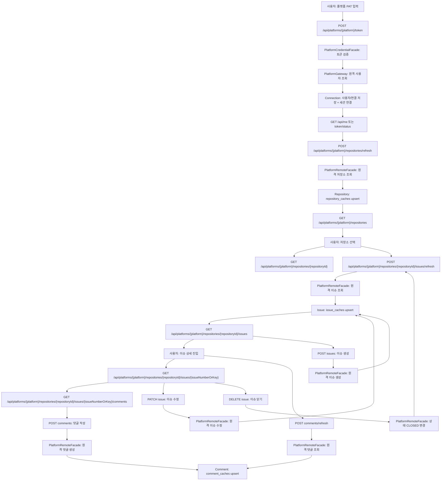
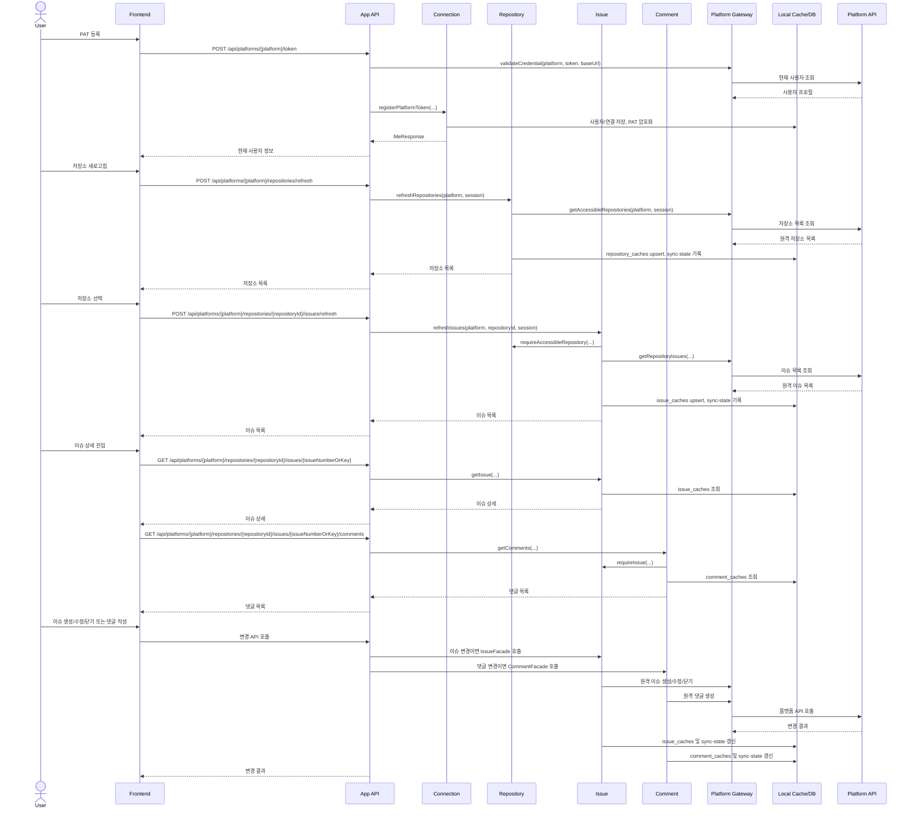

# Main Use Case Flow

## 1. 문서 목적

이 문서는 현재 구현 기준으로 사용자가 플랫폼 PAT를 등록한 뒤 저장소, 이슈, 댓글을 사용하는 전체 흐름을 정리한다.

현재 구현의 핵심은 다음과 같다.

- 프론트는 기본적으로 `github` 플랫폼을 사용한다.
- API는 `/api/platforms/{platform}/...` 경로를 사용한다.
- 플랫폼별 원격 호출은 platform 모듈의 gateway 뒤로 숨겨져 있다.
- connection 모듈은 세션과 암호화된 PAT를 관리한다.
- repository, issue, comment 모듈은 로컬 캐시를 읽고 쓰며 필요한 시점에 platform 모듈을 호출한다.

## 2. 전체 흐름 요약

1. 사용자가 플랫폼 PAT를 등록한다.
2. 백엔드가 플랫폼 API로 토큰을 검증하고 세션을 연결한다.
3. 사용자가 저장소 새로고침으로 접근 가능한 저장소를 캐시에 반영한다.
4. 사용자가 저장소를 선택하고 이슈 목록을 조회한다.
5. 필요하면 이슈 새로고침으로 원격 이슈를 캐시에 반영한다.
6. 사용자가 이슈를 생성, 조회, 수정, 닫기 처리한다.
7. 사용자가 댓글을 새로고침하거나 댓글을 작성한다.
8. 연결 해제 또는 로그아웃으로 세션 흐름을 종료한다.

## 3. 주요 구성 요소

- Frontend: React, React Query, platform-aware API client
- App API: Spring MVC controller
- Connection: 사용자, 플랫폼 연결, PAT 암호화, 세션 관리
- Repository: 저장소 캐시, 저장소 접근 검증
- Issue: 이슈 캐시, 이슈 조회/생성/수정/닫기
- Comment: 댓글 캐시, 댓글 조회/작성
- Platform: `PlatformCredentialFacade`, `PlatformRemoteFacade`, 플랫폼 gateway
- Shared Kernel: 동기화 상태 기록과 조회
- External Platform: GitHub 또는 GitLab API

## 4. 전체 Flowchart

## 5. 전체 Sequence Diagram

## 6. 단계별 동작

### 6.1 플랫폼 토큰 등록

프론트는 선택된 플랫폼을 경로에 포함해 `POST /api/platforms/{platform}/token`을 호출한다. 백엔드는 먼저 `PlatformCredentialFacade`로 토큰을 검증하고, 검증 결과를 connection 모듈에 넘긴다.

connection 모듈은 PAT를 암호화해 저장하고 세션에 `currentUserId`, `currentPlatform`을 저장한다. 이후 요청은 프론트가 PAT를 다시 보내지 않고 세션과 저장된 토큰으로 처리된다.

### 6.2 저장소 동기화와 조회

저장소 목록은 `GET /api/platforms/{platform}/repositories`로 캐시를 조회한다. 최신 원격 상태가 필요하면 `POST /api/platforms/{platform}/repositories/refresh`를 호출한다.

새로고침 시 repository 모듈은 platform 모듈에서 접근 가능한 저장소 목록을 받아 `repository_caches`에 upsert한다. 조회 시에는 현재 연결 계정의 `ownerKey`와 일치하는 저장소만 반환한다.

### 6.3 이슈 동기화와 조회

이슈 목록은 `GET /api/platforms/{platform}/repositories/{repositoryId}/issues`로 캐시를 조회한다. `keyword`, `state` 쿼리로 캐시 결과를 필터링할 수 있다.

새로고침은 `POST /api/platforms/{platform}/repositories/{repositoryId}/issues/refresh`가 담당한다. issue 모듈은 저장소 접근 권한을 확인한 뒤 platform 모듈을 통해 원격 이슈 목록을 조회하고 `issue_caches`에 반영한다.

### 6.4 이슈 생성, 수정, 닫기

이슈 생성은 원격 플랫폼에 먼저 반영한 뒤 생성 결과를 캐시에 저장한다. 수정은 요청에 없는 필드를 현재 캐시 값으로 보완한 뒤 원격 수정 API를 호출한다.

이슈 닫기는 `DELETE` API로 노출되어 있지만 실제 삭제가 아니다. 내부적으로 원격 이슈 상태를 `CLOSED`로 변경하고 이슈 목록을 다시 새로고침한다.

### 6.5 댓글 동기화와 작성

댓글 목록은 `GET /api/platforms/{platform}/repositories/{repositoryId}/issues/{issueNumberOrKey}/comments`로 캐시를 조회한다. 원격 댓글을 다시 맞추려면 `/comments/refresh`를 호출한다.

댓글 작성은 원격 플랫폼에 먼저 작성한 뒤 생성된 댓글을 `comment_caches`에 저장한다. 댓글 수정/삭제는 현재 구현 범위에 없다.

### 6.6 연결 종료

`DELETE /api/platforms/{platform}/token`은 저장된 토큰을 제거하고 현재 세션 플랫폼이면 세션 연결 정보를 제거한다. `POST /api/auth/logout`은 세션 자체를 무효화한다.

## 7. 구현 기준 API 순서

1. `POST /api/platforms/{platform}/token`
2. `GET /api/platforms/{platform}/token/status`
3. `GET /api/me`
4. `POST /api/platforms/{platform}/repositories/refresh`
5. `GET /api/platforms/{platform}/repositories`
6. `GET /api/platforms/{platform}/repositories/{repositoryId}`
7. `POST /api/platforms/{platform}/repositories/{repositoryId}/issues/refresh`
8. `GET /api/platforms/{platform}/repositories/{repositoryId}/issues`
9. `POST /api/platforms/{platform}/repositories/{repositoryId}/issues`
10. `GET /api/platforms/{platform}/repositories/{repositoryId}/issues/{issueNumberOrKey}`
11. `PATCH /api/platforms/{platform}/repositories/{repositoryId}/issues/{issueNumberOrKey}`
12. `DELETE /api/platforms/{platform}/repositories/{repositoryId}/issues/{issueNumberOrKey}`
13. `POST /api/platforms/{platform}/repositories/{repositoryId}/issues/{issueNumberOrKey}/comments/refresh`
14. `GET /api/platforms/{platform}/repositories/{repositoryId}/issues/{issueNumberOrKey}/comments`
15. `POST /api/platforms/{platform}/repositories/{repositoryId}/issues/{issueNumberOrKey}/comments`
16. `DELETE /api/platforms/{platform}/token`
17. `POST /api/auth/logout`

## 8. 코드 추적 기준

- 인증 컨트롤러: `backend/app/src/main/java/com/jw/github_issue_manager/controller/AuthController.java`
- 저장소 컨트롤러: `backend/app/src/main/java/com/jw/github_issue_manager/controller/RepositoryController.java`
- 이슈 컨트롤러: `backend/app/src/main/java/com/jw/github_issue_manager/controller/IssueController.java`
- 댓글 컨트롤러: `backend/app/src/main/java/com/jw/github_issue_manager/controller/CommentController.java`
- 연결 서비스: `backend/connection/src/main/java/com/jw/github_issue_manager/connection/internal/service/AuthService.java`
- 저장소 서비스: `backend/repository/src/main/java/com/jw/github_issue_manager/repository/internal/service/RepositoryService.java`
- 이슈 서비스: `backend/issue/src/main/java/com/jw/github_issue_manager/issue/internal/service/IssueService.java`
- 댓글 서비스: `backend/comment/src/main/java/com/jw/github_issue_manager/comment/internal/service/CommentService.java`
- 플랫폼 facade: `backend/platform/src/main/java/com/jw/github_issue_manager/platform/api`
- 통합 테스트: `backend/app/src/test/java/com/jw/github_issue_manager/controller/ApiFlowIntegrationTest.java`

## 9. 정리

현재 메인 흐름은 "플랫폼 토큰 등록 + 세션 연결 + 캐시 기반 조회 + 수동 원격 동기화 + 원격 우선 변경 반영" 구조다.

문서 기준에서는 GitHub 전용 API 경로보다 플랫폼 공통 경로를 우선 사용한다. GitHub는 기본 플랫폼이고, 플랫폼별 차이는 platform gateway 내부 구현으로 격리한다.
