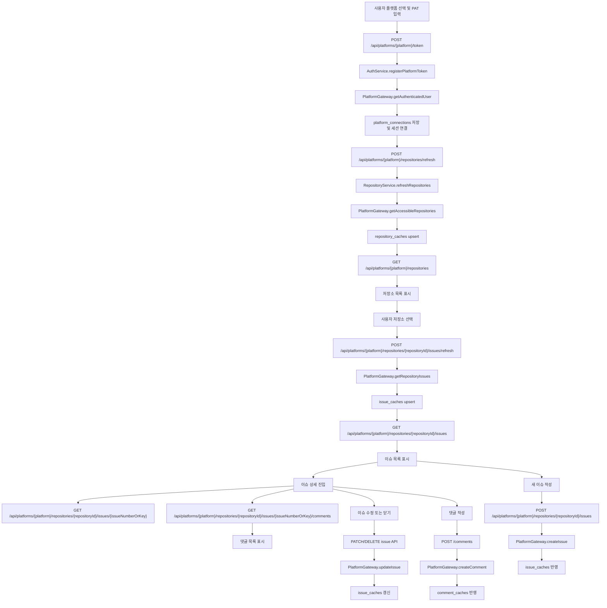
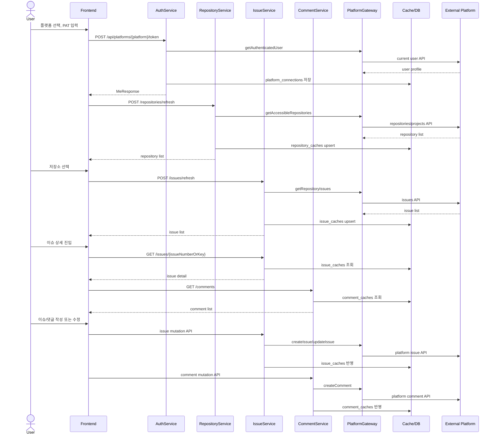

# GitHub Issue Manager 메인 유스케이스 동작 흐름

## 1. 문서 목적

이 문서는 현재 구현 기준으로 메인 유스케이스가 어떻게 동작하는지 한 번에 이해할 수 있도록 정리한다.

현재 기준 흐름은 아래 순서로 본다.

1. 사용자가 플랫폼을 선택하고 PAT를 등록한다.
2. 시스템이 접근 가능한 저장소/프로젝트 목록을 동기화한다.
3. 사용자가 저장소를 선택해 이슈 목록과 상세를 조회한다.
4. 사용자가 이슈를 생성하거나 상태를 변경한다.
5. 사용자가 댓글을 동기화하거나 새 댓글을 작성한다.

## 2. 메인 흐름 요약

사용자는 GitHub 또는 GitLab PAT를 연결한 뒤, 내부 캐시를 기준으로 저장소와 이슈를 탐색한다. 최신 상태가 필요하면 수동 새로고침으로 외부 플랫폼과 캐시를 다시 맞춘다. 이슈/댓글 작성과 수정은 먼저 외부 플랫폼에 반영하고, 결과를 캐시에 저장한다.

## 3. 주요 구성 요소

- 프론트엔드: React + React Query 기반 화면과 API 호출
- 백엔드 API: Spring Boot REST controller
- 공통 포트: `PlatformGateway`, `Remote*` DTO
- 플랫폼 어댑터: `GitHubPlatformGateway`, `GitLabPlatformGateway`
- 로컬 저장소: `platform_connections`, `repository_caches`, `issue_caches`, `comment_caches`, `sync_states`
- 외부 시스템: GitHub REST API, GitLab REST API

## 4. 전체 Flowchart

## 5. 전체 Sequence Diagram

## 6. 단계별 상세 흐름

### 6.1 플랫폼 PAT 등록과 세션 연결

프론트엔드는 `POST /api/platforms/{platform}/token`으로 토큰을 전송한다. 백엔드는 `PlatformGatewayResolver`로 플랫폼 gateway를 선택하고, 현재 사용자 API를 호출해 PAT를 검증한다.

검증에 성공하면 PAT를 `PatCryptoService`로 암호화해 `platform_connections`에 저장하고, 세션에 `currentUserId`, `currentPlatform`을 기록한다.

### 6.2 저장소 목록 동기화

저장소 새로고침은 `RepositoryService.refreshRepositories(...)`에서 처리한다. 서비스는 현재 플랫폼 연결과 저장된 PAT를 확인한 뒤 gateway로 저장소/프로젝트 목록을 조회한다.

결과는 `repository_caches`에 upsert된다. 이후 목록 화면은 `GET /api/platforms/{platform}/repositories`로 캐시를 읽는다.

### 6.3 저장소 선택 후 이슈 목록 조회

사용자가 저장소를 선택하면 이슈 목록 화면으로 이동한다. 화면은 캐시된 이슈 목록을 먼저 조회하고, 사용자가 새로고침을 누르면 외부 플랫폼에서 최신 이슈를 가져와 `issue_caches`를 갱신한다.

### 6.4 이슈 상세와 댓글 조회

이슈 상세 화면은 이슈 캐시와 댓글 캐시를 조회한다. 댓글 새로고침은 gateway를 통해 외부 플랫폼 댓글 API를 호출하고 `comment_caches`를 갱신한다.

### 6.5 이슈 생성/수정/닫기

이슈 생성과 수정은 외부 플랫폼 API를 먼저 호출한다. 성공 결과는 `issue_caches`에 반영한다. 닫기는 삭제가 아니라 상태를 `CLOSED`로 바꾸는 방식이다.

### 6.6 댓글 작성

댓글 작성은 외부 플랫폼 댓글 생성 API를 호출한다. 성공 결과는 `comment_caches`에 반영한다.

## 7. 통합 설계 포인트

- 인증 기준은 세션이다.
- PAT는 최초 등록 시점 이후 프론트엔드에서 다시 보내지 않는다.
- 조회 기준은 캐시이다.
- 최신화 기준은 수동 동기화이다.
- 쓰기 기준은 외부 플랫폼 원본이다.
- 플랫폼 차이는 gateway와 mapper에서 처리한다.

## 8. 코드 추적 포인트

### 프론트엔드

- 플랫폼 연결 화면: `frontend/src/pages/settings/PlatformConnectionPage.tsx`
- 플랫폼 연결 API: `frontend/src/entities/platform-connection/api/platformConnectionApi.ts`
- 저장소 화면: `frontend/src/pages/repositories/RepositoryListPage.tsx`
- 이슈 목록 화면: `frontend/src/pages/issues/IssueListPage.tsx`
- 이슈 상세 화면: `frontend/src/pages/issues/IssueDetailPage.tsx`
- 라우트: `frontend/src/app/router/AppRouter.tsx`

### 백엔드

- 인증 API: `backend/src/main/java/com/jw/github_issue_manager/controller/AuthController.java`
- 저장소 API: `backend/src/main/java/com/jw/github_issue_manager/controller/RepositoryController.java`
- 이슈 API: `backend/src/main/java/com/jw/github_issue_manager/controller/IssueController.java`
- 댓글 API: `backend/src/main/java/com/jw/github_issue_manager/controller/CommentController.java`
- 공통 포트: `backend/src/main/java/com/jw/github_issue_manager/core/platform/PlatformGateway.java`
- GitHub 어댑터: `backend/src/main/java/com/jw/github_issue_manager/github/GitHubPlatformGateway.java`
- GitLab 어댑터: `backend/src/main/java/com/jw/github_issue_manager/gitlab/GitLabPlatformGateway.java`

## 9. 테스트 기준

- 메인 API 흐름은 `ApiFlowIntegrationTest`에서 검증한다.
- 플랫폼 스키마 전환은 `PlatformSchemaIntegrationTest`에서 검증한다.
- GitLab API client와 gateway 매핑은 GitLab 전용 테스트에서 검증한다.
- PAT 암호화는 `PatCryptoServiceTest`에서 검증한다.
