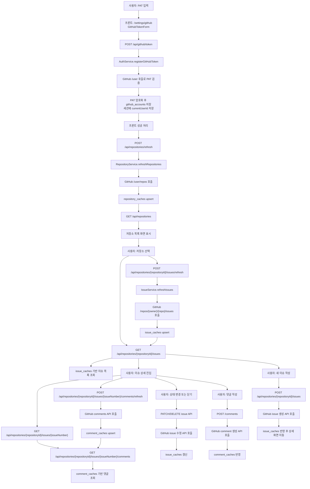
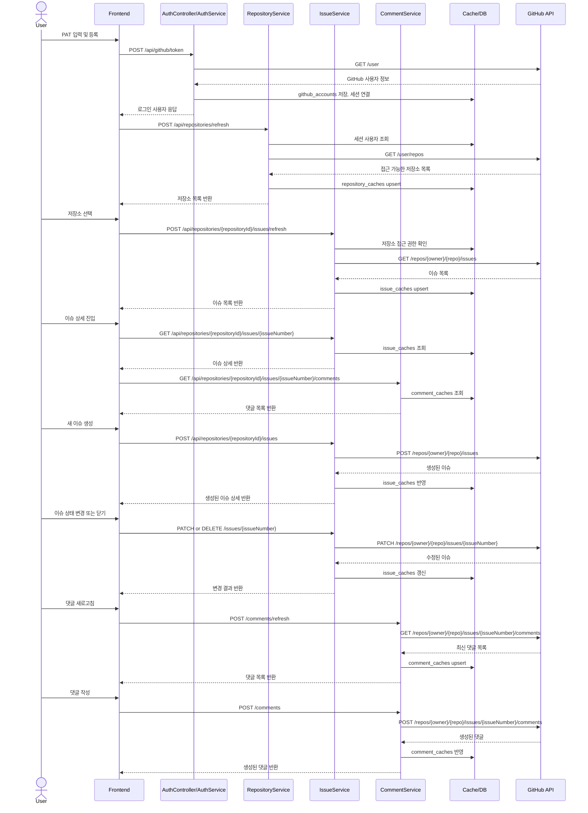

# GitHub Issue Manager 메인 유스케이스 동작 흐름

## 1. 문서 목적

이 문서는 현재 구현 기준으로 GitHub Issue Manager의 메인 유스케이스가 어떻게 동작하는지 한 번에 이해할 수 있도록 정리한 문서다.

대표 시나리오는 아래 순서로 본다.

1. 사용자가 GitHub PAT를 등록한다.
2. 앱이 접근 가능한 저장소 목록을 동기화한다.
3. 사용자가 저장소를 선택해 이슈 목록과 상세를 조회한다.
4. 사용자가 이슈를 생성하거나 상태를 변경한다.
5. 사용자가 댓글을 동기화하거나 새 댓글을 작성한다.

이 흐름은 현재 프론트엔드 화면, 백엔드 서비스, 캐시 테이블, GitHub REST API가 가장 촘촘하게 연결된 핵심 사용자 여정이다.

## 2. 메인 유스케이스 한 줄 요약

사용자는 GitHub PAT를 한 번 연결한 뒤, 앱 내부 캐시를 기준으로 저장소와 이슈를 탐색하고, 필요한 시점에 GitHub와 다시 동기화하거나 직접 이슈/댓글을 생성 및 수정한다.

## 3. 주요 구성 요소

- 프론트엔드: React + React Query 기반 화면과 API 호출
- 백엔드 API: Spring Boot REST 컨트롤러
- 도메인 서비스: 인증, 저장소, 이슈, 댓글, 동기화 상태 관리
- 로컬 저장소: `github_accounts`, `repository_caches`, `issue_caches`, `comment_caches`, `sync_states`
- 외부 시스템: GitHub REST API

## 4. 전체 Flowchart

## 5. 전체 Sequence Diagram

## 6. 단계별 상세 흐름

### 5.1 PAT 등록과 세션 연결

사용자는 설정 화면에서 PAT를 입력한다. 프론트는 `POST /api/github/token`으로 토큰을 전송하고, 백엔드의 `AuthService.registerGitHubToken(...)`는 먼저 GitHub `/user` API를 호출해 토큰이 유효한지 확인한다.

검증에 성공하면 백엔드는 PAT를 `PatCryptoService`로 암호화해서 `github_accounts`에 저장하고, 세션에 `currentUserId`를 넣는다. 이후 요청부터는 프론트가 PAT를 다시 보내지 않아도 세션과 저장된 암호화 토큰을 조합해 GitHub 연동을 수행한다.

### 5.2 저장소 목록 동기화

PAT 등록이 성공하면 프론트는 즉시 `refreshRepositories()`를 호출한다. 백엔드의 `RepositoryService.refreshRepositories(...)`는 세션으로 현재 사용자를 확인하고, 저장된 PAT를 복호화한 뒤 GitHub `/user/repos`를 호출한다.

응답으로 받은 저장소 목록은 `repository_caches`에 upsert 된다. 이후 저장소 목록 화면은 GitHub를 매번 직접 조회하지 않고 `GET /api/repositories`로 캐시된 저장소 목록을 읽는다.

### 5.3 저장소 선택 후 이슈 목록 조회

사용자가 저장소를 선택하면 이슈 목록 화면으로 이동한다. 이 화면은 먼저 저장소 메타데이터를 조회하고, 이어서 `GET /api/repositories/{repositoryId}/issues`로 캐시된 이슈 목록을 읽는다.

최신 GitHub 상태가 필요하면 사용자가 `이슈 새로고침`을 누른다. 그러면 `IssueService.refreshIssues(...)`가 GitHub `/repos/{owner}/{repo}/issues`를 호출하고, 응답을 `issue_caches`에 반영한 뒤 다시 캐시 기반 목록을 반환한다.

### 5.4 이슈 상세와 댓글 조회

이슈 상세 화면은 `GET /issues/{issueNumber}`로 이슈 본문과 상태를 읽고, `GET /comments`로 캐시된 댓글을 읽는다.

댓글도 저장소와 같은 패턴을 따른다. 사용자가 `댓글 새로고침`을 누르면 `CommentService.refreshComments(...)`가 GitHub 댓글 API를 호출하고, 결과를 `comment_caches`에 반영한 뒤 목록을 다시 보여준다.

### 5.5 이슈 생성

사용자가 새 이슈를 작성하면 프론트는 `POST /api/repositories/{repositoryId}/issues`를 호출한다. `IssueService.createIssue(...)`는 GitHub 이슈 생성 API를 호출하고, 생성된 결과를 즉시 `issue_caches`에 반영한다.

프론트는 성공 후 이슈 목록/상세 쿼리를 무효화하거나 상세 화면으로 이동하면서 새로 만들어진 이슈를 바로 보게 된다.

### 5.6 이슈 상태 변경과 닫기

이슈 상세 화면에서 상태를 바꾸거나 목록/상세에서 이슈를 닫으면 백엔드는 GitHub issue update API를 호출한다. 이후 수정된 결과를 `issue_caches`에 반영하거나, 닫기 동작의 경우 저장소 이슈 목록을 다시 동기화한다.

즉 현재 구현은 삭제가 아니라 GitHub 이슈를 `CLOSED` 상태로 변경하는 방식이다.

### 5.7 댓글 작성

댓글 작성은 `POST /api/repositories/{repositoryId}/issues/{issueNumber}/comments`로 들어간다. `CommentService.createComment(...)`가 GitHub 댓글 생성 API를 호출하고, 생성된 댓글을 `comment_caches`에 반영한다.

## 7. 이 흐름의 핵심 설계 포인트

- 인증의 기준은 세션이다. PAT는 최초 등록 시점에만 프론트에서 전달된다.
- 조회의 기준은 캐시다. 저장소, 이슈, 댓글 조회 API는 기본적으로 로컬 캐시를 반환한다.
- 최신화의 기준은 수동 동기화다. `refresh` 계열 API가 GitHub와 캐시를 다시 맞춘다.
- 쓰기의 기준은 GitHub 원본이다. 이슈 생성, 수정, 댓글 생성은 먼저 GitHub에 반영한 뒤 캐시에 반영한다.
- 접근 제어의 기준은 현재 로그인 사용자다. 백엔드는 세션 사용자와 저장소 owner 정보를 대조해 접근 가능한 리소스만 노출한다.

## 8. 코드 추적 포인트

### 프론트엔드

- PAT 화면: `frontend/src/pages/settings/GitHubTokenPage.tsx`
- PAT 등록/해제: `frontend/src/widgets/github-token/GitHubTokenForm.tsx`
- 저장소 화면: `frontend/src/pages/repositories/RepositoryListPage.tsx`
- 저장소 목록/자동 새로고침: `frontend/src/widgets/repository-list/RepositoryListWidget.tsx`
- 이슈 목록 화면: `frontend/src/pages/issues/IssueListPage.tsx`
- 이슈 목록 액션: `frontend/src/widgets/issue-list/IssueListWidget.tsx`
- 이슈 상세 화면: `frontend/src/pages/issues/IssueDetailPage.tsx`
- 이슈 상세 표시: `frontend/src/widgets/issue-detail/IssueDetailSection.tsx`

### 백엔드

- 인증 API: `backend/src/main/java/com/jw/github_issue_manager/controller/AuthController.java`
- 저장소 API: `backend/src/main/java/com/jw/github_issue_manager/controller/RepositoryController.java`
- 이슈 API: `backend/src/main/java/com/jw/github_issue_manager/controller/IssueController.java`
- 댓글 API: `backend/src/main/java/com/jw/github_issue_manager/controller/CommentController.java`
- 인증 서비스: `backend/src/main/java/com/jw/github_issue_manager/service/AuthService.java`
- 저장소 서비스: `backend/src/main/java/com/jw/github_issue_manager/service/RepositoryService.java`
- 이슈 서비스: `backend/src/main/java/com/jw/github_issue_manager/service/IssueService.java`
- 댓글 서비스: `backend/src/main/java/com/jw/github_issue_manager/service/CommentService.java`
- GitHub API 클라이언트: `backend/src/main/java/com/jw/github_issue_manager/github/DefaultGitHubApiClient.java`

## 9. 대표 API 시퀀스

메인 유스케이스를 가장 짧게 따라가면 아래 호출 순서가 된다.

1. `POST /api/github/token`
2. `GET /api/github/token/status`
3. `POST /api/repositories/refresh`
4. `GET /api/repositories`
5. `POST /api/repositories/{repositoryId}/issues/refresh`
6. `GET /api/repositories/{repositoryId}/issues`
7. `POST /api/repositories/{repositoryId}/issues`
8. `GET /api/repositories/{repositoryId}/issues/{issueNumber}`
9. `POST /api/repositories/{repositoryId}/issues/{issueNumber}/comments/refresh`
10. `POST /api/repositories/{repositoryId}/issues/{issueNumber}/comments`
11. `PATCH /api/repositories/{repositoryId}/issues/{issueNumber}`
12. `DELETE /api/github/token`

## 10. 테스트 기준의 검증 포인트

현재 이 전체 흐름은 `backend/src/test/java/com/jw/github_issue_manager/controller/ApiFlowIntegrationTest.java`에 통합 시나리오 형태로 정리되어 있다.

이 테스트는 아래 순서를 실제로 검증한다.

- PAT 등록
- 토큰 상태 조회
- 현재 사용자 조회
- 저장소 새로고침
- 저장소 상세 조회
- 이슈 새로고침
- 이슈 생성
- 이슈 목록 조회
- 이슈 상태 변경
- 댓글 새로고침
- 댓글 생성
- 이슈 sync-state 조회
- 토큰 연결 해제

## 11. 정리

현재 GitHub Issue Manager의 메인 유스케이스는 "PAT 기반 GitHub 연동 + 캐시 기반 조회 + 필요 시 GitHub 재동기화" 구조로 이해하면 가장 정확하다.

즉 사용자는 앱 안에서 빠르게 캐시 데이터를 탐색하고, 중요한 쓰기 동작은 GitHub 원본에 반영한 뒤 그 결과를 다시 앱 캐시에 반영하는 방식으로 시스템이 동작한다.
