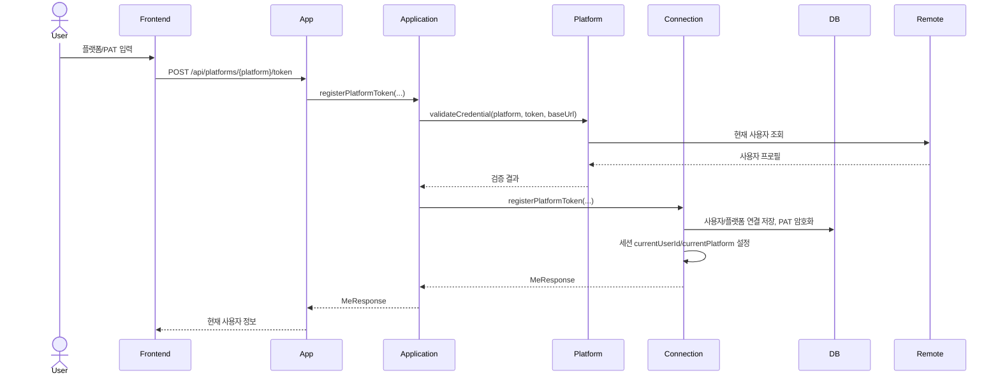
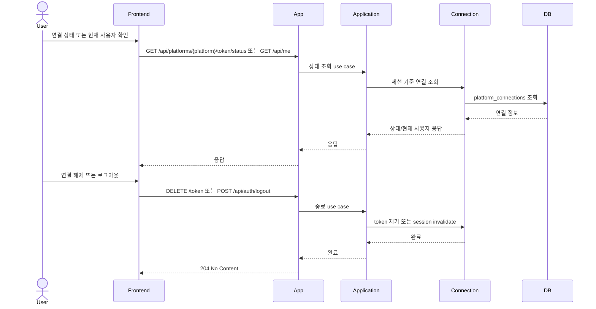
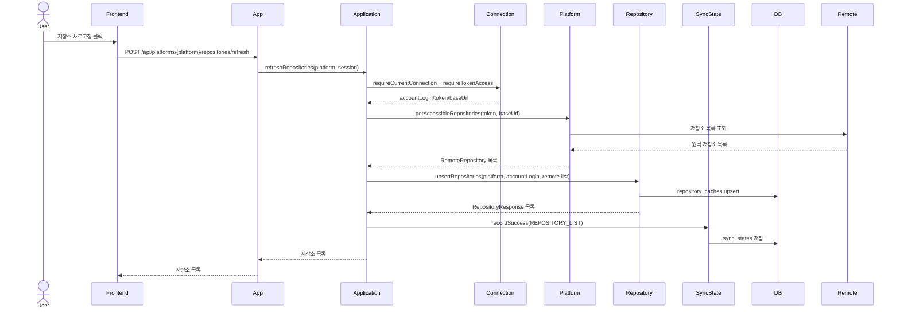
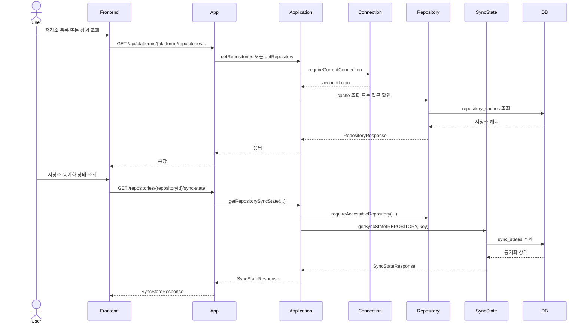
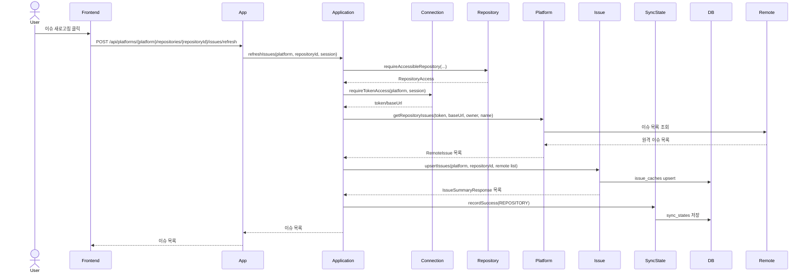
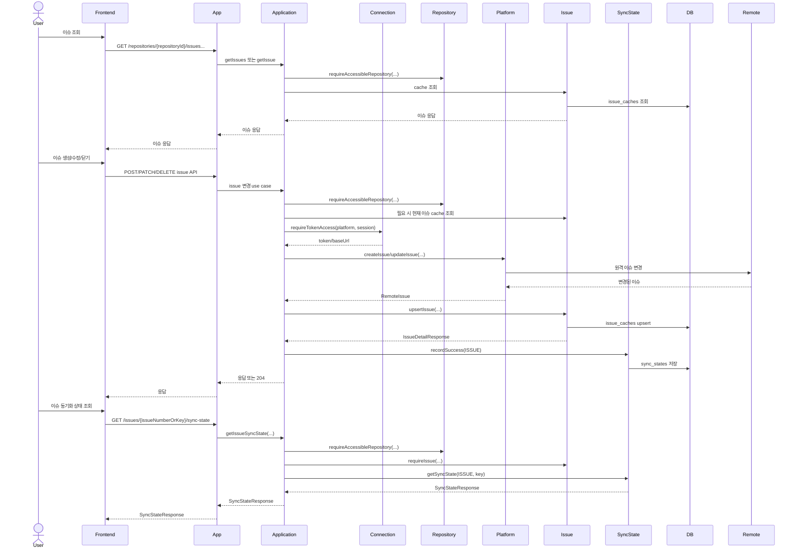
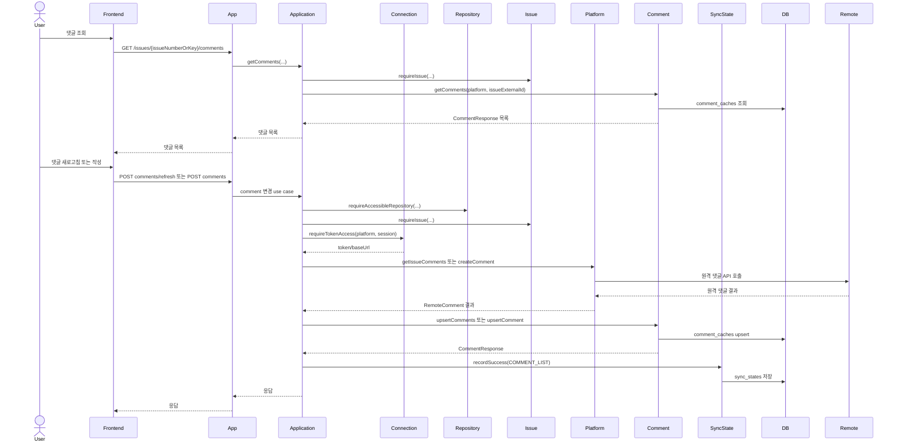

# Use Case Sequence Diagrams

## 1. 개요

이 문서는 현재 구현 기준의 주요 유스케이스 흐름을 시퀀스 다이어그램으로 정리한다.

공통 기준은 다음과 같다.

- App: Spring MVC controller
- Application: use case orchestration 계층
- Connection: 세션, 플랫폼 연결, token access
- Platform: `PlatformCredentialFacade`, `PlatformGatewayResolver`, GitHub/GitLab gateway
- Repository / Issue / Comment: 로컬 cache 소유 모듈
- SyncState: application 모듈 내부 sync 상태 저장소

## UC-01 플랫폼 토큰 등록

## UC-02 토큰 상태 / 현재 사용자 / 연결 종료

## UC-06 저장소 새로고침

## UC-07 저장소 조회 / UC-09 저장소 동기화 상태 조회

## UC-10 이슈 새로고침

## UC-11~16 이슈 조회 / 생성 / 수정 / 닫기 / 동기화 상태

## UC-17~19 댓글 새로고침 / 조회 / 작성

