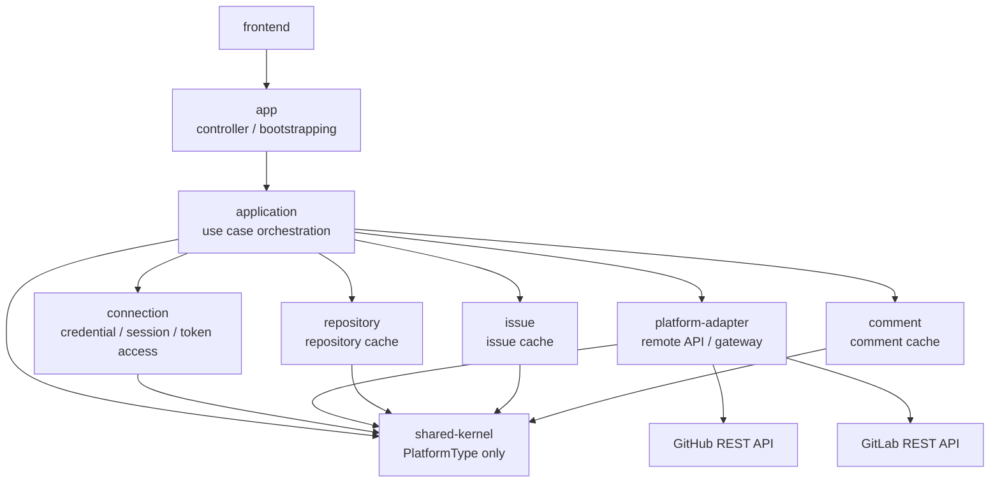
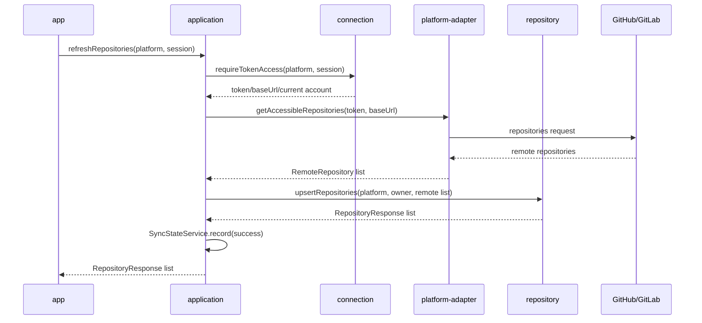
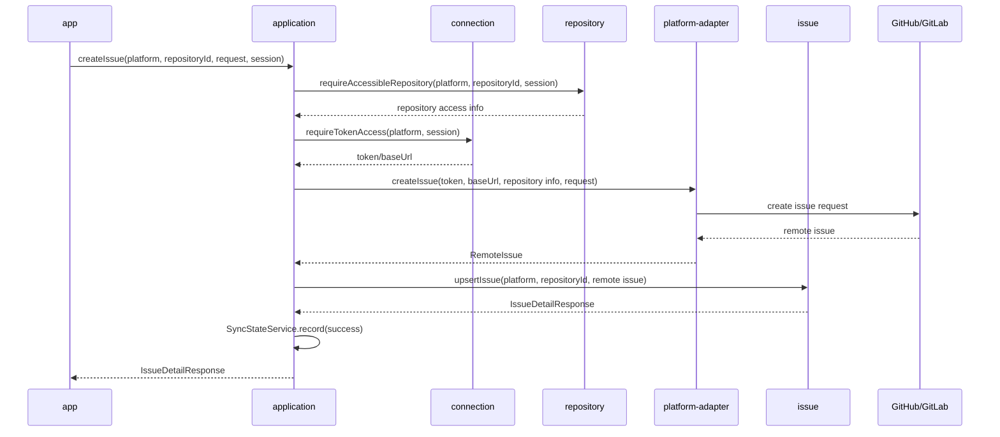

# 아키텍처 구조 개선 계획

## 요약

- 목적: 현재 멀티모듈 구조의 의존 방향을 단순화한다.
- 기준: 실제 구현과 문서의 일치도를 높이되, 현재 구조를 그대로 고착하지 않는다.
- 방향: remote 호출 조립 책임을 업무 모듈에서 분리하고 application 계층으로 모은다.
- 결과: repository / issue / comment 모듈은 cache와 업무 규칙에 집중하고, platform은 외부 API adapter로 축소한다.

## 1. 현재 구조의 문제

- 문제: app이 여러 모듈을 직접 알고 있어 다이어그램상 중앙 집중 구조로 보인다.
- 문제: repository / issue / comment 모듈이 platform remote 호출까지 직접 조립한다.
- 문제: platform 모듈이 외부 API adapter와 token access orchestration을 함께 가진다.
- 문제: platform -> connection 의존 때문에 adapter 모듈이 session/token 저장 책임까지 간접 인식한다.
- 문제: shared-kernel 의존이 넓어질수록 공통 모듈이 업무 규칙 저장소가 될 위험이 있다.
- 문제: 현재 구조를 문서화만 하면 복잡한 의존 그래프가 설계 기준으로 고착될 수 있다.

## 2. 개선 목표

- 목표: 의존 방향을 application 중심으로 단순화한다.
- 목표: 업무 모듈은 외부 플랫폼 adapter를 직접 호출하지 않는다.
- 목표: platform은 GitHub/GitLab API 호출과 remote DTO mapping만 담당한다.
- 목표: connection은 credential 저장, token 암복호화, session 기준 current connection만 담당한다.
- 목표: application 계층은 connection, platform, cache 모듈을 조립하는 use case를 담당한다.
- 목표: shared-kernel은 `PlatformType`만 유지한다.
- 목표: sync 상태 기록은 application use case 흐름의 일부로 이동한다.
- 목표: not found 예외는 각 업무 모듈이 자기 예외로 정의한다.

## 3. 목표 의존 방향



- 결정: `application`은 `app` 내부 패키지가 아니라 별도 Gradle 서브모듈로 둔다.
- 이유: HTTP 조립과 use case orchestration의 경계를 Gradle 의존성으로 강제한다.
- 이유: app이 업무 모듈을 직접 호출하는 경로를 줄이고 application public API만 보도록 만든다.
- 결정: repository / issue / comment는 서로를 직접 참조하지 않는다.
- 결정: 상위 리소스 접근 확인은 application use case가 직접 조립한다.
- 결정: platform-adapter는 connection을 모른다.
- 결정: token과 baseUrl은 application이 connection에서 조회해 platform-adapter에 전달한다.
- 결과: controller 변경과 use case 변경의 책임선을 분리한다.

## 4. 모듈 책임

### app

- 책임: HTTP controller, request/response boundary, bootstrapping
- 허용: application public API 호출
- 금지: 각 모듈 internal package 접근
- 금지: remote API 호출 조립

### application

- 책임: use case orchestration
- 책임: PAT 등록 흐름 조립
- 책임: repository refresh 흐름 조립
- 책임: issue/comment 생성, 수정, 동기화 흐름 조립
- 책임: sync 상태 기록과 조회
- 책임: sync JPA entity scan / repository scan 설정
- 사용: connection token access, platform gateway, cache module public API
- 금지: 외부 API client 직접 구현
- 금지: JPA entity 직접 소유, 단 SyncState 클러스터는 제외
- 금지: 하나의 facade 또는 service에 여러 도메인 흐름 누적
- 금지: controller 요청 DTO를 그대로 하위 모듈로 전달
- 원칙: 유스케이스별 클래스로 분리
- 원칙: command/result 객체는 application 경계에서 정의

### application 내부 패키지 규칙

```text
application
└── src/main/java/com/jw/github_issue_manager/application
    ├── auth
    │   ├── RegisterPlatformTokenUseCase
    │   └── DisconnectPlatformTokenUseCase
    ├── repository
    │   ├── RefreshRepositoriesUseCase
    │   └── GetRepositoryUseCase
    ├── issue
    │   ├── RefreshIssuesUseCase
    │   ├── CreateIssueUseCase
    │   ├── UpdateIssueUseCase
    │   └── CloseIssueUseCase
    ├── comment
    │   ├── RefreshCommentsUseCase
    │   └── CreateCommentUseCase
    ├── sync
    │   ├── SyncState
    │   ├── SyncResourceType
    │   ├── SyncStatus
    │   ├── SyncStateRepository
    │   ├── SyncStateService
    │   └── SyncStateResponse
    └── support
        └── CurrentPlatformContextLoader
```

- 패키지 기준: 기능 리소스별 패키지
- 클래스 기준: 하나의 public use case는 하나의 사용자 행동만 담당
- 공통 보조: 여러 use case가 공유하는 session/token/context 조회는 `support`로 제한
- 금지: `ApplicationService`, `PlatformUseCaseService` 같은 넓은 이름의 통합 서비스
- 금지: `support`에서 업무 판단, cache 갱신, remote 호출을 직접 수행
- 금지: application 내부 use case끼리 순환 호출
- 허용: 상위 흐름을 위해 private helper 또는 package-private collaborator 사용
- 검증: application 패키지 import 규칙을 ModuleBoundaryTest에 추가

### application 비대화 방지 기준

- 기준: use case class가 connection, platform, cache module을 조립하는 수준을 넘으면 분리한다.
- 기준: 한 클래스가 두 개 이상의 aggregate/cache를 직접 갱신하면 별도 use case로 분리한다.
- 기준: if 분기가 플랫폼별 구현 세부사항으로 늘어나면 platform-adapter로 이동한다.
- 기준: if 분기가 HTTP 요청 해석 중심이면 app controller 또는 request mapper로 이동한다.
- 기준: if 분기가 cache 저장 규칙 중심이면 해당 업무 모듈로 이동한다.
- 기준: application은 흐름 순서와 트랜잭션 경계만 명확히 가진다.

### application JPA 설정

- 책임: `SyncState` entity scan과 `SyncStateRepository` 등록 설정을 application config에 둔다.
- 책임: 기존 `SharedKernelConfig`가 담당하던 SyncState 관련 `@EntityScan` / `@EnableJpaRepositories` 역할을 대체한다.
- 금지: SyncState 외 JPA entity를 application이 소유하지 않는다.

### connection

- 책임: 플랫폼 연결 정보 저장
- 책임: token 암복호화
- 책임: session 기준 current connection 확인
- 제공: `TokenAccess`, `CurrentConnection`
- 금지: GitHub/GitLab adapter 호출
- 금지: repository / issue / comment cache 접근

### platform-adapter

- 책임: `PlatformGateway` 계약
- 책임: GitHub/GitLab gateway 구현
- 책임: 외부 API client와 remote DTO mapping
- 입력: accessToken, baseUrl, remote 요청 값
- 출력: `RemoteRepository`, `RemoteIssue`, `RemoteComment`, `RemoteUserProfile`
- 금지: session 접근
- 금지: token 저장소 접근
- 금지: cache 갱신

### repository

- 책임: `repository_caches` 소유
- 책임: repository 접근 가능 여부 확인
- 책임: remote repository 결과를 cache에 반영하는 public API
- 예외: `RepositoryNotFoundException`
- 금지: platform gateway 직접 호출
- 금지: connection token access 직접 호출

### issue

- 책임: `issue_caches` 소유
- 책임: issue 접근 가능 여부 확인
- 책임: remote issue 결과를 cache에 반영하는 public API
- 예외: `IssueNotFoundException`
- 금지: platform gateway 직접 호출
- 금지: connection token access 직접 호출
- 금지: repository internal entity 직접 참조
- 금지: repository public API 직접 호출

### comment

- 책임: `comment_caches` 소유
- 책임: remote comment 결과를 cache에 반영하는 public API
- 예외: `CommentNotFoundException`
- 금지: platform gateway 직접 호출
- 금지: connection token access 직접 호출
- 금지: issue/repository internal entity 직접 참조
- 금지: issue/repository public API 직접 호출

### shared-kernel

- 책임: `PlatformType`
- 허용: cache 식별자에 필요한 platform enum
- 금지: API 응답 DTO
- 금지: 업무 규칙
- 금지: 특정 플랫폼 정책
- 금지: 편의성 util 누적
- 금지: sync 상태 entity/service/repository
- 금지: 공통 not found 예외

## 5. shared-kernel 축소 계획

| 항목 | 현재 위치 | 목표 위치 |
| --- | --- | --- |
| `PlatformType` | shared-kernel | shared-kernel 유지 |
| `SyncState` | shared-kernel | application |
| `SyncResourceType` | shared-kernel | application |
| `SyncStatus` | shared-kernel | application |
| `SyncStateRepository` | shared-kernel | application |
| `SyncStateService` | shared-kernel | application |
| `SyncStateResponse` | shared-kernel | application |
| `SharedKernelConfig` | shared-kernel | application config로 이전 |
| `ResourceNotFoundException` | shared-kernel | 각 업무 모듈 예외로 분리 |

- 결정: `PlatformType`은 cache entity의 `platform + externalId` 식별자 일부이므로 shared-kernel에 남긴다.
- 결정: cache entity의 platform 컬럼을 String으로 낮추지 않는다.
- 이유: shared-kernel 완전 제거보다 enum 타입 안전성 유지 이득이 크다.
- 결정: `ResourceNotFoundException`은 application으로 옮기지 않는다.
- 이유: 업무 모듈이 application을 참조하면 의존 방향이 역전된다.
- 예외: repository는 `RepositoryNotFoundException`을 정의한다.
- 예외: issue는 `IssueNotFoundException`을 정의한다.
- 예외: comment는 `CommentNotFoundException`을 정의한다.
- 처리: app의 `GlobalExceptionHandler`가 각 모듈 예외를 HTTP 응답으로 변환한다.

### sync 상태 이동 주의사항

- 주의: SyncState가 application으로 이동하면 application 모듈이 sync JPA entity를 소유한다.
- 작업: `SharedKernelConfig`의 entity scan 설정을 application config로 옮긴다.
- 작업: `SyncStateRepository` repository scan 설정을 application config로 옮긴다.
- 작업: 기존 repository scan 중복 제외 필터가 필요하면 application config에 동일하게 반영한다.
- 결과: shared-kernel은 JPA 설정을 소유하지 않는다.

## 6. 대표 흐름

### repository refresh



### issue create



## 7. 단계별 전환 계획

### 1단계: application 경계 생성

- 작업: Gradle `application` 서브모듈 추가
- 작업: app은 application public API만 호출하도록 전환
- 작업: application 내부 패키지와 use case class 명명 규칙 적용
- 작업: ModuleBoundaryTest에 app -> application 중심 의존 방향 추가
- 결과: HTTP 조립과 use case 조립 경계를 분리한다.

### 2단계: use case orchestration 이전

- 작업: `PlatformRemoteFacade`의 token 조회 + gateway 호출 조립을 application으로 이동
- 작업: repository / issue / comment에서 platform 직접 의존 제거
- 작업: remote 결과 반영용 public API를 업무 모듈에 추가
- 작업: SyncState 클러스터와 JPA 설정을 application으로 이동
- 결과: application이 remote 호출, 접근 확인, cache 반영, sync 기록을 조립한다.

### 3단계: 모듈 경계 고정

- 작업: platform은 gateway, client, mapper 중심으로 축소
- 작업: shared-kernel에는 `PlatformType`만 유지
- 작업: 공통 `ResourceNotFoundException`을 모듈별 not found 예외로 분리
- 작업: `03-architecture.md`, `05-platform-module-service-structure.md`를 목표 구조 기준으로 갱신
- 작업: 기존 구조는 transition history에 남긴다.
- 결과: 실제 구현과 목표 구조의 차이를 테스트와 문서로 고정한다.

## 8. 설명 기준

- 현재 구조 설명: 멀티모듈 기반 모듈러 모놀리스의 중간 단계
- 개선 목표 설명: application 계층으로 use case orchestration을 모아 의존 방향을 단순화
- platform 설명: 플랫폼 도메인 전체가 아니라 외부 Git 서비스 adapter boundary
- connection 설명: credential/session/token access 소유 모듈
- 업무 모듈 설명: remote API가 아니라 cache와 업무 규칙 소유 모듈

## 9. 보류 사항

- 보류: 마이크로서비스 분리
- 보류: GitHub App / OAuth 인증 전환
- 보류: GitLab 전용 고급 기능 반영
- 보류: 플랫폼별 extra metadata 설계
- 보류: 운영 DB migration 세부 계획
