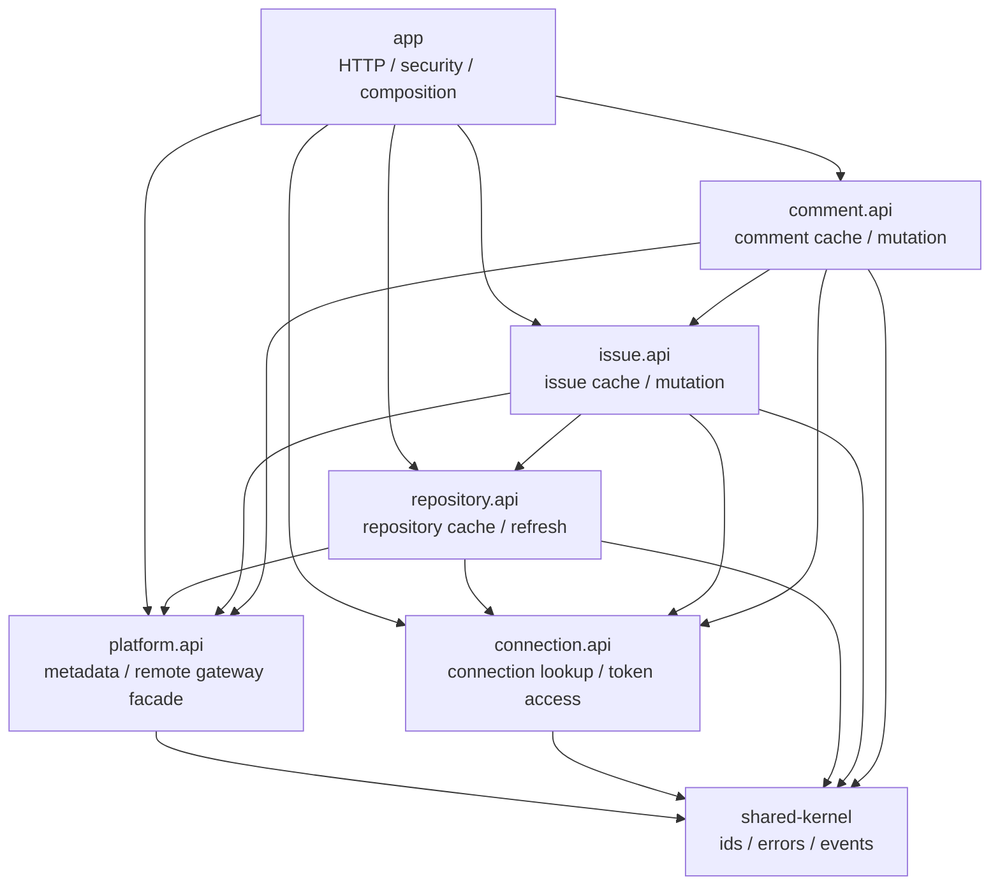
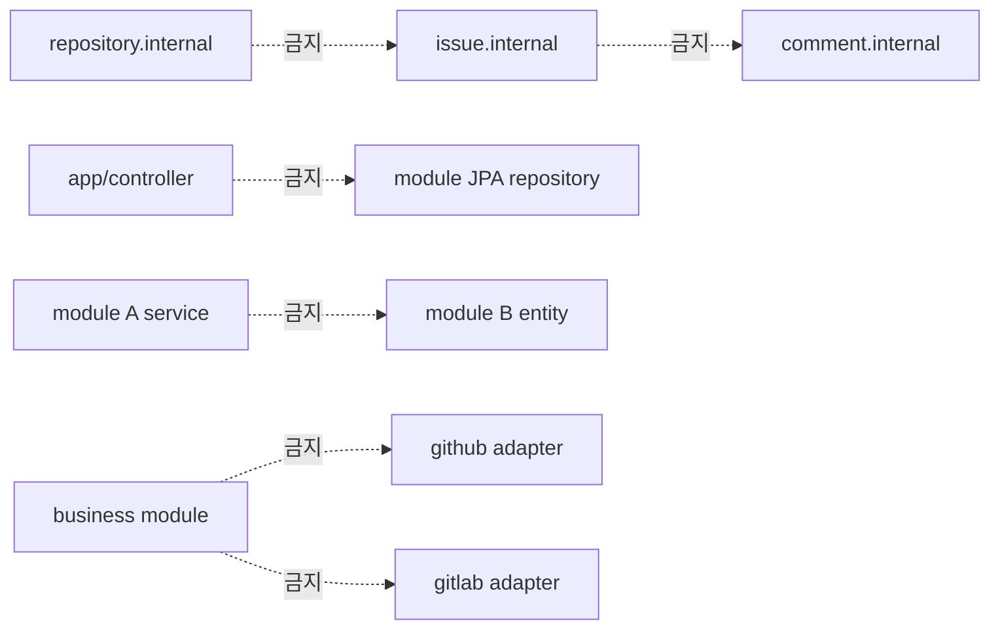
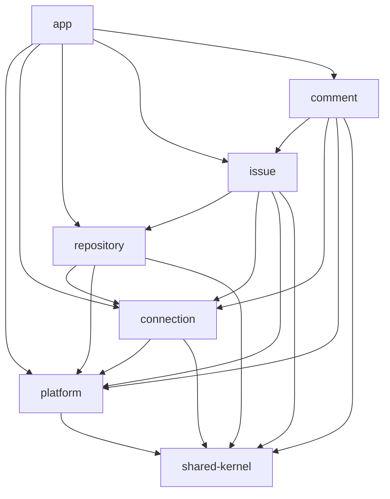
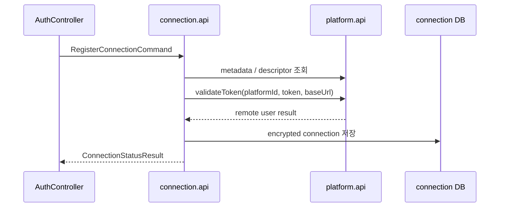
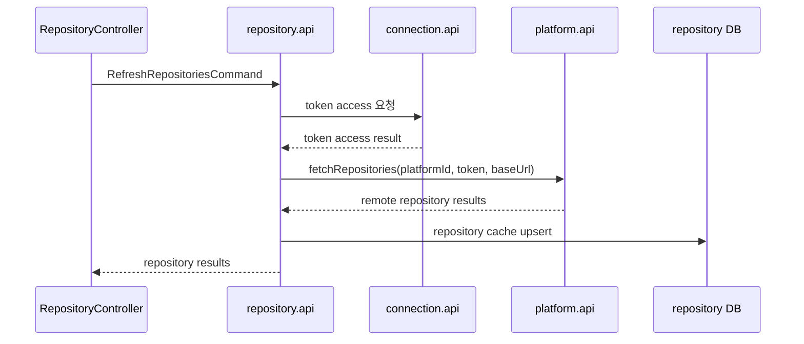
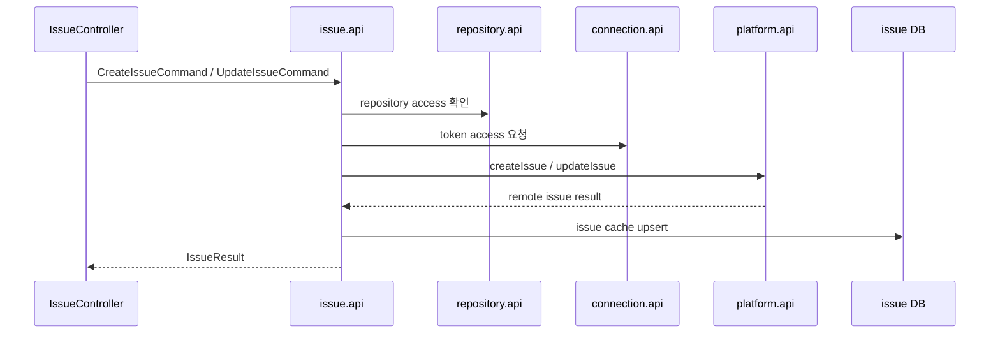
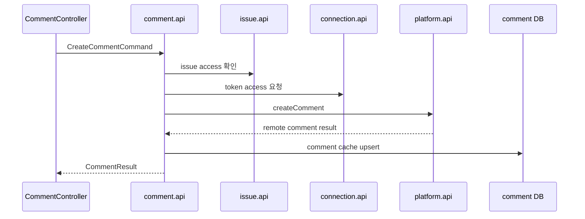
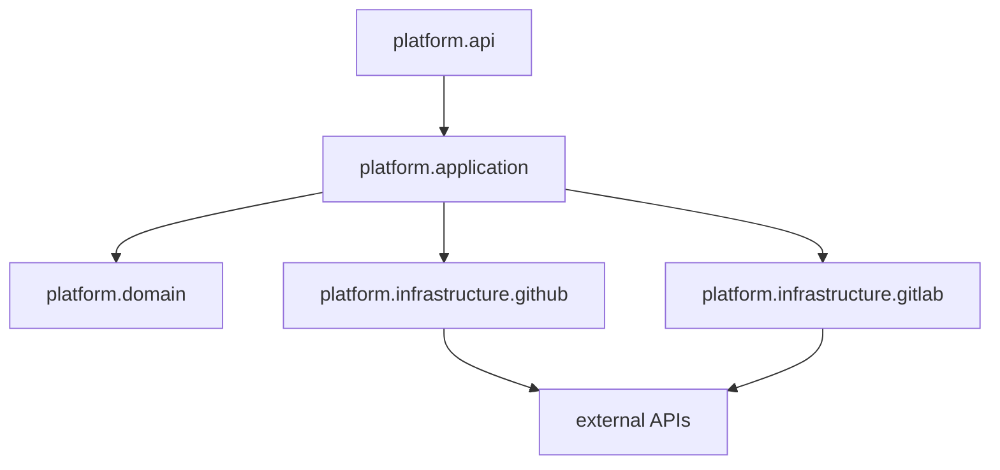

# Modular Monolith Design

## Summary

- 목적: 현재 플랫폼 공통화 구조를 모듈러 모놀리스 방식으로 재정리할 때의 파일 구조와 동작 방식을 정의한다.
- 정정: 단순 `platform-core`, `platform-github`, `platform-gitlab` 패키지 분리는 모듈화라고 보기 어렵다.
- 목표: 업무 경계별 모듈을 만들고, 모듈 간 의존은 공개 API와 작은 shared kernel로 제한한다.
- 최종 구조: Gradle 기반 멀티 모듈을 목표로 하되, 먼저 패키지 기반 모듈로 경계를 안정화한다.
- 원칙: GitHub/GitLab 차이는 `platform` 모듈 내부 구현으로 숨기고, 저장소/이슈/댓글 모듈은 플랫폼 구현체를 직접 알지 않는다.

## 1. 모듈화 목표

- 한 모듈의 내부 domain, repository, infrastructure를 다른 모듈이 직접 참조하지 않는다.
- 모듈 간 호출은 `*.api` 패키지의 public facade, command, query, result DTO로 제한한다.
- 공통 모듈은 작게 유지하고, 업무 규칙을 shared로 올리지 않는다.
- 외부 플랫폼 연동은 `platform` 모듈이 소유한다.
- PAT 연결과 암호화 저장은 `connection` 모듈이 소유한다.
- 저장소, 이슈, 댓글 캐시는 각각 자기 모듈이 소유한다.
- 프론트/컨트롤러 계약은 모듈 내부 구현이 아니라 application API를 통해 연결한다.

## 2. 목표 모듈



의존 방향은 단방향으로 유지한다.

- `app`은 조립자 역할만 한다.
- `repository`는 `issue`, `comment`를 모른다.
- `issue`는 댓글 저장 방식을 모른다.
- `comment`는 이슈 존재 확인을 위해 `issue.api`만 사용한다.
- 모든 모듈은 필요한 최소 식별자와 오류 타입만 `shared-kernel`에서 공유한다.

## 3. 금지 의존



- 다른 모듈의 JPA repository 직접 주입 금지
- 다른 모듈의 entity 직접 참조 금지
- 다른 모듈의 internal service 직접 호출 금지
- GitHub/GitLab adapter 직접 참조 금지
- shared-kernel에 서비스 로직이나 외부 API DTO 추가 금지

## 4. 목표 파일 구조와 전환 기준

최종 목표는 Gradle 기반 멀티 모듈이다. 다만 현재 구조에서 바로 물리 모듈을 나누면 Spring bean scan, JPA entity scan, 테스트 fixture, 순환 의존 정리가 한 번에 겹친다. 따라서 먼저 패키지 기반 모듈로 경계를 만들고, 의존 규칙이 안정된 뒤 같은 경계를 Gradle 모듈로 승격한다.

### 4.1 1차 구조: 패키지 기반 모듈

```text
backend/src/main/java/com/jw/github_issue_manager
  app
    GithubIssueManagerApplication.java
    web
      AuthController.java
      PlatformController.java
      RepositoryController.java
      IssueController.java
      CommentController.java
    security
    config

  shared
    PlatformId.java
    ExternalId.java
    RepositoryRef.java
    IssueRef.java
    ModuleErrorCode.java
    DomainEvent.java

  platform
    api
      PlatformMetadataFacade.java
      RemoteRepositoryPort.java
      RemoteIssuePort.java
      RemoteCommentPort.java
      PlatformMetadataResult.java
      RemoteRepositoryResult.java
      RemoteIssueResult.java
      RemoteCommentResult.java
    application
      PlatformRegistryService.java
      PlatformRemoteService.java
    domain
      PlatformCapability.java
      PlatformModule.java
      PlatformConnectionDescriptor.java
    infrastructure
      github
        GitHubPlatformModule.java
        GitHubApiClient.java
        GitHubMapper.java
      gitlab
        GitLabPlatformModule.java
        GitLabApiClient.java
        GitLabMapper.java

  connection
    api
      PlatformConnectionFacade.java
      RegisterConnectionCommand.java
      ConnectionStatusResult.java
      TokenAccessResult.java
    application
      RegisterConnectionService.java
      ConnectionQueryService.java
      TokenAccessService.java
    domain
      PlatformConnection.java
      EncryptedToken.java
      BaseUrlPolicy.java
    infrastructure
      PlatformConnectionJpaRepository.java
      TokenEncryptor.java

  repository
    api
      RepositoryFacade.java
      RefreshRepositoriesCommand.java
      RepositoryResult.java
    application
      RepositoryQueryService.java
      RepositoryRefreshService.java
    domain
      RepositoryCache.java
      RepositoryAccessPolicy.java
    infrastructure
      RepositoryCacheJpaRepository.java

  issue
    api
      IssueFacade.java
      RefreshIssuesCommand.java
      CreateIssueCommand.java
      UpdateIssueCommand.java
      IssueResult.java
    application
      IssueQueryService.java
      IssueRefreshService.java
      IssueMutationService.java
    domain
      IssueCache.java
      IssueState.java
    infrastructure
      IssueCacheJpaRepository.java

  comment
    api
      CommentFacade.java
      RefreshCommentsCommand.java
      CreateCommentCommand.java
      CommentResult.java
    application
      CommentQueryService.java
      CommentRefreshService.java
      CommentMutationService.java
    domain
      CommentCache.java
    infrastructure
      CommentCacheJpaRepository.java
```

### 4.2 최종 구조: Gradle 기반 멀티 모듈

패키지 기반 모듈의 의존 규칙이 안정되면 아래 구조로 승격한다.

```text
backend
  settings.gradle
  build.gradle

  app
    build.gradle
    src/main/java/com/jw/github_issue_manager/app
      GithubIssueManagerApplication.java
      web
      security
      config

  shared-kernel
    build.gradle
    src/main/java/com/jw/github_issue_manager/shared

  platform
    build.gradle
    src/main/java/com/jw/github_issue_manager/platform
      api
      application
      domain
      infrastructure
        github
        gitlab

  connection
    build.gradle
    src/main/java/com/jw/github_issue_manager/connection
      api
      application
      domain
      infrastructure

  repository
    build.gradle
    src/main/java/com/jw/github_issue_manager/repository
      api
      application
      domain
      infrastructure

  issue
    build.gradle
    src/main/java/com/jw/github_issue_manager/issue
      api
      application
      domain
      infrastructure

  comment
    build.gradle
    src/main/java/com/jw/github_issue_manager/comment
      api
      application
      domain
      infrastructure
```

최종 Gradle 의존 방향:



- `app`은 실행 애플리케이션과 HTTP 조립을 담당한다.
- `shared-kernel`은 식별자, 공통 오류, 최소 이벤트 타입만 가진다.
- 업무 모듈은 자기 `api` 패키지를 외부 계약으로 제공한다.
- Gradle 의존성이 없는 모듈의 내부 구현은 컴파일 단계에서 import할 수 없게 한다.

## 5. 모듈별 책임

### 5.1 app

- HTTP 요청/응답 조립
- 세션, 인증, 공통 exception handler 연결
- 각 모듈 facade 호출
- 업무 규칙과 외부 플랫폼 분기 로직을 갖지 않음

### 5.2 platform

- 등록 플랫폼 metadata 제공
- capability 확인
- GitHub/GitLab API 호출
- 외부 API 응답을 플랫폼 중립 result로 변환
- GitHub/GitLab adapter는 `platform.infrastructure` 내부에 격리

### 5.3 connection

- 플랫폼 PAT 등록
- base URL 정규화
- 토큰 암호화/복호화
- 연결 상태 조회
- 다른 모듈에는 token 원문 대신 제한된 token access API 제공

### 5.4 repository

- 저장소/프로젝트 캐시 소유
- 저장소 refresh 유스케이스 소유
- 접근 가능 저장소 기준 검증 소유
- 외부 플랫폼 호출은 `platform.api`로 위임
- 연결 정보 조회는 `connection.api`로 위임

### 5.5 issue

- 이슈 캐시 소유
- 이슈 목록 refresh, 생성, 수정 소유
- 저장소 존재/접근 확인은 `repository.api`로 위임
- 외부 플랫폼 호출은 `platform.api`로 위임

### 5.6 comment

- 댓글 캐시 소유
- 댓글 refresh, 작성 소유
- 이슈 존재 확인은 `issue.api`로 위임
- 외부 플랫폼 호출은 `platform.api`로 위임

## 6. 백엔드 동작 방식

### 6.1 PAT 등록



- 토큰 저장 규칙은 `connection` 모듈이 가진다.
- 토큰 검증 호출은 `platform.api`를 통해 수행한다.
- `app`은 연결 저장 방식과 GitHub/GitLab 검증 방식을 모른다.

### 6.2 저장소 refresh



- `repository` 모듈은 GitHub/GitLab client를 모른다.
- `connection` 모듈의 DB를 직접 조회하지 않는다.
- 저장소 캐시 write model은 `repository` 모듈 내부에만 있다.

### 6.3 이슈 생성/수정



- 이슈 모듈은 저장소 캐시 entity를 직접 참조하지 않는다.
- 저장소 확인 결과는 `repository.api`의 result로 받는다.
- 외부 플랫폼 쓰기 성공 후 이슈 캐시를 갱신한다.

### 6.4 댓글 작성



- 댓글 모듈은 이슈 모듈의 내부 저장소를 직접 보지 않는다.
- 댓글 쓰기 기준은 외부 플랫폼 원본이며, 성공 결과만 캐시에 반영한다.

## 7. 플랫폼 모듈은 어디에 두는가

GitHub/GitLab은 독립 업무 모듈이 아니라 `platform` 모듈의 infrastructure 구현체로 둔다.



- 다른 업무 모듈은 `platform.api`만 의존한다.
- `github` / `gitlab` 패키지는 외부 API DTO와 mapper를 마음대로 가져도 된다.
- 외부 API DTO는 `platform.api` 밖으로 나오지 않는다.
- 새 플랫폼 추가는 `platform.infrastructure.{new}` 추가와 module registration 변경으로 제한한다.

## 8. 프론트 구조 방향

프론트도 같은 원칙을 적용한다. 단순 폴더 분리가 아니라 feature 간 직접 내부 참조를 줄인다.

```text
frontend/src
  app
    routes
    providers
  shared
    api
    routing
    ui
  entities
    platform
      api
      model
    connection
      api
      model
    repository
      api
      model
    issue
      api
      model
    comment
      api
      model
  features
    connect-platform
    refresh-repositories
    mutate-issue
    write-comment
  pages
    platform-settings
    repository-list
    issue-list
    issue-detail
```

- `pages`는 feature와 entity public API를 조립한다.
- feature는 다른 feature 내부 구현을 직접 참조하지 않는다.
- 플랫폼 목록과 입력 필드는 백엔드 metadata를 기준으로 구성한다.
- GitHub/GitLab 전용 문구는 platform metadata 또는 feature 내부 adapter로 제한한다.

## 9. 검증 방식

모듈러 모놀리스는 규칙을 자동 검증해야 유지된다.

- ArchUnit 또는 Spring Modulith로 패키지 의존 규칙 테스트 추가
- `..repository..`가 `..issue.internal..`을 참조하지 않는지 검증
- `..issue..`가 `..comment.infrastructure..`를 참조하지 않는지 검증
- `..platform.infrastructure.github..`를 참조하는 모듈이 `platform` 내부뿐인지 검증
- module API DTO와 JPA entity를 분리해 entity 누수를 테스트로 방지

예상 규칙:

```text
app -> *.api
repository -> connection.api, platform.api, shared
issue -> repository.api, connection.api, platform.api, shared
comment -> issue.api, connection.api, platform.api, shared
platform -> shared
connection -> platform.api, shared
```

## 10. 전환 순서

전환은 두 구간으로 나눈다. 1구간은 패키지 기반 모듈로 경계를 안정화하는 단계이고, 2구간은 안정화된 경계를 Gradle 멀티 모듈로 승격하는 단계이다.

이 순서를 따르는 이유는 모듈 경계와 빌드 경계를 한 번에 바꾸면 회귀 원인을 추적하기 어렵기 때문이다. 먼저 코드 내부 의존 방향을 정리하고 테스트로 고정한 뒤, 동일한 경계를 Gradle 모듈로 옮기면 동작 변경과 물리 구조 변경을 분리해서 검토할 수 있다.

### 10.1 1단계: 공개 API 패키지 만들기

- 이유: 다른 모듈이 무엇을 호출해도 되는지 먼저 정해야 내부 구현을 안전하게 옮길 수 있다.
- 설명: 이 단계에서는 실제 업무 로직을 크게 이동하기보다 모듈의 입구를 먼저 만든다. 예를 들어 `RepositoryFacade`, `IssueFacade`, `CommentFacade` 같은 public facade와 command/result DTO를 만들고, controller가 기존 service 대신 facade를 호출하도록 바꾼다. 내부 구현은 기존 service에 위임해도 된다. 목표는 "앞으로 다른 모듈이 이 API만 보게 한다"는 경계를 먼저 세우는 것이다.
- 기존 service를 바로 옮기지 않고 각 모듈의 `api` facade를 먼저 만든다.
- controller는 service 직접 호출에서 facade 호출로 전환한다.
- DTO는 public API DTO와 internal entity로 분리한다.

### 10.2 2단계: connection 모듈 분리

- 이유: PAT, base URL, 암호화 토큰은 모든 주요 흐름의 선행 조건이므로 먼저 소유권을 고정해야 이후 모듈이 DB를 직접 건드리지 않는다.
- 설명: 플랫폼 연결 정보는 저장소, 이슈, 댓글 흐름이 모두 필요로 하는 기반 데이터다. 이 데이터를 먼저 `connection` 모듈로 모으면 이후 모듈은 `PlatformConnectionRepository`나 토큰 암호화 구현을 직접 알 필요가 없어진다. 이 단계의 산출물은 연결 등록, 연결 상태 조회, 토큰 접근을 담당하는 `connection.api`다.
- PAT 등록, base URL, 토큰 암호화, 연결 상태를 `connection` 모듈로 모은다.
- 다른 모듈은 connection repository를 직접 보지 않고 `connection.api`만 사용한다.

### 10.3 3단계: platform 모듈 내부화

- 이유: GitHub/GitLab client와 mapper가 밖으로 노출되면 repository/issue/comment 모듈이 플랫폼 구현에 다시 결합된다.
- 설명: 이 단계에서는 외부 플랫폼 API 호출을 `platform` 모듈 안으로 숨긴다. GitHub/GitLab client, mapper, base URL 처리, issue number/iid 변환 같은 세부 구현은 `platform.infrastructure`에 둔다. 다른 업무 모듈은 `fetchRepositories`, `createIssue`, `createComment` 같은 플랫폼 중립 API만 호출한다. 목표는 "GitHub/GitLab을 아는 코드는 platform 모듈뿐"인 상태다.
- `PlatformGateway`, GitHub/GitLab client, mapper를 `platform` 모듈 내부로 이동한다.
- repository/issue/comment 모듈은 `platform.api`의 remote port만 사용한다.
- GitHub/GitLab 식별자 변환은 platform 모듈 밖으로 나오지 않게 한다.

### 10.4 4단계: repository / issue / comment 모듈 분리

- 이유: 연결과 플랫폼 의존이 API로 정리된 뒤에 업무 캐시 모듈을 나누면 entity 이동 범위와 회귀 범위를 작게 유지할 수 있다.
- 설명: 이 단계에서 실제 업무 데이터 소유권을 나눈다. `RepositoryCache`는 repository 모듈, `IssueCache`는 issue 모듈, `CommentCache`는 comment 모듈이 소유한다. issue 모듈이 repository entity를 직접 들고 오지 않고 `repository.api`로 저장소 접근 가능 여부를 확인하게 만들고, comment 모듈도 issue entity 대신 `issue.api`를 사용하게 만든다. 이 단계가 끝나면 각 캐시의 write model이 자기 모듈 안에 갇힌다.
- 각 cache entity와 JPA repository를 해당 모듈 내부로 이동한다.
- issue는 repository entity 대신 `RepositoryRef`와 `repository.api` result만 사용한다.
- comment는 issue entity 대신 `IssueRef`와 `issue.api` result만 사용한다.

### 10.5 5단계: 의존성 규칙 테스트 추가

- 이유: 패키지 기반 단계에서는 컴파일러가 모듈 경계를 막아주지 않으므로 테스트로 금지 의존을 먼저 고정해야 한다.
- 설명: 패키지 기반 모듈은 같은 Gradle 모듈 안에 있기 때문에 잘못된 import가 컴파일 단계에서 막히지 않는다. 그래서 ArchUnit 또는 Spring Modulith 테스트로 "다른 모듈의 infrastructure를 참조하지 않는다", "entity가 public API 밖으로 새지 않는다", "GitHub/GitLab adapter는 platform 내부에서만 참조한다" 같은 규칙을 고정한다. 이 테스트가 있어야 다음 리팩토링에서 경계가 다시 흐려지는 것을 막을 수 있다.
- 패키지 의존 규칙을 테스트로 고정한다.
- 위반이 생기면 빌드에서 실패하게 한다.
- 문서의 모듈 경계와 테스트 규칙을 함께 유지한다.

### 10.6 6단계: Gradle 멀티 모듈 골격 생성

- 이유: 패키지 의존이 안정된 뒤 물리 모듈을 만들면 Gradle 설정 문제와 업무 로직 변경을 분리해서 처리할 수 있다.
- 설명: 이 단계부터는 논리 경계를 물리 경계로 옮긴다. 먼저 `app`, `shared-kernel`, `platform`, `connection`, `repository`, `issue`, `comment` Gradle 모듈을 만들고, 기존 패키지 기반 코드를 같은 이름의 모듈로 이동한다. 이때 기능 변경은 하지 않고 빌드 구조와 소스 위치만 바꾸는 것을 목표로 한다.
- `backend/settings.gradle`에 `app`, `shared-kernel`, `platform`, `connection`, `repository`, `issue`, `comment`를 등록한다.
- 기존 패키지 기반 모듈을 같은 이름의 Gradle 모듈로 이동한다.
- 공통 Spring Boot 실행 진입점은 `app` 모듈에 둔다.
- 공통 dependency 버전 관리는 root `build.gradle` 또는 convention 설정으로 모은다.

### 10.7 7단계: 모듈별 의존성 명시

- 이유: Gradle 의존성을 문서의 모듈 의존 방향과 일치시켜야 잘못된 import를 컴파일 단계에서 차단할 수 있다.
- 설명: Gradle 모듈을 만든 뒤에는 각 모듈의 `implementation` 의존성을 최소화한다. 예를 들어 comment 모듈은 issue api가 필요하므로 issue 모듈에 의존하지만, repository 모듈이 issue 모듈을 거꾸로 의존하면 안 된다. 이 단계의 핵심은 문서의 의존 그래프를 Gradle 설정으로 그대로 표현하는 것이다.
- `app`은 모든 업무 모듈의 public API에 의존한다.
- `platform`은 `shared-kernel`에만 의존한다.
- `connection`은 `platform`, `shared-kernel`에 의존한다.
- `repository`는 `connection`, `platform`, `shared-kernel`에 의존한다.
- `issue`는 `repository`, `connection`, `platform`, `shared-kernel`에 의존한다.
- `comment`는 `issue`, `connection`, `platform`, `shared-kernel`에 의존한다.

### 10.8 8단계: Spring/JPA 스캔 경계 정리

- 이유: 멀티 모듈 전환 후 가장 흔한 문제는 bean/entity/repository scan 누락이므로 실행 조립 책임을 `app`에 명확히 모아야 한다.
- 설명: 멀티 모듈로 나누면 Spring Boot가 기존처럼 모든 bean과 entity를 자연스럽게 찾지 못할 수 있다. 각 모듈은 자기 configuration을 제공하고, `app` 모듈이 필요한 configuration을 import해 실행 애플리케이션을 조립한다. JPA entity와 repository scan도 모듈별로 명확히 잡아야 한다. 이 단계는 "컴파일은 되지만 런타임 context가 뜨지 않는 문제"를 정리하는 구간이다.
- `app`에서 필요한 모듈의 configuration을 명시적으로 import한다.
- 각 모듈은 자기 entity와 JPA repository scan 범위를 가진다.
- 테스트에서 전체 애플리케이션 context와 모듈 단위 slice context를 분리한다.
- 모듈 간 entity 직접 참조가 생기면 id/ref 기반 public API로 되돌린다.

### 10.9 9단계: 패키지 규칙에서 컴파일 규칙으로 승격

- 이유: 마지막 단계에서 기존 의존 규칙을 Gradle 컴파일 경계로 검증해야 논리적 모듈화가 실제 물리 모듈화로 완성된다.
- 설명: 패키지 기반 단계에서 테스트로 막던 규칙을 Gradle 의존성으로 한 번 더 강제한다. 의존성이 없는 모듈의 internal 패키지는 import 자체가 되지 않아야 한다. 이 단계에서는 기존 ArchUnit/Spring Modulith 테스트도 유지해서 컴파일 경계가 잡지 못하는 세부 규칙까지 계속 검증한다. 마지막으로 GitHub/GitLab 주요 흐름 회귀 테스트를 실행해 물리 모듈화가 기능 변경을 만들지 않았는지 확인한다.
- ArchUnit/Spring Modulith 규칙은 유지하되 Gradle 의존성으로 1차 차단한다.
- 더 이상 다른 모듈 internal 패키지를 import할 수 없는지 컴파일로 확인한다.
- 기존 API 회귀 테스트를 실행해 GitHub/GitLab 동작을 확인한다.

## 11. 회귀 방지 기준

- GitHub PAT 등록, 저장소 refresh, 이슈 조회/생성/수정, 댓글 조회/작성 유지
- GitLab PAT 등록, base URL 처리, 프로젝트 refresh, 이슈/댓글 흐름 유지
- `/api/platforms/{platform}/...` 외부 API 계약 유지
- legacy GitHub 라우트 redirect 유지
- 기존 캐시 데이터 조회 가능
- 모듈 분리 중 프론트 라우트와 query key 반복 변경 최소화

## 12. 남은 설계 결정

- 모듈 간 동기 호출만 사용할지, 일부 흐름을 domain event로 전환할지 결정 필요
- connection 모듈이 token 원문을 반환할지, platform 호출 대행 방식으로 token 노출을 더 줄일지 결정 필요
- issue/comment가 repository 접근 확인을 매번 동기 호출할지, read model을 일부 복제할지 결정 필요
- ArchUnit만 사용할지 Spring Modulith까지 도입할지 결정 필요
- Gradle 멀티 모듈 승격 시점을 어느 작업 단위 이후로 둘지 결정 필요

## 13. 1차 적용 상태

- 적용: Gradle 멀티 모듈 골격 생성
- 적용: `app`, `platform`, `shared-kernel`, `connection`, `repository`, `issue`, `comment` 모듈 등록
- 적용: 기존 Spring Boot 실행 코드와 업무 서비스는 `app` 모듈로 이동
- 적용: `core`, `github`, `gitlab` 패키지는 `platform` 모듈로 물리 분리
- 적용: GitLab platform 테스트는 `platform` 모듈 테스트로 이동
- 유지: connection / repository / issue / comment 업무 코드는 아직 `app` 모듈 내부에 위치
- 이유: public API facade와 entity 경계가 아직 충분히 분리되지 않아 업무 모듈을 바로 물리 분리하면 순환 의존과 JPA scan 리스크가 큼
- 다음: connection public API와 token access 경계를 만든 뒤 connection 모듈로 이동

## 14. 2차 적용 상태

- 적용: `connection` 모듈에 플랫폼 연결 책임 물리 이동
- 적용: `PlatformConnection`, `User` 엔티티를 `connection` 모듈로 이동
- 적용: `PlatformConnectionRepository`, `UserRepository`를 `connection` 모듈로 이동
- 적용: `AuthService`, `PatCryptoService`를 `connection` 모듈로 이동
- 적용: auth DTO와 연결/인증 관련 예외를 `connection` 모듈로 이동
- 적용: 연결/토큰 테스트를 `connection` 모듈 테스트로 이동
- 적용: `connection.api.PlatformConnectionFacade`를 도입해 `app`이 연결 내부 서비스 대신 공개 API를 호출
- 적용: `CurrentConnection`, `TokenAccess` result DTO를 도입해 `app` 업무 서비스의 entity 직접 접근을 제거
- 유지: 기존 Java package 이름은 유지
- 유지: 외부 REST API 계약과 세션 기반 인증 흐름은 기존 동작 유지
- 이유: 2차에서는 연결 모듈의 물리 소유권과 공개 호출 경계를 먼저 고정해 repository / issue / comment 모듈 이동 전에 token/baseUrl 접근 책임을 connection으로 모음
- 다음: repository 모듈을 같은 방식으로 `repository.api` 경계 뒤로 이동

## 15. 3차 적용 상태

- 적용: `repository` 모듈에 저장소 캐시 책임 물리 이동
- 적용: `RepositoryCache`, `RepositoryCacheRepository`, `RepositoryService`, repository DTO를 `repository` 모듈로 이동
- 적용: `repository.api.RepositoryFacade`를 도입해 `app` controller와 issue/comment 서비스가 공개 API를 호출
- 적용: `RepositoryAccess` result DTO를 도입해 issue/comment 서비스의 repository entity 직접 접근 제거
- 적용: sync 상태 도메인, repository, service, DTO를 `shared-kernel`로 이동
- 이유: repository 모듈이 refresh 결과를 기록하려면 sync 상태 기능이 필요하므로, `repository -> app` 역의존 대신 shared-kernel 공통 기능으로 분리
- 유지: issue / comment 업무 코드는 아직 `app` 모듈 내부에 위치
- 유지: 외부 REST API 계약과 저장소 refresh / 조회 흐름 유지
- 다음: issue 모듈을 `issue.api` 경계 뒤로 이동

## 16. 4차 적용 상태

- 적용: `issue` 모듈에 이슈 캐시 책임 물리 이동
- 적용: `IssueCache`, `IssueCacheRepository`, `IssueService`, issue DTO를 `issue` 모듈로 이동
- 적용: `issue.api.IssueFacade`를 도입해 `app` controller와 comment 서비스가 공개 API를 호출
- 적용: `IssueAccess` result DTO를 도입해 comment 서비스의 issue entity 직접 접근 제거
- 이유: comment 모듈 분리 전에 issue 접근 확인과 issue external id 조회를 공개 API로 고정해 다음 단계 순환 의존 리스크를 줄임
- 유지: comment 업무 코드는 아직 `app` 모듈 내부에 위치
- 유지: 외부 REST API 계약과 이슈 조회/refresh/생성/수정/닫기 흐름 유지
- 다음: comment 모듈을 `comment.api` 경계 뒤로 이동

## 17. 5차 적용 상태

- 적용: `comment` 모듈에 댓글 캐시 책임 물리 이동
- 적용: `CommentCache`, `CommentCacheRepository`, `CommentService`, comment DTO를 `comment` 모듈로 이동
- 적용: `comment.api.CommentFacade`를 도입해 `app` controller가 공개 API를 호출
- 이유: 마지막 업무 캐시 모듈을 물리 분리해 `app`이 controller/bootstrapping 중심 역할만 갖도록 축소
- 유지: 외부 REST API 계약과 댓글 조회/refresh/작성 흐름 유지
- 다음: 모듈 의존성 규칙 테스트와 Spring/JPA scan 경계 점검

## 18. 6차 적용 상태

- 적용: Gradle 모듈 의존 방향을 테스트로 고정
- 적용: `app` 모듈이 업무 모듈의 `api` 패키지만 직접 참조하는지 테스트로 검증
- 적용: Spring context에서 connection / repository / issue / comment facade bean 등록을 검증
- 적용: JPA metamodel에서 connection / repository / issue / comment / sync entity 스캔을 검증
- 이유: 물리 모듈 이동 이후 의존 방향과 Spring/JPA 스캔 누락을 회귀 테스트로 막아 다음 구조 변경의 안전망 확보
- 유지: 외부 REST API 계약과 전체 API flow 테스트 유지
- 다음: 필요 시 public API 패키지와 internal 패키지 네이밍을 더 명확히 분리

## 19. 7차 적용 상태

- 적용: connection / repository / issue / comment 내부 구현 패키지를 `*.internal.*`로 이동
- 적용: 각 모듈의 public facade는 자기 모듈 내부 구현만 참조하도록 유지
- 적용: app 테스트의 JPA entity scan 검증 대상을 새 internal entity 패키지로 갱신
- 적용: 모듈 경계 테스트에 public API 패키지의 타 모듈 internal import 차단 규칙 추가
- 이유: 물리 모듈 분리 이후에도 공통 `domain`, `repository`, `service` 패키지명이 남아 있으면 모듈 소유권이 흐려지므로, 공개 API와 내부 구현의 네이밍 경계를 명확히 분리
- 유지: DTO 패키지와 외부 REST API 계약은 그대로 유지
- 다음: 필요 시 DTO도 모듈별 `api.dto` 패키지로 점진 이동

## 20. 8차 적용 상태

- 적용: auth / repository / issue / comment / sync DTO를 각 모듈의 `api.dto` 패키지로 이동
- 적용: connection / repository / issue / comment facade와 controller import를 새 DTO 패키지로 갱신
- 적용: 공통 `dto.auth`, `dto.repository`, `dto.issue`, `dto.comment`, `dto.sync` 패키지 재사용을 차단하는 테스트 추가
- 이유: 외부 REST 계약에 쓰이는 request/response도 모듈 공개 API의 일부이므로 facade와 같은 public API 경계 안으로 이동
- 유지: app 전용 health DTO와 exception response는 app 소유로 유지
- 유지: JSON 필드와 외부 REST API 계약은 변경 없음
- 다음: 불필요한 transitive `api` 의존을 `implementation`으로 줄이는 의존성 정리
