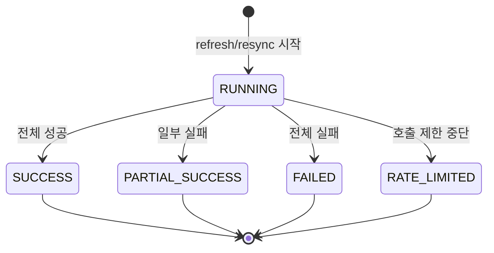
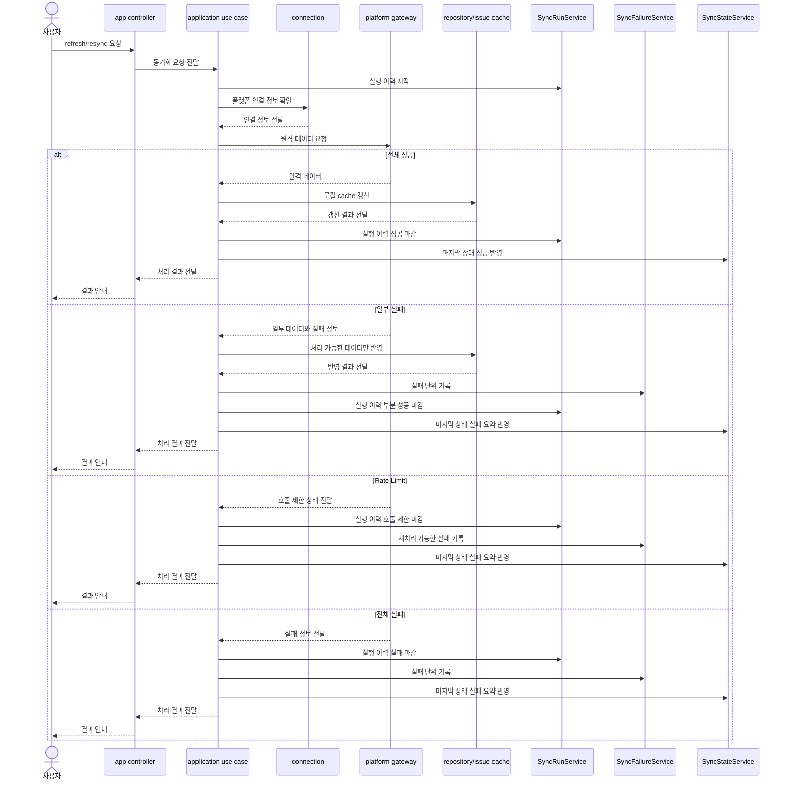

# 14-1 SyncRun 실행 이력 설계

## 요약

이 문서는 동기화의 마지막 상태와 실행 이력을 분리하는 설계를 설명한다.

`SyncState`는 기존 화면/API의 상태 요약으로 유지하고, `SyncRun`은 refresh/resync 실행 이력으로 새로 둔다.

실패 상세와 재처리 정보는 `SyncFailure`에 남겨 운영 복구에 활용한다.

## 작업 배경

`SyncState`는 “마지막 동기화 결과”를 저장한다.

예를 들어 특정 저장소의 이슈 목록을 새로고침했을 때 성공하면 `SUCCESS`, 실패하면 `FAILED` 같은 상태를 남긴다. 프론트는 이 값을 보고 사용자에게 최근 동기화 상태를 보여줄 수 있다.

`SyncState`는 다음 질문에는 잘 답한다.

- 마지막 동기화가 성공했는가?
- 마지막 동기화가 실패했는가?
- 마지막 동기화 시각은 언제인가?
- 마지막 실패 메시지는 무엇인가?

하지만 다음 질문에는 충분히 답하지 못한다.

- 실패한 실행은 몇 번째 refresh였는가?
- 전체 중 몇 건이 성공하고 몇 건이 실패했는가?
- 실패한 항목만 다시 실행할 수 있는가?
- rate limit 때문에 실패했다면 언제 다시 시도할 수 있는가?
- 같은 실패가 반복됐는가?

`SyncRun`은 이 부족한 부분을 채우기 위한 모델이다.

## 설계 목표

이 설계의 목표는 기존 동작을 크게 흔들지 않으면서 운영 복구에 필요한 이력을 추가하는 것이다.

- 기존 화면은 계속 `SyncState`로 마지막 상태를 확인한다.
- 신규 운영/복구 API는 `SyncRun`과 `SyncFailure`로 상세 이력을 확인한다.
- 저장소/이슈/댓글 cache 모듈은 복구 정책을 직접 알지 않는다.
- 동기화 실행 이력과 실패 복구 정책은 application 계층에서 관리한다.
- rate limit이나 부분 실패가 발생해도 기존 GitHub 조회/수정 흐름은 유지한다.

## 주요 개념과 역할 분리

| 구분 | SyncState | SyncRun | SyncFailure |
| --- | --- | --- | --- |
| 목적 | 마지막 상태 요약 | 실행 이력 원본 | 실패/재처리 단위 |
| 생성 단위 | 리소스별 최신 상태 | refresh/resync 실행마다 | 실패 발생마다 |
| 주요 사용자 | 기존 화면, 기존 API | 운영 조회, 복구 API | 재처리 API |
| 정보 수준 | 성공/실패 요약 | 처리 시간, 건수, 최종 상태 | 실패 원인, 재처리 가능 여부 |
| 저장 방식 | 최신 상태 갱신 | 누적 기록 | 해결 전까지 추적 |
| 예시 질문 | 마지막 refresh 성공했나? | 이 실행에서 몇 건 실패했나? | 이 실패를 다시 실행할 수 있나? |

`SyncState`는 기존 화면을 위한 최신 상태이고, `SyncRun`은 실행마다 누적되는 이력이다. `SyncFailure`는 `SyncRun` 안에서 발생한 실패를 따로 남겨 재처리 판단에 사용한다.

## SyncRun 상태 생명주기

`SyncRun`은 실행 시작 시 항상 `RUNNING`으로 생성되고, 실행 결과에 따라 하나의 최종 상태로 마감된다. 마감된 `SyncRun`은 다시 상태를 바꾸기보다, 후속 재처리가 필요하면 새 `SyncRun`을 만들어 추적한다.



이 생명주기를 단순하게 유지하면 실행 이력 조회가 쉬워진다. 재처리나 수동 재동기화는 기존 `SyncRun`을 수정해서 이어 붙이지 않고, 별도의 실행으로 남긴다.

## 설계 결정

### 1. SyncState는 제거하지 않는다

`SyncRun`을 추가하더라도 `SyncState`는 유지한다.

이유는 기존 API와 화면이 `SyncState`를 기준으로 마지막 동기화 상태를 보고 있기 때문이다. `SyncState`를 갑자기 제거하거나 `SyncRun`으로 대체하면 기존 응답 구조와 화면 로직이 함께 바뀐다.

이번 설계의 목적은 기존 흐름을 크게 바꾸는 것이 아니라, 장애 복구를 위한 이력 기반을 추가하는 것이다. 따라서 `SyncState`는 사용자 화면을 위한 요약 상태로 남긴다.

### 2. SyncRun은 실행마다 새로 만든다

`SyncRun`은 상태 저장소가 아니라 실행 로그다.

저장소 refresh, 이슈 refresh, 저장소 resync, 이슈 resync, 실패 재처리는 모두 별도의 실행이다. 각 실행은 시작 시점에 `RUNNING` 상태의 `SyncRun`을 만들고, 끝날 때 최종 상태로 마감한다.

이렇게 하면 나중에 운영자가 시간순으로 동기화 이력을 확인할 수 있다.

```text
10:00 저장소 refresh → SyncRun #1 SUCCESS
10:05 이슈 refresh → SyncRun #2 PARTIAL_SUCCESS
10:10 이슈 retry   → SyncRun #3 SUCCESS
```

### 3. SyncRun을 먼저 마감한 뒤 SyncState에 요약 반영한다

`SyncState`는 `SyncRun`의 결과를 요약한 값이다. 따라서 실행 중간에 `SyncState`를 먼저 바꾸지 않는다.

이 순서를 지키면 `SyncRun`에는 실패로 남아 있는데 `SyncState`는 성공으로 보이는 식의 불일치를 줄일 수 있다.

### 4. 부분 성공과 rate limit은 SyncState에서 실패로 요약한다

1차 구현에서는 기존 `SyncState`의 상태값을 확장하지 않는다.

따라서 `SyncRun`이 `PARTIAL_SUCCESS` 또는 `RATE_LIMITED`로 마감되더라도 기존 `sync-state` API에서는 `FAILED`로 요약한다.

이 결정은 사용자에게 보수적인 상태를 보여주기 위한 것이다. 일부 데이터가 반영됐더라도 누락이 있으면 운영 확인이 필요하다. rate limit도 시간이 지나면 다시 시도할 수 있지만, 현재 요청 관점에서는 동기화가 끝까지 완료되지 않은 상태다.

| SyncRun 마감 상태 | SyncState 반영 | 설명 |
| --- | --- | --- |
| `SUCCESS` | `SUCCESS` | 전체 동기화 성공 |
| `PARTIAL_SUCCESS` | `FAILED` | 일부 성공했지만 누락 가능성 있음 |
| `FAILED` | `FAILED` | 실행 실패 |
| `RATE_LIMITED` | `FAILED` | 호출 제한으로 중단, 이후 복구 필요 |

## 상황별 기록 결과

아래 표는 같은 동기화 요청이라도 결과에 따라 어떤 데이터가 남는지 보여준다. 처음 이 설계를 보는 사람은 이 표를 기준으로 `SyncState`, `SyncRun`, `SyncFailure`의 차이를 빠르게 확인할 수 있다.

| 상황 | SyncRun | SyncFailure | SyncState |
| --- | --- | --- | --- |
| 전체 성공 | `SUCCESS`로 마감 | 생성 안 함 | `SUCCESS`로 요약 |
| 일부 항목 실패 | `PARTIAL_SUCCESS`로 마감 | 실패 항목별 생성 | `FAILED`로 요약 |
| 전체 실행 실패 | `FAILED`로 마감 | 실패 원인 생성 | `FAILED`로 요약 |
| GitHub rate limit | `RATE_LIMITED`로 마감 | `retryable=true`, `nextRetryAt` 기록 | `FAILED`로 요약 |
| 실패 재처리 성공 | 새 `SyncRun=SUCCESS` 생성 | 기존 실패 `resolvedAt` 기록 | 관련 리소스 상태 갱신 |

## 처리 흐름

아래 시퀀스는 refresh/resync 요청에서 `SyncRun`, `SyncFailure`, `SyncState`가 어떤 순서로 갱신되는지 보여준다.



성공 흐름은 기존 refresh 동작에 실행 이력 기록이 추가된 형태다. 일부 실패와 rate limit은 기존 `sync-state` API에서는 실패로 요약하지만, 상세 원인은 `SyncRun`과 `SyncFailure`에서 확인한다.

## API 영향

기존 `sync-state` 조회 API는 계속 `SyncState`를 반환한다. 따라서 기존 화면은 성공/실패 요약을 그대로 사용할 수 있다.

새 운영/복구 API는 `SyncRun`과 `SyncFailure`를 기준으로 실행 이력과 실패 원인을 제공한다. 기존 화면이 “현재 상태”를 보여준다면, 신규 API는 “무슨 일이 있었는지”를 보여주는 역할이다.

## 모듈 책임

| 모듈 | 책임 |
| --- | --- |
| app | 기존 API 응답 유지, 신규 조회 API 제공 |
| application | `SyncRun` 생성/마감, `SyncFailure` 기록, `SyncState` 요약 반영 |
| connection | 현재 사용자의 token/baseUrl 제공 |
| platform | 원격 API 호출, rate limit 정보와 실패 정보 반환 |
| repository | 저장소 cache 반영 결과 제공 |
| issue | 이슈 cache 반영 결과 제공 |
| comment | 댓글 cache 반영 결과 제공 |

repository / issue / comment 모듈은 `SyncRun`이나 `SyncFailure` 저장 정책을 직접 알지 않는다. 이 모듈들은 cache 반영과 조회 책임에 집중한다. 실행 이력과 복구 정책은 application 계층이 관리한다.

## 구분 기준

- `SyncState`는 최신 상태이고, `SyncRun`은 실행 이력이다.
- `SyncRun`은 실패 상세 목록을 모두 품지 않고, 실패 단위는 `SyncFailure`로 분리한다.
- `SyncFailure`는 재처리 판단과 해결 추적을 위한 단위다.
- `retry`는 실패한 `SyncFailure`를 다시 실행하는 흐름이다.
- `resync`는 특정 저장소나 이슈를 원격 상태와 다시 맞추는 수동 보정 흐름이다.
- `PARTIAL_SUCCESS`는 일부 데이터가 반영됐더라도 기존 `SyncState`에서는 `FAILED`로 요약한다.
- 재처리 성공은 기존 `SyncRun`을 성공으로 바꾸는 것이 아니라 새 `SyncRun`으로 남긴다.

## 설계 기준

- refresh/resync 시작 시 `SyncRun`을 먼저 생성한다.
- 실행 종료 후 `SyncRun`을 먼저 마감한다.
- 마감된 `SyncRun` 결과를 `SyncState`에 요약 반영한다.
- `SyncState`에는 마지막 상태 요약만 저장한다.
- 실패 상세는 `SyncFailure`에 저장한다.
- repository / issue / comment 모듈에 복구 정책을 넣지 않는다.
- 기존 `sync-state` 응답 구조는 가능한 한 유지한다.

## 확인 기준

- 성공한 동기화는 `SyncRun=SUCCESS`, `SyncState=SUCCESS`로 남는다.
- 일부 실패한 동기화는 `SyncRun=PARTIAL_SUCCESS`, `SyncState=FAILED`로 남는다.
- rate limit으로 중단된 동기화는 `SyncRun=RATE_LIMITED`, `SyncState=FAILED`로 남는다.
- 기존 `sync-state` 조회 API 응답은 깨지지 않는다.
- 상세 실패 원인은 신규 이력 조회 API에서 확인할 수 있다.
- repository / issue / comment 모듈이 `SyncRun` 저장소를 직접 호출하지 않는다.

## 관련 문서

- [14. 플랫폼별 API Rate Limit 관리 + 장애 복구 시스템 설계 계획](./14-platform-rate-limit-recovery-plan.md)
- 14-2 플랫폼 Rate Limit 설계: GitHub rate limit 감지와 중립 모델 변환
- 14-3 실패 기록과 재처리 설계: 실패 단위 저장과 수동 retry 흐름
- 14-4 수동 재동기화 설계: 저장소/이슈 단위 cache 보정 흐름
