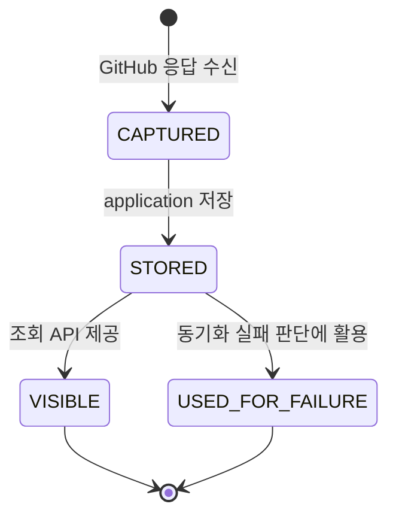
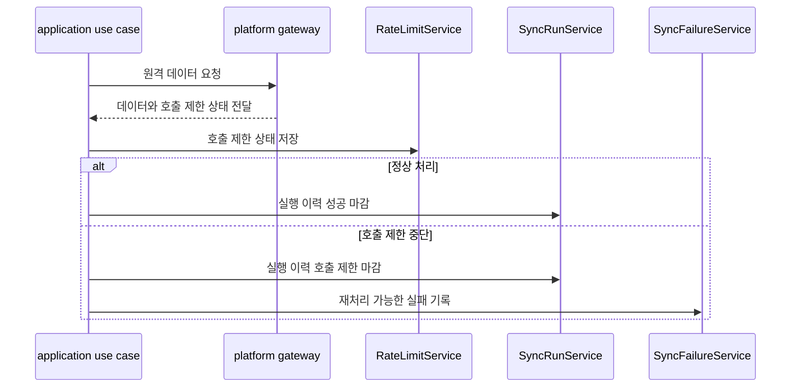

# 14-2 플랫폼 Rate Limit 설계

## 요약

이 문서는 외부 플랫폼 API의 호출 제한 정보를 수집하고 저장하는 설계를 설명한다.

platform 모듈은 GitHub 응답에서 rate limit 정보를 추출하고, application 계층은 이를 저장해 운영 상태로 제공한다.

rate limit으로 동기화가 중단되면 실행 이력과 실패 기록에 복구 가능한 상태로 남긴다.

## 작업 배경

GitHub API는 일정 시간 안에 호출할 수 있는 횟수를 제한한다. 제한에 가까워지거나 제한에 도달하면 동기화가 중단될 수 있다.

호출 제한 상태를 기록하지 않으면 사용자는 같은 요청을 반복하고, 서버는 실패를 계속 만들 수 있다. 따라서 원격 API 응답에서 호출 제한 정보를 수집하고, 동기화 실패와 연결할 수 있어야 한다.

## 설계 목표

- GitHub rate limit 정보를 공통 모델로 다룬다.
- platform 모듈은 헤더를 해석하고, application 계층은 저장과 조회를 맡는다.
- rate limit 실패는 일반 실패와 구분한다.
- 재처리 가능 시각을 남겨 사용자가 후속 조치를 판단할 수 있게 한다.
- GitLab 등 다른 플랫폼 확장은 TODO로 남긴다.

## 주요 개념과 역할 분리

| 구분 | RateLimitSnapshot | RateLimitService | SyncFailure |
| --- | --- | --- | --- |
| 목적 | 호출 제한 상태 표현 | snapshot 저장/조회 | rate limit 실패 복구 단위 |
| 생성 위치 | platform adapter | application 계층 | application 계층 |
| 주요 정보 | 한도, 남은 횟수, 초기화 시각 | 최근 snapshot | retryable, nextRetryAt |
| 사용 목적 | API 응답 해석 | 운영 상태 제공 | 재처리 판단 |

`RateLimitSnapshot`은 호출 제한 상태를 나타내고, `SyncFailure`는 그 호출 제한 때문에 실패한 동기화를 복구하기 위한 단위다.

## Rate Limit 상태 생명주기

rate limit snapshot은 자체로 복구 대상은 아니다. 복구가 필요한 경우에는 `SyncFailure`와 `SyncRun`에 실패 상태가 별도로 남는다.

## 설계 결정

### 1. platform은 저장하지 않는다

platform 모듈은 GitHub 응답을 해석해 중립 모델을 반환한다. snapshot 저장은 application 계층이 담당한다.

### 2. GitHub 헤더는 공통 모델로 감싼다

GitHub 전용 헤더 이름을 application 흐름에 직접 퍼뜨리지 않는다. application 계층은 `RateLimitSnapshot`만 보고 판단한다.

### 3. rate limit 실패는 재처리 가능한 실패로 남긴다

호출 제한은 시간이 지나면 해제될 수 있다. 따라서 `SyncFailure.retryable=true`와 `nextRetryAt`을 남겨 이후 수동 재처리할 수 있게 한다.

### 4. 조회 API는 최신 상태 확인용이다

rate limit 조회 API는 현재 호출 여유를 확인하는 API다. 실패 복구 실행은 retry/resync API가 담당한다.

## 상황별 기록 결과

| 상황 | RateLimitSnapshot | SyncRun | SyncFailure |
| --- | --- | --- | --- |
| 정상 API 응답 | 저장 | 성공 또는 진행 중 | 생성 안 함 |
| 남은 호출 수 낮음 | 저장 | 필요 시 주의 상태로 활용 | 보통 생성 안 함 |
| rate limit 도달 | 저장 | `RATE_LIMITED` | `retryable=true`, `nextRetryAt` 기록 |
| snapshot 없음 | 없음 | 영향 없음 | 영향 없음 |

## 처리 흐름

## API 영향

| Method | Path | 설명 | 주요 파라미터 | 응답 |
| --- | --- | --- | --- | --- |
| <strong>GET</strong> | `/api/platforms/{platform}/rate-limit` | 현재 플랫폼 연결 기준 최신 rate limit 상태 조회 | Path: `platform` | 최근 `RateLimitSnapshot`, 없으면 `204 No Content` |

## 모듈 책임

| 모듈 | 책임 |
| --- | --- |
| platform | GitHub 응답에서 rate limit 정보 추출 |
| application | snapshot 저장, 조회, 실패 판단 연결 |
| app | rate limit 조회 API 제공 |
| connection | 현재 플랫폼 연결 정보 제공 |
| repository / issue / comment | rate limit 정책을 직접 판단하지 않음 |

## 구분 기준

- `RateLimitSnapshot`은 호출 제한 상태이고, `SyncFailure`는 복구할 실패 단위다.
- platform은 헤더를 해석하지만 저장하지 않는다.
- application은 snapshot을 저장하지만 GitHub 헤더 이름에 직접 의존하지 않는다.
- rate limit 조회는 상태 확인이고, retry는 실패 복구다.

## 설계 기준

- GitHub 응답에서 얻은 호출 제한 정보는 공통 모델로 변환한다.
- snapshot 저장은 application 계층에서 처리한다.
- rate limit 실패는 `SyncRun=RATE_LIMITED`로 남긴다.
- 재처리 가능한 실패에는 `nextRetryAt`을 남긴다.
- GitLab 매핑은 후속 작업으로 분리한다.

## 확인 기준

- GitHub API 응답 후 최신 rate limit snapshot을 조회할 수 있다.
- snapshot이 없으면 조회 API는 빈 상태를 표현한다.
- rate limit 실패는 일반 실패와 구분된다.
- rate limit 실패는 재처리 가능한 실패로 남는다.
- platform 모듈이 application 저장소를 직접 호출하지 않는다.

## 관련 문서

- [14. 플랫폼별 API Rate Limit 관리 + 장애 복구 시스템 설계 계획](./14-platform-rate-limit-recovery-plan.md)
- [14-1 SyncRun 실행 이력 설계](./14-1-sync-run-state-flow.md)
- [14-3 실패 기록과 재처리 설계](./14-3-sync-failure-retry-design.md)

