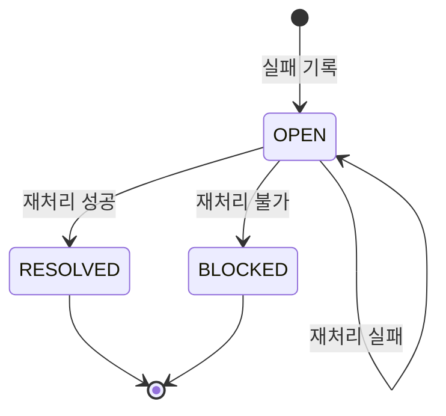
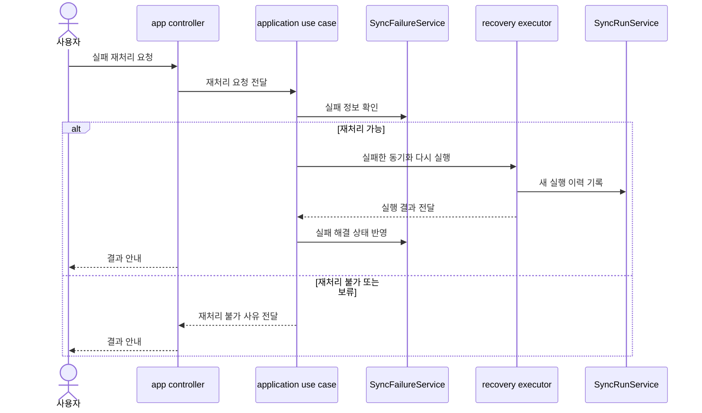

# 14-3 실패 기록과 재처리 설계

## 요약

이 문서는 동기화 실패를 별도 단위로 기록하고 다시 실행하는 설계를 설명한다.

`SyncFailure`는 실패 원인, 재처리 가능 여부, 재처리 가능 시각을 남기는 복구 기준이다.

재처리는 기존 실패를 지우거나 기존 실행을 수정하지 않고, 새 `SyncRun`으로 남긴다.

## 작업 배경

동기화는 원격 API 호출, cache 반영, 권한 확인 등 여러 단계로 이루어진다. 실패가 발생했을 때 마지막 상태만 남기면 어떤 작업을 다시 실행해야 하는지 알기 어렵다.

따라서 실패를 `SyncRun`과 분리된 `SyncFailure`로 남기고, 운영자가 재처리 가능한 실패만 선택해 다시 실행할 수 있어야 한다.

## 설계 목표

- 실패 원인과 재처리 가능 여부를 기록한다.
- 해결되지 않은 실패를 조회할 수 있게 한다.
- 재처리 성공/실패를 추적한다.
- 자동 queue 없이도 수동 복구 경로를 제공한다.
- 실패 기록 책임은 application 계층에 둔다.

## 주요 개념과 역할 분리

| 구분 | SyncRun | SyncFailure | Retry |
| --- | --- | --- | --- |
| 목적 | 실행 전체 이력 | 실패/재처리 단위 | 실패 재실행 |
| 생성 단위 | 동기화 실행마다 | 실패 발생마다 | 사용자 요청마다 |
| 주요 정보 | 상태, 처리 건수 | 실패 유형, retryable, nextRetryAt | 새 실행 결과 |
| 결과 | 성공/실패 이력 | 해결 또는 미해결 | 새 `SyncRun` |

`SyncRun`은 실행 전체를 설명하고, `SyncFailure`는 그 실행 중 복구가 필요한 실패를 설명한다.

## SyncFailure 상태 생명주기

`BLOCKED`는 설명용 상태다. 실제 표현은 `retryable=false`와 미해결 상태의 조합이 될 수 있다.

## 설계 결정

### 1. 실패는 SyncRun과 분리한다

실행 전체 상태와 재처리 대상은 다르다. 실패 단위를 별도로 남겨야 나중에 특정 실패만 다시 실행할 수 있다.

### 2. 재처리 가능 여부를 명시한다

모든 실패가 다시 실행 가능한 것은 아니다. 권한 문제나 인증 문제는 사용자 조치가 먼저 필요할 수 있다.

### 3. 재처리 결과는 새 SyncRun으로 남긴다

기존 `SyncRun`을 성공으로 바꾸면 이력이 왜곡된다. retry는 새로운 실행이므로 새 `SyncRun`으로 남긴다.

### 4. 해결된 실패도 삭제하지 않는다

`resolvedAt`을 남겨 어떤 실패가 언제 해결됐는지 추적한다.

## 상황별 기록 결과

| 상황 | SyncRun | SyncFailure | 후속 조치 |
| --- | --- | --- | --- |
| 일시 장애 | `FAILED` | `retryable=true` | 나중에 retry |
| rate limit | `RATE_LIMITED` | `retryable=true`, `nextRetryAt` 기록 | 제한 해제 후 retry |
| 권한 오류 | `FAILED` | `retryable=false` | PAT/권한 확인 |
| retry 성공 | 새 `SyncRun=SUCCESS` | 기존 실패 `resolvedAt` 기록 | 완료 |
| retry 실패 | 새 `SyncRun=FAILED` | 기존 실패 `retryCount` 증가 | 원인 재확인 |

## 처리 흐름

## API 영향

| Method | Path | 설명 | 주요 파라미터 | 응답 |
| --- | --- | --- | --- | --- |
| <strong>GET</strong> | `/api/sync-failures` | 해결되지 않은 실패와 재처리 가능 여부 조회 | Query: `platform`, `retryable`, `resolved`, `resourceType` | `SyncFailure` 목록 |
| <strong>POST</strong> | `/api/sync-failures/{failureId}/retry` | 재처리 가능한 실패를 선택해 다시 실행 | Path: `failureId` | 새 `SyncRun` 결과 |

## 모듈 책임

| 모듈 | 책임 |
| --- | --- |
| app | 실패 조회와 재처리 API 제공 |
| application | 실패 기록, 재처리 가능 여부 판단, retry 실행 조립 |
| platform | 원격 API 실패 정보 제공 |
| repository / issue / comment | cache 반영 API 제공 |

## 구분 기준

- `SyncRun`은 실행 전체이고, `SyncFailure`는 실패 단위다.
- retry는 `SyncFailure`를 기준으로 다시 실행하는 흐름이다.
- resync는 특정 리소스를 원격 상태와 맞추는 보정 흐름이다.
- 해결된 실패는 삭제하지 않고 해결 시각을 남긴다.

## 설계 기준

- 실패 발생 시 실패 유형과 재처리 가능 여부를 남긴다.
- rate limit 실패는 재처리 가능한 실패로 분류한다.
- 재처리 실행은 새 `SyncRun`으로 기록한다.
- 재처리 성공 시 기존 실패에 해결 시각을 남긴다.
- 재처리 실패 시 retry count와 실패 메시지를 갱신한다.

## 확인 기준

- 실패한 동기화는 `SyncFailure`로 조회할 수 있다.
- 재처리 가능한 실패와 불가능한 실패가 구분된다.
- 재처리 성공은 새 `SyncRun`으로 남는다.
- 기존 실패는 해결 상태로 표시된다.
- retry와 resync의 의미가 섞이지 않는다.

## 관련 문서

- [14-1 SyncRun 실행 이력 설계](./14-1-sync-run-state-flow.md)
- [14-2 플랫폼 Rate Limit 설계](./14-2-platform-rate-limit-design.md)
- [14-4 수동 재동기화 설계](./14-4-manual-resync-design.md)

