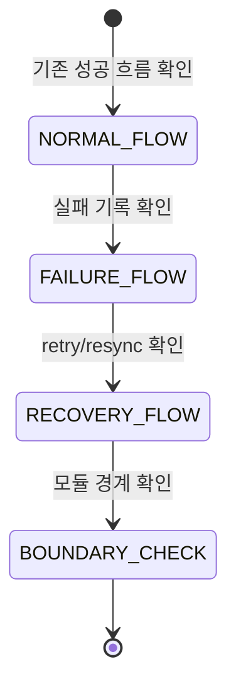
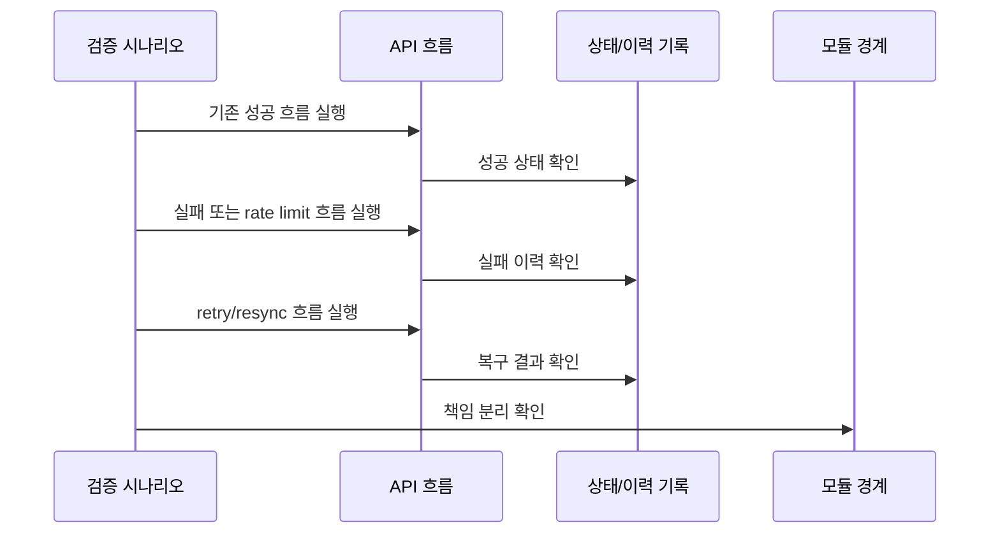

# 14-6 Rate Limit 복구 검증 계획

## 요약

이 문서는 rate limit과 복구 설계가 의도대로 동작하는지 확인하는 기준을 설명한다.

검증은 기존 GitHub 흐름을 깨지 않는지, 실행 이력과 실패 기록이 남는지, 복구 API가 올바르게 동작하는지를 중심으로 본다.

테스트 구현 세부보다 어떤 상황을 반드시 확인해야 하는지에 초점을 둔다.

## 작업 배경

rate limit 복구 설계는 여러 모듈과 API에 걸쳐 있다. 모델만 추가해서는 충분하지 않고, 성공/실패/rate limit/retry/resync 흐름이 함께 검증되어야 한다.

또한 기존 저장소, 이슈, 댓글 흐름이 유지되는지도 함께 확인해야 한다.

## 설계 목표

- 기존 GitHub 기능 회귀를 방지한다.
- `SyncRun`, `SyncFailure`, `RateLimitSnapshot` 기록을 확인한다.
- retry와 resync가 새 실행 이력으로 남는지 확인한다.
- 모듈 책임이 섞이지 않는지 확인한다.
- API 응답이 사용자의 후속 조치 판단에 필요한 정보를 제공하는지 확인한다.

## 주요 개념과 역할 분리

| 구분 | 회귀 검증 | 복구 검증 | 경계 검증 |
| --- | --- | --- | --- |
| 목적 | 기존 기능 유지 | 실패/복구 흐름 확인 | 모듈 책임 유지 |
| 대상 | 저장소/이슈/댓글 흐름 | `SyncRun`, `SyncFailure`, API | 모듈 의존 방향 |
| 확인 질문 | 기존 기능이 깨지지 않았나? | 복구 정보가 남는가? | 책임이 섞이지 않았나? |

검증 계획은 코드 위치보다 확인해야 할 상황과 기대 결과를 기준으로 정리한다.

## 검증 상태 생명주기

## 설계 결정

### 1. 기존 성공 흐름을 먼저 확인한다

복구 기능이 추가되어도 기존 저장소/이슈/댓글 흐름이 유지되어야 한다.

### 2. 실패는 기록 결과까지 확인한다

실패 응답만 확인하지 않고 `SyncRun`, `SyncFailure`, `SyncState` 결과를 함께 확인한다.

### 3. retry와 resync는 별도 흐름으로 검증한다

두 기능은 목적과 기준 데이터가 다르므로 같은 테스트로 뭉개지 않는다.

### 4. 모듈 경계를 검증한다

repository / issue / comment 모듈이 복구 정책이나 sync 이력 저장소를 직접 알지 않도록 확인한다.

## 상황별 기록 결과

| 상황 | 확인 대상 | 기대 결과 |
| --- | --- | --- |
| refresh 성공 | `SyncRun`, `SyncState` | 성공 이력과 성공 요약 |
| refresh 실패 | `SyncRun`, `SyncFailure`, `SyncState` | 실패 이력과 실패 요약 |
| rate limit | `RateLimitSnapshot`, `SyncFailure` | 호출 제한 상태와 재처리 가능 실패 |
| retry 성공 | `SyncRun`, `SyncFailure` | 새 실행 성공과 기존 실패 해결 |
| resync 성공 | `SyncRun`, cache | 새 실행 성공과 cache 보정 |

## 처리 흐름

## API 영향

| Method | Path | 설명 | 주요 파라미터 | 응답 |
| --- | --- | --- | --- | --- |
| <strong>GET</strong> | `/api/sync-runs` | 실행 이력 검증에 사용 | Query: `platform`, `resourceType`, `status`, `from`, `to` | `SyncRun` 목록 |
| <strong>GET</strong> | `/api/sync-failures` | 실패 기록 검증에 사용 | Query: `platform`, `retryable`, `resolved`, `resourceType` | `SyncFailure` 목록 |
| <strong>POST</strong> | `/api/sync-failures/{failureId}/retry` | 재처리 검증에 사용 | Path: `failureId` | 새 `SyncRun` 결과 |
| <strong>POST</strong> | `/api/platforms/{platform}/repositories/{repositoryId}/resync` | 저장소 보정 검증에 사용 | Path: `platform`, `repositoryId` | 새 `SyncRun` 결과 |
| <strong>POST</strong> | `/api/platforms/{platform}/repositories/{repositoryId}/issues/{issueNumberOrKey}/resync` | 이슈 보정 검증에 사용 | Path: `platform`, `repositoryId`, `issueNumberOrKey` | 새 `SyncRun` 결과 |

## 모듈 책임

| 모듈 | 검증 관점 |
| --- | --- |
| app | API 응답 계약 유지 |
| application | 실행 이력, 실패 기록, 복구 흐름 조립 |
| platform | rate limit 정보 전달 |
| repository / issue / comment | cache 반영 책임 유지 |

## 구분 기준

- 성공 흐름 검증은 기존 기능 회귀 방지다.
- 실패 흐름 검증은 기록과 응답 확인이다.
- retry 검증은 실패 단위 재실행 확인이다.
- resync 검증은 리소스 단위 cache 보정 확인이다.
- 경계 검증은 책임 분리 확인이다.

## 설계 기준

- 실제 GitHub 호출에 의존하지 않고 실패와 rate limit 상황을 재현한다.
- 성공/실패/rate limit/retry/resync를 각각 별도 상황으로 확인한다.
- 기존 `sync-state` API 응답 유지 여부를 확인한다.
- 실패 응답에는 후속 조치 판단 정보가 있어야 한다.
- 모듈 책임을 테스트나 구조 검증으로 확인한다.

## 확인 기준

- 기존 저장소/이슈/댓글 흐름이 유지된다.
- 실패한 실행은 조회 API에서 확인할 수 있다.
- 재처리 가능한 실패와 불가능한 실패가 구분된다.
- resync 후 cache가 원격 상태와 맞춰진다.
- repository / issue / comment 모듈이 복구 정책을 직접 알지 않는다.

## 관련 문서

- [14-1 SyncRun 실행 이력 설계](./14-1-sync-run-state-flow.md)
- [14-2 플랫폼 Rate Limit 설계](./14-2-platform-rate-limit-design.md)
- [14-3 실패 기록과 재처리 설계](./14-3-sync-failure-retry-design.md)
- [14-4 수동 재동기화 설계](./14-4-manual-resync-design.md)
- [14-5 복구 API 설계](./14-5-recovery-api-design.md)

