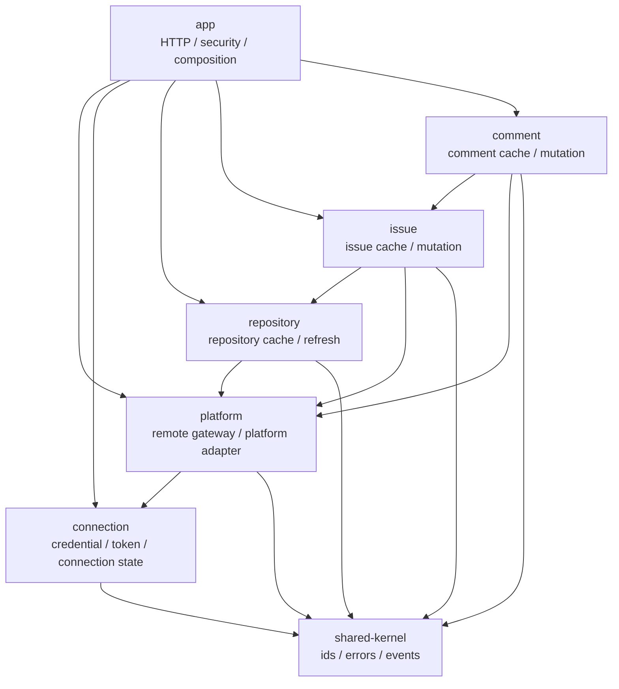
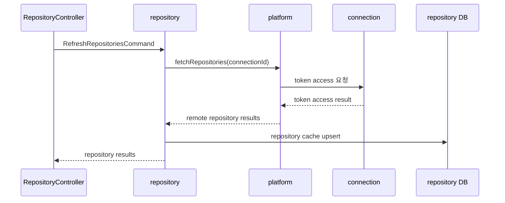
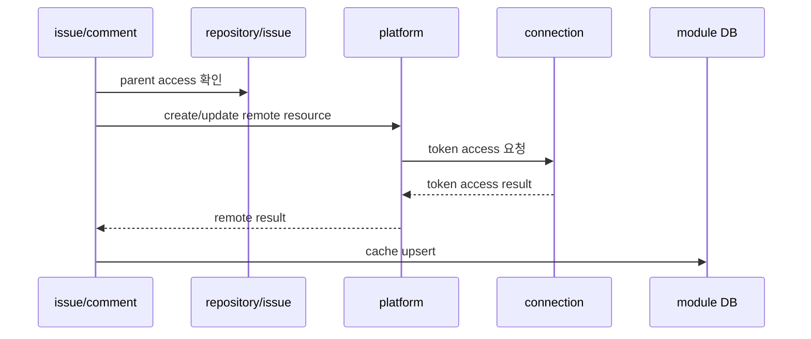

# Platform Structure Improvement Plan

## Summary

- 목적: 13번 문서 기준 멀티 모듈 전환 이후 발견된 구조 개선 후보를 별도 후속 설계로 정리한다.
- 기준: 13번 문서는 진행 중인 전환 기준으로 유지하고, 이 문서는 다음 구조 개선 방향만 제안한다.
- 핵심: 목표 모듈 그래프는 실제 모듈명으로 표현하고, 공개 API 경계는 설명으로 분리한다.
- 핵심: 원격 호출에 필요한 token/baseUrl 접근은 `platform -> connection` 경로로 숨긴다.
- 원칙: repository / issue / comment 모듈은 GitHub/GitLab 구현뿐 아니라 credential 접근 방식도 모르게 한다.

## 1. 현재 구조에서 보이는 문제

- 문제: 13번 목표 그래프의 노드가 `*.api`로 표시되어 모듈과 공개 API 경계가 섞여 보인다.
- 문제: repository / issue / comment가 `platform`과 `connection`을 동시에 의존해 그래프가 복잡하다.
- 문제: 업무 모듈이 token access 흐름을 알면 외부 호출 세부 절차가 업무 유스케이스에 새어 나온다.
- 문제: `connection -> platform`과 `platform -> connection` 후보가 함께 존재하면 장기적으로 순환 의존 위험이 생긴다.

## 2. 개선 목표

- 목표: 그래프 노드는 Gradle 모듈 기준으로 표현한다.
- 목표: 모듈 간 호출 제한은 `*.api` 공개 패키지 규칙으로 별도 설명한다.
- 목표: 원격 호출은 업무 모듈이 `platform.api`에 요청하고, platform이 connection에서 credential을 얻는다.
- 목표: connection은 token 저장, 암호화, 연결 상태, token access 제공에 집중한다.
- 목표: platform은 GitHub/GitLab adapter와 원격 API 호출 orchestration을 소유한다.

## 3. 목표 의존 방향

- 노드: Gradle 모듈
- 호출: 각 모듈의 `*.api` 패키지에 있는 public facade / command / query / result DTO로 제한
- 금지: repository / issue / comment가 `connection.api`를 직접 호출하는 구조
- 허용: app이 연결 등록, 삭제, 상태 조회를 위해 `connection.api` 호출
- 허용: platform이 원격 호출 직전에 `connection.api`로 token access 조회

## 4. 모듈 책임 조정

### 4.1 connection

- 소유: PAT, base URL, 암호화 토큰, 연결 상태
- 제공: 연결 등록, 연결 삭제, 연결 상태 조회, token access
- 금지: GitHub/GitLab repository, issue, comment API 호출
- 금지: 업무 캐시 모듈의 유스케이스 orchestration

### 4.2 platform

- 소유: GitHub/GitLab client, mapper, pagination, rate limit 대응, remote DTO 변환
- 제공: repository / issue / comment 원격 API의 플랫폼 중립 facade
- 사용: 원격 호출에 필요한 credential을 `connection.api`로 조회
- 금지: repository / issue / comment 캐시 write model 소유

### 4.3 repository / issue / comment

- 소유: 각자 cache entity, JPA repository, 업무 유스케이스
- 사용: 원격 조회와 변경은 `platform.api`로 요청
- 사용: 상위 업무 관계 확인은 필요한 공개 API만 사용
- 금지: token 복호화, base URL 정규화, connection DB 직접 조회

## 5. 대표 흐름

### 5.1 저장소 refresh

- repository: 저장소 캐시와 refresh 유스케이스만 소유
- platform: token access 조회와 GitHub/GitLab 원격 호출 소유
- connection: token 원문과 암호화 저장 방식 소유
- 모듈 간 호출은 각 모듈의 `*.api` 공개 계약을 통해 수행

### 5.2 이슈 / 댓글 변경

- issue: repository 존재와 접근 가능 여부만 확인
- comment: issue 존재와 접근 가능 여부만 확인
- issue/comment: token/baseUrl 조회 방식은 모름
- 모듈 간 호출은 각 모듈의 `*.api` 공개 계약을 통해 수행

## 6. PAT 등록 흐름 선택지

`platform -> connection`을 원칙으로 잡으면 PAT 등록 시 token 검증 흐름에서 순환 의존을 주의해야 한다.

### 선택지 A: app 조립 방식

- 흐름: app -> platform token 검증, app -> connection 저장
- 장점: connection -> platform 의존 제거
- 단점: app이 등록 절차를 두 단계로 조립
- 판단: 순환 의존 방지에는 가장 단순

### 선택지 B: connection 등록 내부에서 platform 검증

- 흐름: app -> connection, connection -> platform 검증
- 장점: 등록 유스케이스가 connection에 모임
- 단점: 평상시 원격 호출은 platform -> connection이므로 순환 의존이 생김
- 판단: Gradle 모듈 기준으로는 피하는 편이 안전

### 선택지 C: verification port 분리

- 흐름: connection -> token-verifier port, platform adapter가 구현
- 장점: 등록 유스케이스를 connection에 유지 가능
- 단점: 포트/어댑터가 늘어나고 초기 구조가 복잡해짐
- 판단: 등록 정책이 복잡해질 때 검토

1차 개선안은 선택지 A를 기준으로 한다.

## 7. 전환 순서 제안

1. 문서 정리
   - 13번은 현재 전환 기준으로 유지
   - 14번에서 개선 목표와 후속 전환 순서 관리

2. platform remote API 재정의
   - remote command에 `connectionId` 또는 connection reference 전달
   - token/baseUrl 파라미터를 업무 모듈 API에서 제거

3. platform 내부 credential 조회 추가
   - platform application service가 `connection.api`로 token access 조회
   - GitHub/GitLab adapter에는 검증된 credential만 전달

4. 업무 모듈의 connection 의존 제거
   - repository / issue / comment에서 `connection.api` 직접 호출 제거
   - Gradle 의존성에서 connection 제거

5. PAT 등록 흐름 정리
   - app 조립 방식 또는 verification port 방식 중 하나로 확정
   - connection -> platform 직접 의존 제거 여부 결정

6. 모듈 경계 테스트 갱신
   - repository / issue / comment -> connection 금지
   - platform -> connection 허용
   - GitHub/GitLab adapter 외부 참조 금지 유지

## 8. 검증 기준

- repository / issue / comment Gradle 모듈이 connection 모듈에 의존하지 않는다.
- repository / issue / comment 코드에서 token, baseUrl, encrypted token 타입이 사라진다.
- platform 모듈만 GitHub/GitLab adapter와 connection token access를 함께 안다.
- connection 모듈은 GitHub/GitLab repository, issue, comment API를 모른다.
- 기존 GitHub 저장소 refresh, 이슈 생성/수정, 댓글 작성 흐름은 동일하게 동작한다.

## 9. 보류 사항

- PAT 등록 token 검증을 app 조립으로 둘지, verification port로 분리할지 확정 필요
- `connectionId`를 platform remote command에 직접 노출할지, 공통 reference 타입으로 감쌀지 결정 필요
- 현재 Gradle 의존성과 코드 구조가 13번 기준으로 이미 진행된 상태이므로 실제 변경은 별도 단계로 작게 나누어야 함
