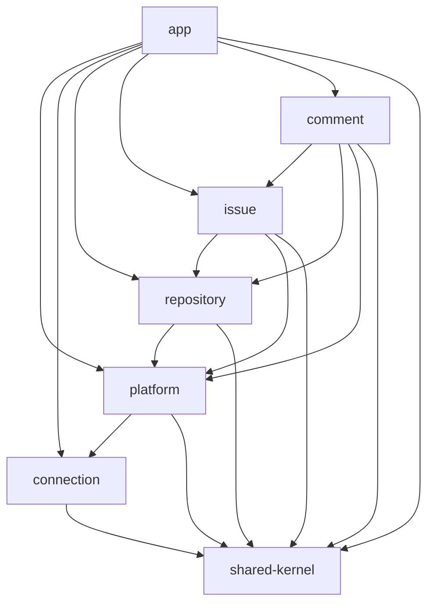
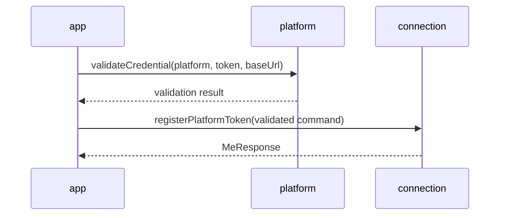
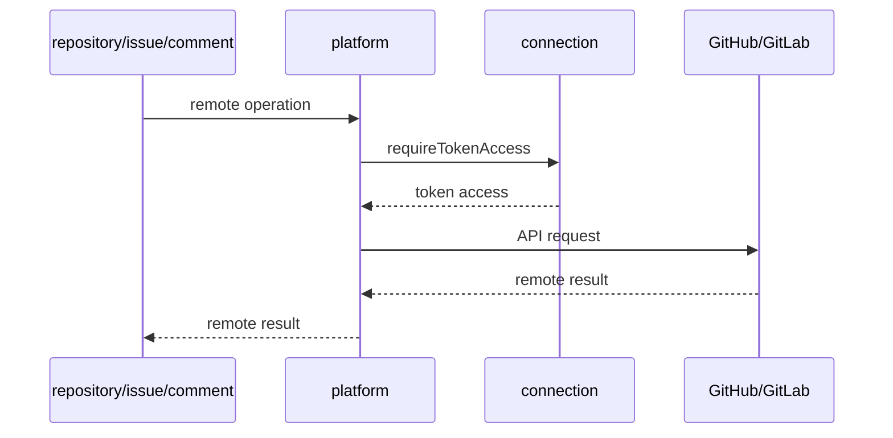

# Platform Module Service Structure

## Summary

- 목적: platform/connection 중심 구조 전환 이후 각 모듈과 서비스 책임을 정리한다.
- 기준: 원격 API 호출은 `platform`이 소유하고, credential 저장과 token access는 `connection`이 소유한다.
- 원칙: repository / issue / comment는 token, baseUrl, 암호화 저장 방식을 모른다.
- 검증: 모듈 경계 테스트가 Gradle 의존성과 금지 import를 함께 확인한다.

## 1. 전체 의존 방향

- app: HTTP 조립, 등록 흐름 조립
- platform: credential 검증, 원격 API 호출, adapter 선택
- connection: token 저장, 암호화, 현재 연결 조회, token access 제공
- repository / issue / comment: 자기 cache와 업무 유스케이스 소유
- shared-kernel: 공통 식별자, sync 상태, 최소 공통 타입

## 2. app

- 주요 서비스: controller 계층
- 역할: REST 요청을 각 모듈 public API로 연결
- PAT 등록: platform 검증 후 connection 저장 호출
- 금지: connection DB, platform adapter, 업무 모듈 internal 직접 접근

### PAT 등록 흐름

## 3. platform

- 주요 서비스: `PlatformCredentialFacade`, `PlatformRemoteFacade`
- `PlatformCredentialFacade`: PAT/baseUrl 검증, remote user profile 조회, GitLab baseUrl 정규화
- `PlatformRemoteFacade`: repository/issue/comment 원격 API 호출의 단일 관문
- 내부 구성: `PlatformGatewayResolver`, GitHub/GitLab gateway
- 사용 의존: connection token access, shared PlatformType

### 원격 호출 흐름

## 4. connection

- 주요 서비스: `PlatformConnectionFacade`, `AuthService`, `PatCryptoService`
- `PlatformConnectionFacade`: 연결 등록, 상태 조회, logout, token access 공개 API
- `AuthService`: 연결 저장/조회, 세션 기준 현재 연결 확인
- `PatCryptoService`: token 암호화/복호화
- 금지: GitHub/GitLab adapter 호출
- 금지: repository/issue/comment 캐시 직접 접근

## 5. repository

- 주요 서비스: `RepositoryFacade`, `RepositoryService`
- 소유: repository cache, repository refresh, repository access 확인
- 원격 호출: `PlatformRemoteFacade` 사용
- 부모 확인: 없음
- 금지: `PlatformConnectionFacade`, `TokenAccess`, platform gateway 직접 사용

## 6. issue

- 주요 서비스: `IssueFacade`, `IssueService`
- 소유: issue cache, issue refresh, issue 생성/수정/닫기
- 부모 확인: `RepositoryFacade`로 repository 접근 가능 여부 확인
- 원격 호출: `PlatformRemoteFacade` 사용
- 금지: connection 직접 의존, repository entity 직접 참조

## 7. comment

- 주요 서비스: `CommentFacade`, `CommentService`
- 소유: comment cache, comment refresh, comment 작성
- 부모 확인: `IssueFacade`로 issue 접근 가능 여부 확인, 필요 시 `RepositoryFacade`로 repository 정보 확인
- 원격 호출: `PlatformRemoteFacade` 사용
- 금지: connection 직접 의존, issue entity 직접 참조

## 8. shared-kernel

- 주요 서비스: `SyncStateService`
- 소유: sync 상태, 공통 exception, 공통 response DTO, `PlatformType`
- 제한: 업무 규칙과 외부 API DTO를 추가하지 않는다.
- 후속 후보: `PlatformType` 패키지명을 shared-kernel 성격에 맞게 정리

## 9. 검증 기준

- repository / issue / comment는 connection 모듈에 Gradle 의존을 갖지 않는다.
- connection은 platform 모듈에 Gradle 의존을 갖지 않는다.
- platform만 connection token access와 GitHub/GitLab gateway를 함께 안다.
- app은 각 모듈의 public API만 호출한다.
- 전체 검증 명령: `.\gradlew.bat test`
