# Use Case Sequence Diagrams

## 1. 개요

이 문서는 `06-core-use-cases.md`의 각 유스케이스가 현재 구현에서 어떻게 동작하는지 시퀀스 다이어그램으로 정리한다.

공통 참여자는 다음과 같다.

- User: 사용자
- Frontend: React 화면과 API client
- App: Spring MVC controller
- Connection: connection 모듈
- Repository: repository 모듈
- Issue: issue 모듈
- Comment: comment 모듈
- Platform: platform facade/gateway
- DB: 로컬 DB와 캐시
- Remote: GitHub/GitLab API

## UC-01 플랫폼 토큰 등록

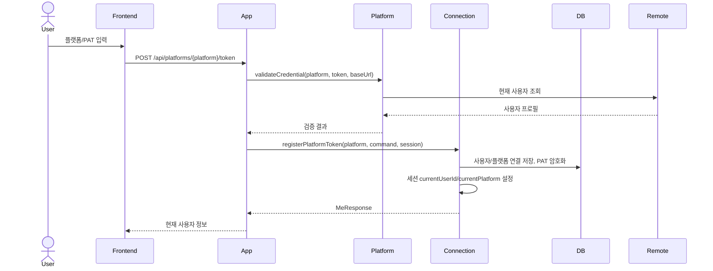

## UC-02 토큰 상태 조회

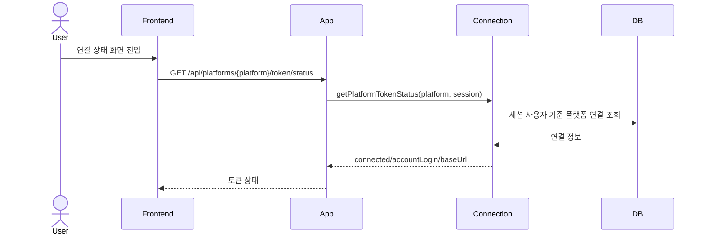

## UC-03 현재 사용자 조회

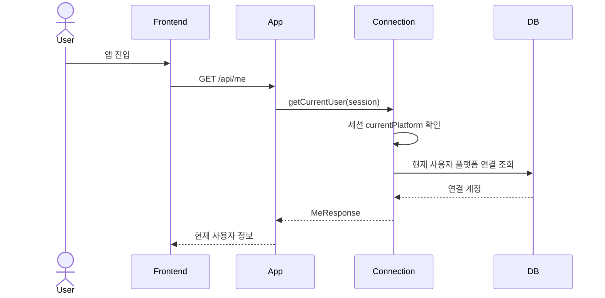

## UC-04 플랫폼 연결 해제

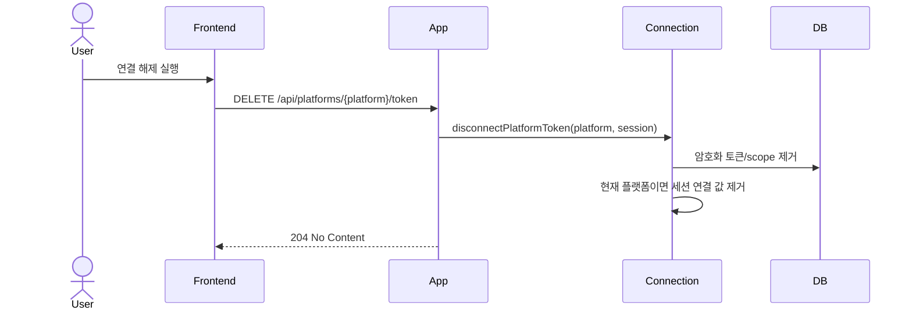

## UC-05 로그아웃

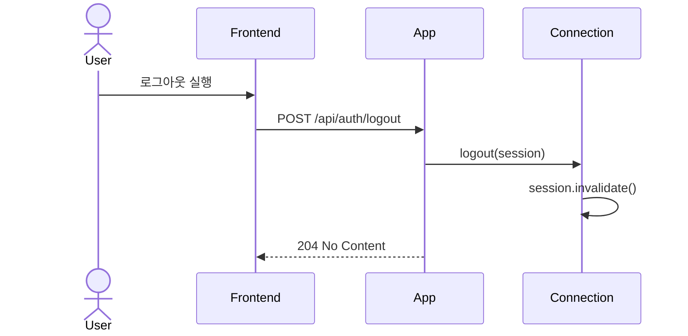

## UC-06 저장소 새로고침

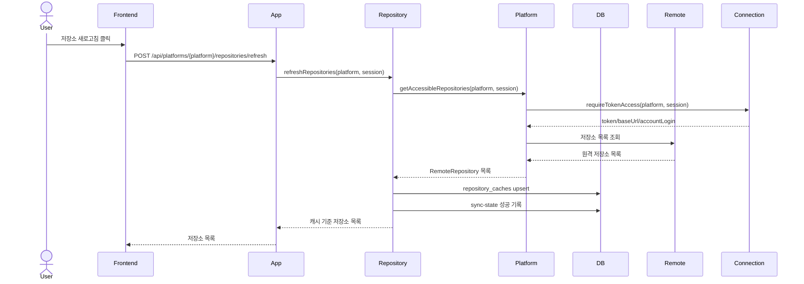

## UC-07 저장소 목록 조회

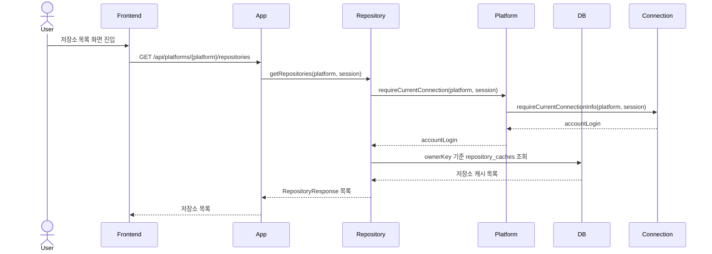

## UC-08 저장소 상세 조회

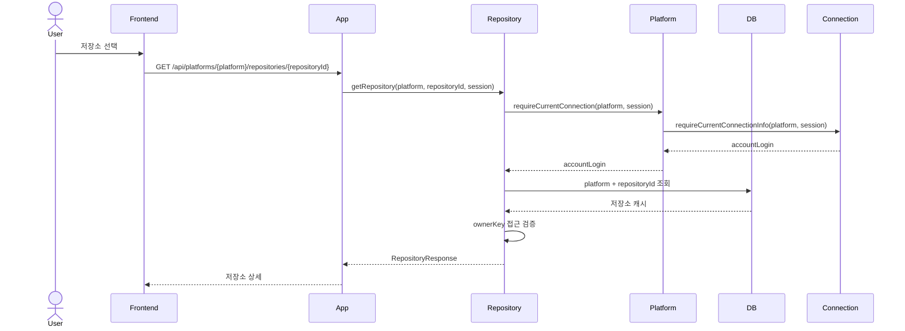

## UC-09 저장소 동기화 상태 조회

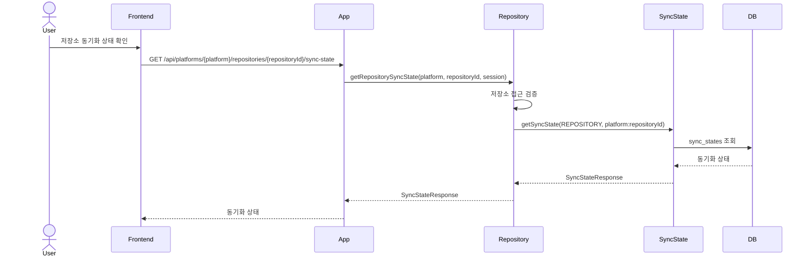

## UC-10 이슈 새로고침

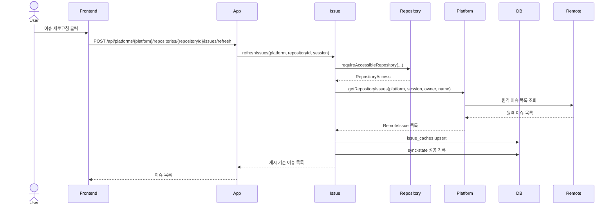

## UC-11 이슈 목록 조회

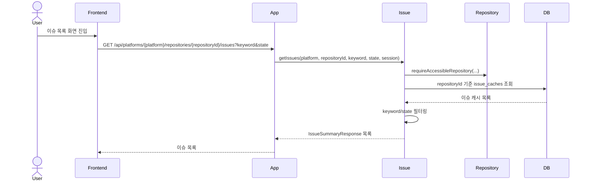

## UC-12 이슈 생성

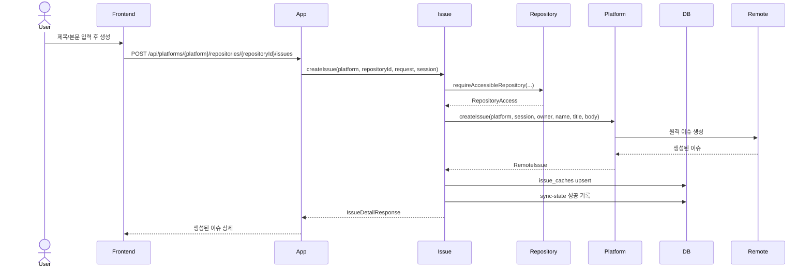

## UC-13 이슈 상세 조회

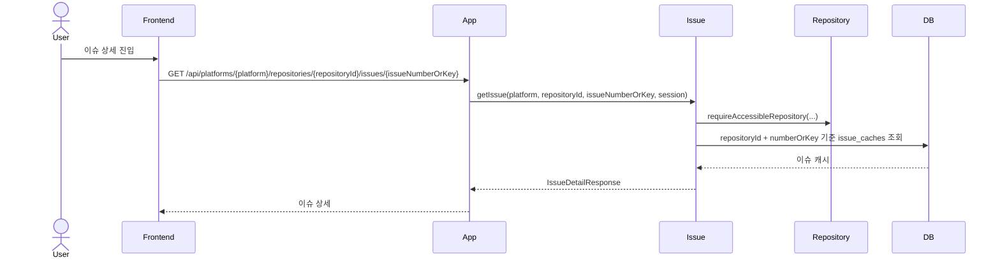

## UC-14 이슈 수정

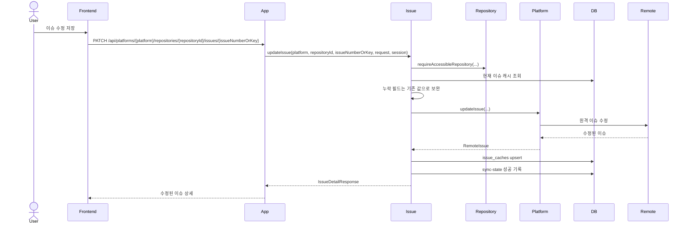

## UC-15 이슈 닫기

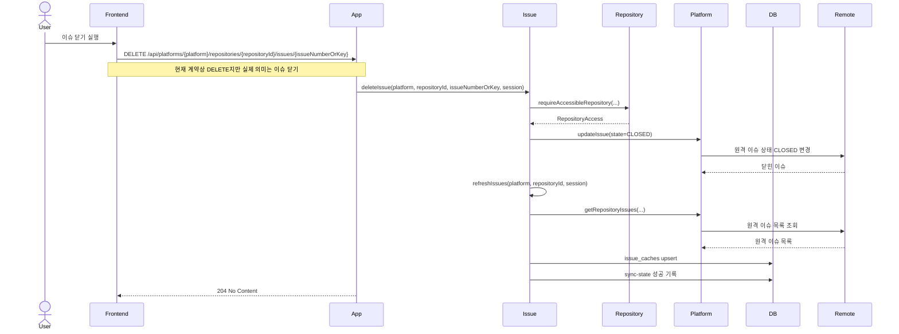

## UC-16 이슈 동기화 상태 조회

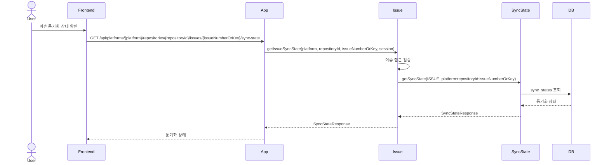

## UC-17 댓글 새로고침

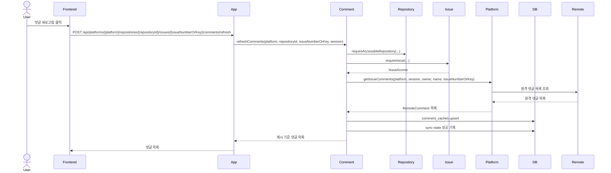

## UC-18 댓글 목록 조회

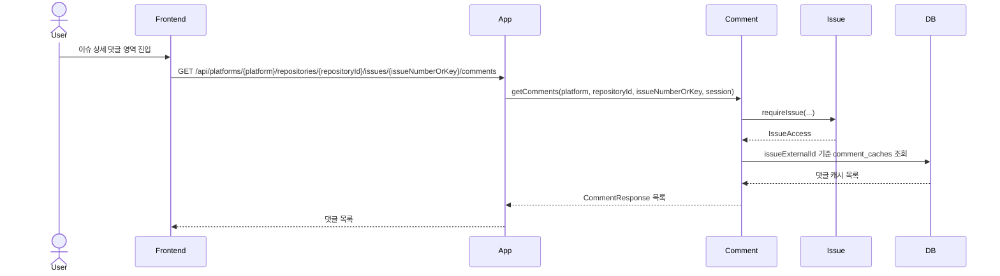

## UC-19 댓글 작성

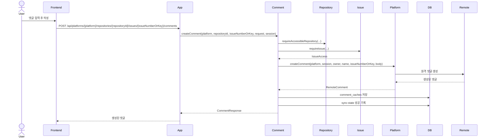
