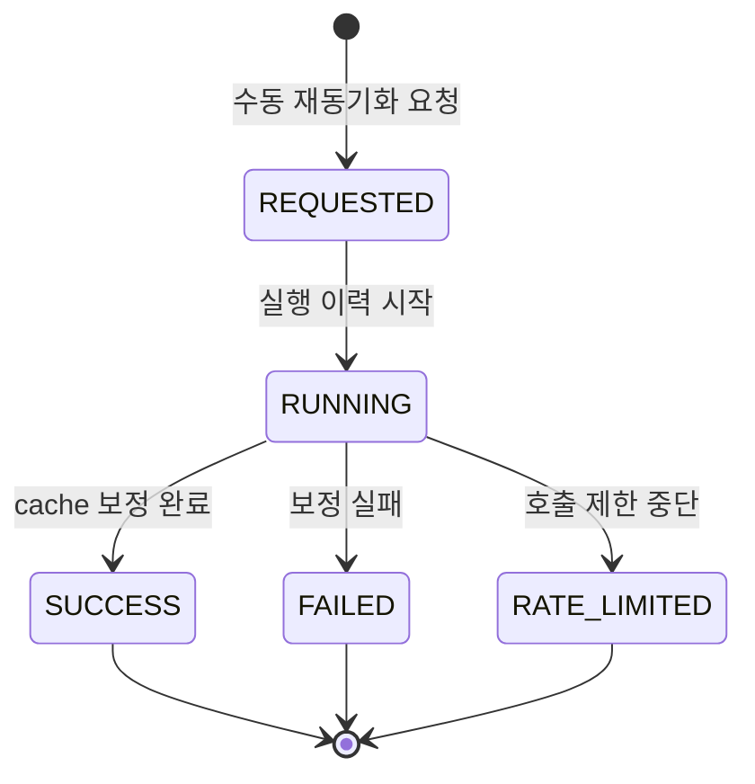
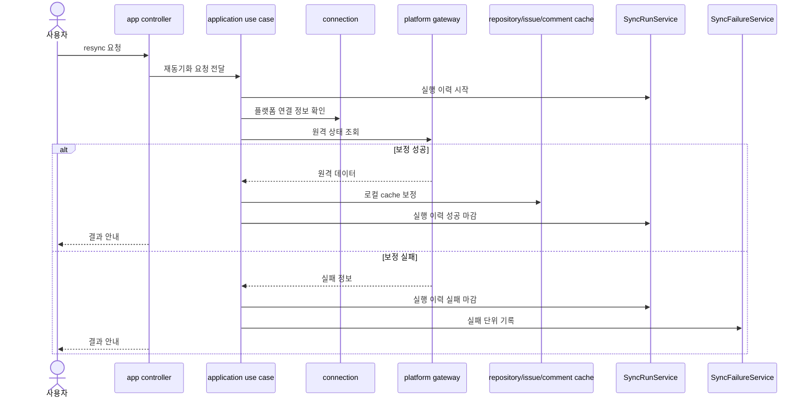

# 14-4 수동 재동기화 설계

## 요약

이 문서는 특정 저장소나 이슈의 로컬 cache를 원격 상태와 다시 맞추는 설계를 설명한다.

수동 재동기화는 실패 레코드 기반의 retry가 아니라, 운영자가 리소스를 지정해 cache를 보정하는 흐름이다.

재동기화 결과도 새 `SyncRun`으로 남겨 추적할 수 있게 한다.

## 작업 배경

rate limit, 외부 장애, 서버 장애가 발생하면 일부 데이터가 누락되거나 오래된 상태로 남을 수 있다. 이때 실패 레코드만으로는 어떤 범위를 다시 맞춰야 하는지 충분하지 않을 수 있다.

수동 재동기화는 운영자가 저장소나 이슈 단위를 지정해 원격 상태와 로컬 cache를 다시 맞추는 보정 수단이다.

## 설계 목표

- 저장소 단위와 이슈 단위 보정 흐름을 제공한다.
- 재동기화 실행을 `SyncRun`으로 추적한다.
- 실패가 발생하면 `SyncFailure`로 남긴다.
- cache 반영은 repository / issue / comment 모듈의 책임을 유지한다.
- retry와 resync의 의미를 분리한다.

## 주요 개념과 역할 분리

| 구분 | Retry | Repository Resync | Issue Resync |
| --- | --- | --- | --- |
| 출발점 | 기존 `SyncFailure` | 사용자가 지정한 저장소 | 사용자가 지정한 이슈 |
| 목적 | 실패한 작업 재실행 | 저장소 범위 cache 보정 | 이슈 단위 cache 보정 |
| 실행 기록 | 새 `SyncRun` | 새 `SyncRun` | 새 `SyncRun` |
| 사용 상황 | 실패 원인이 명확함 | 넓은 범위 누락 의심 | 특정 이슈 불일치 |

resync는 실패 기록이 없어도 실행할 수 있는 수동 보정 흐름이다.

## Resync 상태 생명주기

## 설계 결정

### 1. retry와 resync를 분리한다

retry는 실패 레코드를 다시 실행하는 흐름이고, resync는 지정한 리소스를 원격 상태와 다시 맞추는 흐름이다.

### 2. resync도 SyncRun으로 남긴다

수동 보정도 운영 이력이다. 언제 어떤 범위를 다시 맞췄는지 추적할 수 있어야 한다.

### 3. cache 모듈은 보정 정책을 모른다

repository / issue / comment 모듈은 cache 반영 API만 제공한다. 어떤 시점에 resync할지는 application 계층이 결정한다.

### 4. 댓글 동기화는 선택적으로 처리한다

이슈 resync에서 댓글까지 포함하면 호출 수가 늘어난다. 따라서 댓글 포함 여부를 옵션으로 둔다.

## 상황별 기록 결과

| 상황 | SyncRun | SyncFailure | 결과 |
| --- | --- | --- | --- |
| 저장소 resync 성공 | `SUCCESS` | 생성 안 함 | 저장소 범위 cache 보정 |
| 이슈 resync 성공 | `SUCCESS` | 생성 안 함 | 이슈 cache 보정 |
| 댓글 포함 resync | `SUCCESS` | 생성 안 함 | 이슈와 댓글 cache 보정 |
| 원격 API 실패 | `FAILED` | 실패 기록 | 후속 retry 가능 |
| rate limit | `RATE_LIMITED` | 재처리 가능한 실패 기록 | 제한 해제 후 복구 |

## 처리 흐름

## API 영향

| Method | Path | 설명 | 주요 파라미터 | 응답 |
| --- | --- | --- | --- | --- |
| <strong>POST</strong> | `/api/platforms/{platform}/repositories/{repositoryId}/resync` | 특정 저장소 범위의 cache를 원격 상태와 다시 맞춤 | Path: `platform`, `repositoryId`; Query: `scope` | 새 `SyncRun` 결과 |
| <strong>POST</strong> | `/api/platforms/{platform}/repositories/{repositoryId}/issues/{issueNumberOrKey}/resync` | 특정 이슈와 필요 시 댓글 cache를 원격 상태와 다시 맞춤 | Path: `platform`, `repositoryId`, `issueNumberOrKey`; Query: `includeComments` | 새 `SyncRun` 결과 |

## 모듈 책임

| 모듈 | 책임 |
| --- | --- |
| app | resync API 제공 |
| application | 접근 확인, 원격 호출, cache 반영 흐름 조립 |
| platform | 원격 저장소/이슈/댓글 조회 |
| repository / issue / comment | cache 반영 API 제공 |

## 구분 기준

- retry는 실패 ID 기준이고, resync는 리소스 경로 기준이다.
- 저장소 resync와 이슈 resync는 보정 범위가 다르다.
- resync 성공이 과거 모든 실패를 자동 해결한다는 의미는 아니다.
- 댓글 포함 resync는 호출 수와 rate limit 영향을 고려해야 한다.

## 설계 기준

- resync 실행은 새 `SyncRun`으로 기록한다.
- 접근 권한 확인 후 원격 API를 호출한다.
- cache 반영은 각 업무 모듈 public API를 사용한다.
- 실패 시 `SyncFailure`를 남긴다.
- 댓글 동기화는 옵션으로 둔다.

## 확인 기준

- 저장소 resync는 저장소 범위 cache를 보정한다.
- 이슈 resync는 특정 이슈 cache를 보정한다.
- 댓글 포함 옵션은 comment cache까지 반영한다.
- 실패한 resync는 `SyncFailure`로 남는다.
- resync와 retry 의미가 API와 문서에서 구분된다.

## 관련 문서

- [14. 플랫폼별 API Rate Limit 관리 + 장애 복구 시스템 설계 계획](../14-platform-rate-limit-recovery-plan.md)
