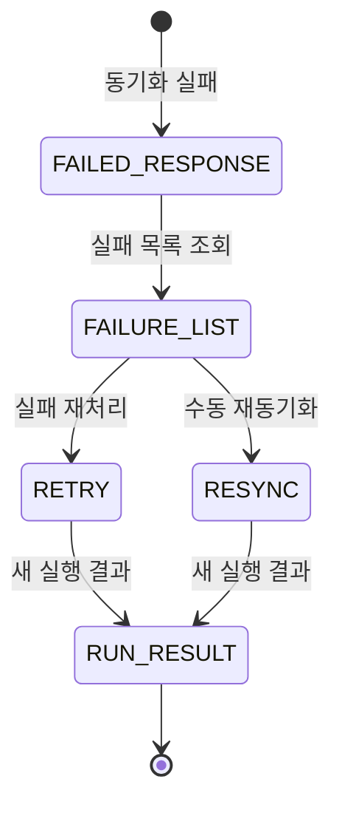
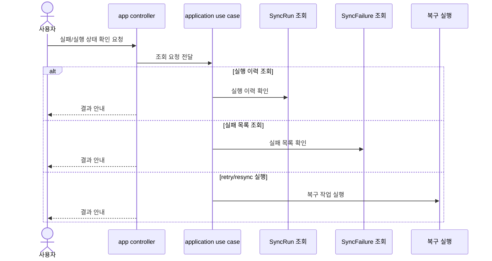

# 14-5 복구 API 설계

## 요약

이 문서는 rate limit과 동기화 실패 복구 기능을 어떤 API로 제공할지 설명한다.

기존 `sync-state` API는 마지막 상태 요약을 유지하고, 신규 복구 API는 실행 이력과 실패 이력을 제공한다.

사용자는 실패 조회, 재처리, 수동 재동기화 API를 통해 복구 작업을 진행한다.

## 작업 배경

동기화 실패는 즉시 확인해야 할 때도 있고, 나중에 운영자가 다시 확인해야 할 때도 있다.

따라서 실패 직후 응답뿐 아니라, 실패 목록 조회와 실행 이력 조회, retry/resync 실행 API가 필요하다.

## 설계 목표

- 기존 `sync-state` API와 신규 복구 API 역할을 분리한다.
- 실행 이력과 실패 이력을 조회할 수 있게 한다.
- 재처리와 수동 재동기화를 API로 제공한다.
- 실패 직후 사용자가 다음 행동을 판단할 수 있게 한다.
- app controller는 플랫폼별 세부 오류를 직접 해석하지 않는다.

## 주요 개념과 역할 분리

| 구분 | sync-state API | sync-runs API | sync-failures API | retry/resync API |
| --- | --- | --- | --- | --- |
| 목적 | 마지막 상태 요약 | 실행 이력 조회 | 실패 목록 조회 | 복구 실행 |
| 기준 데이터 | `SyncState` | `SyncRun` | `SyncFailure` | `SyncFailure` 또는 리소스 |
| 사용자 질문 | 지금 상태가 어떤가? | 무슨 일이 있었나? | 무엇을 복구해야 하나? | 어떻게 다시 실행하나? |

복구 API는 기존 조회 API를 대체하지 않고, 운영 복구에 필요한 정보를 추가로 제공한다.

## API 사용 생명주기

## 설계 결정

### 1. 기존 sync-state API는 유지한다

기존 화면은 마지막 상태 요약을 계속 사용할 수 있어야 한다.

### 2. 복구 API는 SyncRun과 SyncFailure를 기준으로 한다

운영 복구는 상세 이력과 실패 단위를 봐야 하므로 `SyncState`가 아니라 `SyncRun`, `SyncFailure`를 기준으로 한다.

### 3. retry와 resync API를 분리한다

retry는 실패 ID 기준이고, resync는 리소스 경로 기준이다. 두 API는 사용 목적이 다르다.

### 4. 상세 스펙은 OpenAPI로 분리한다

총괄 문서와 설명 문서는 API 의도를 설명하고, 상세 schema는 OpenAPI YAML에서 관리한다.

## 상황별 기록 결과

| 상황 | 사용하는 API | 기준 데이터 | 결과 |
| --- | --- | --- | --- |
| 최근 호출 제한 확인 | `GET /rate-limit` | `RateLimitSnapshot` | 현재 호출 여유 확인 |
| 실행 이력 확인 | `GET /sync-runs` | `SyncRun` | 실행 목록 확인 |
| 실패 목록 확인 | `GET /sync-failures` | `SyncFailure` | 재처리 대상 확인 |
| 실패 재처리 | `POST /retry` | `SyncFailure` | 새 `SyncRun` 생성 |
| 저장소/이슈 보정 | `POST /resync` | 리소스 경로 | 새 `SyncRun` 생성 |

## 처리 흐름

## API 영향

| Method | Path | 설명 | 주요 파라미터 | 응답 |
| --- | --- | --- | --- | --- |
| <strong>GET</strong> | `/api/platforms/{platform}/rate-limit` | 현재 플랫폼 연결 기준 최신 rate limit 상태 조회 | Path: `platform` | 최근 `RateLimitSnapshot`, 없으면 `204 No Content` |
| <strong>GET</strong> | `/api/sync-runs` | 최근 동기화 실행 이력 조회 | Query: `platform`, `resourceType`, `status`, `from`, `to` | `SyncRun` 목록 |
| <strong>GET</strong> | `/api/sync-runs/{syncRunId}` | 단일 동기화 실행 상세 조회 | Path: `syncRunId` | `SyncRun` 상세, 처리 건수, 실패 메시지 |
| <strong>GET</strong> | `/api/sync-failures` | 해결되지 않은 실패와 재처리 가능 여부 조회 | Query: `platform`, `retryable`, `resolved`, `resourceType` | `SyncFailure` 목록 |
| <strong>POST</strong> | `/api/sync-failures/{failureId}/retry` | 재처리 가능한 실패를 선택해 다시 실행 | Path: `failureId` | 새 `SyncRun` 결과 |
| <strong>POST</strong> | `/api/platforms/{platform}/repositories/{repositoryId}/resync` | 특정 저장소 범위의 cache를 원격 상태와 다시 맞춤 | Path: `platform`, `repositoryId`; Query: `scope` | 새 `SyncRun` 결과 |
| <strong>POST</strong> | `/api/platforms/{platform}/repositories/{repositoryId}/issues/{issueNumberOrKey}/resync` | 특정 이슈와 필요 시 댓글 cache를 원격 상태와 다시 맞춤 | Path: `platform`, `repositoryId`, `issueNumberOrKey`; Query: `includeComments` | 새 `SyncRun` 결과 |

## 모듈 책임

| 모듈 | 책임 |
| --- | --- |
| app | HTTP API 제공 |
| application | 조회/재처리/재동기화 use case 수행 |
| platform | 원격 API 호출 결과 제공 |
| repository / issue / comment | cache 반영 API 제공 |

## 구분 기준

- `sync-state` API는 마지막 상태 요약이다.
- `sync-runs` API는 실행 이력 조회다.
- `sync-failures` API는 실패 목록 조회다.
- retry API는 실패 ID 기준이다.
- resync API는 리소스 경로 기준이다.
- rate limit API는 호출 제한 상태 확인용이다.

## 설계 기준

- 기존 `sync-state` API는 유지한다.
- 복구 API는 `SyncRun`과 `SyncFailure`를 기준으로 한다.
- 실패 응답에는 후속 조치 판단에 필요한 정보를 포함한다.
- API 상세 schema는 OpenAPI YAML에서 관리한다.
- app controller는 플랫폼별 세부 오류를 직접 해석하지 않는다.

## 확인 기준

- 실행 이력과 실패 목록을 API로 조회할 수 있다.
- retry는 새 `SyncRun`을 반환한다.
- resync는 새 `SyncRun`을 반환한다.
- 기존 `sync-state` API와 신규 복구 API의 역할이 분리되어 있다.
- OpenAPI YAML과 문서의 endpoint 목록이 어긋나지 않는다.

## 관련 문서

- [14. 플랫폼별 API Rate Limit 관리 + 장애 복구 시스템 설계 계획](../14-platform-rate-limit-recovery-plan.md)
