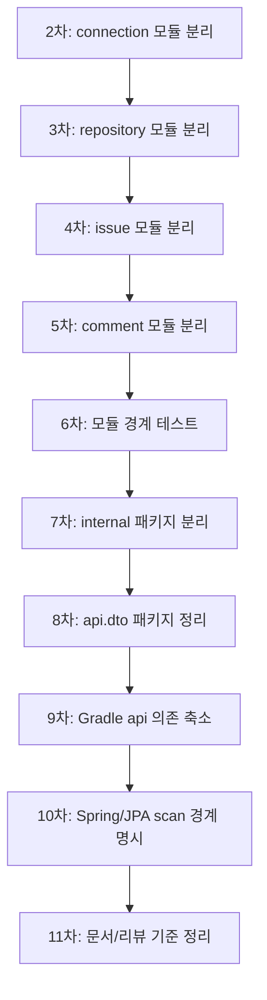
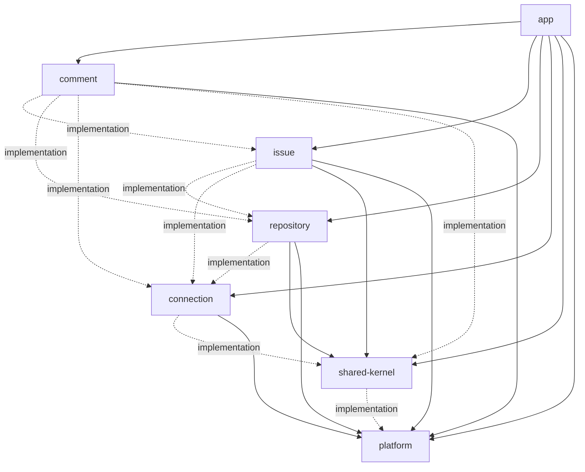

[변경 목적]
Gradle 멀티 모듈 전환 2차~11차를 통해 `app` 중심의 단일 패키지 구조를 모듈러 모놀리스 구조로 정리하고, 업무 모듈 간 의존을 public API와 Gradle 의존성으로 제한

[핵심 변경]
- `connection` 모듈로 플랫폼 연결, PAT 저장, token access 책임 이동
- `repository` 모듈로 저장소 캐시와 refresh 책임 이동
- `issue` 모듈로 이슈 캐시, 조회, 생성, 수정, refresh 책임 이동
- `comment` 모듈로 댓글 캐시, 조회, 작성, refresh 책임 이동
- `shared-kernel`로 sync 상태 공통 기능 이동
- 업무 모듈의 공개 진입점을 `*.api` facade로 정리
- 업무 DTO를 각 모듈의 `api.dto` 패키지로 이동
- 업무 구현 패키지를 `*.internal.*`로 이동
- Gradle `api` 의존을 public contract에 필요한 경우로 축소
- 각 모듈에 Spring/JPA scan configuration 추가
- 모듈 경계, DTO 위치, Gradle 의존 방향, `api` scope 검증 테스트 추가
- 2차~11차 전환 흐름과 최종 구조를 문서화

[리뷰 대상 - 중요]
"이 파일들의 diff를 중심으로 리뷰"
- `backend/app/src/test/java/com/jw/github_issue_manager/ModuleBoundaryTest.java`
  - Gradle 모듈 의존 방향, `api` scope, app의 internal import 차단, DTO 위치 규칙을 검증하는 중심 파일
- `backend/connection/src/main/java/com/jw/github_issue_manager/connection/api/PlatformConnectionFacade.java`
  - connection 모듈의 공개 API가 app과 다른 업무 모듈에 어떤 계약을 제공하는지 보는 기준 파일
- `backend/repository/src/main/java/com/jw/github_issue_manager/repository/api/RepositoryFacade.java`
  - repository 모듈의 공개 API와 repository cache 접근 경계를 보는 기준 파일
- `backend/issue/src/main/java/com/jw/github_issue_manager/issue/api/IssueFacade.java`
  - issue 모듈의 공개 API와 comment 모듈이 의존하는 계약을 보는 기준 파일
- `backend/comment/src/main/java/com/jw/github_issue_manager/comment/api/CommentFacade.java`
  - comment 모듈의 공개 API와 app controller 연결 방식을 보는 기준 파일
- `backend/shared-kernel/src/main/java/com/jw/github_issue_manager/shared/config/SharedKernelConfig.java`
  - shared-kernel JPA scan 범위와 repository scan 중복 제외 규칙을 보는 기준 파일

[참고 파일]
"필요할 때만 참고하고, 기본적으로는 리뷰 대상 파일에 집중"
- `backend/app/build.gradle`
  - app이 모든 업무 모듈의 public API를 조립하는 구조 확인용 참고 파일
- `backend/connection/build.gradle`
  - connection 모듈의 public contract 의존과 internal 구현 의존 확인용 참고 파일
- `backend/repository/build.gradle`
  - repository 모듈의 `api` / `implementation` 의존 구분 확인용 참고 파일
- `backend/issue/build.gradle`
  - issue 모듈이 repository 의존을 전이 노출하지 않는지 확인용 참고 파일
- `backend/comment/build.gradle`
  - comment 모듈이 issue/shared-kernel 의존을 전이 노출하지 않는지 확인용 참고 파일
- `backend/shared-kernel/build.gradle`
  - shared-kernel이 platform 의존을 전이 노출하지 않는지 확인용 참고 파일
- `backend/connection/src/main/java/com/jw/github_issue_manager/connection/config/ConnectionModuleConfig.java`
  - connection entity/repository scan 범위 확인용 참고 파일
- `backend/repository/src/main/java/com/jw/github_issue_manager/repository/config/RepositoryModuleConfig.java`
  - repository entity/repository scan 범위 확인용 참고 파일
- `backend/issue/src/main/java/com/jw/github_issue_manager/issue/config/IssueModuleConfig.java`
  - issue entity/repository scan 범위 확인용 참고 파일
- `backend/comment/src/main/java/com/jw/github_issue_manager/comment/config/CommentModuleConfig.java`
  - comment entity/repository scan 범위 확인용 참고 파일
- `docs/13-platform-modularization-design.md`
  - 2차~11차 전환 의도와 최종 구조 확인용 참고 파일

[리뷰 포인트]
1. 모듈 공개 API 경계
   - app과 다른 업무 모듈이 `*.api` / `*.api.dto`만 의존하고 `*.internal.*`을 직접 참조하지 않는지
2. Gradle 의존성 노출 범위
   - public facade/DTO 시그니처에 필요한 의존만 `api`로 남고, 구현 전용 의존은 `implementation`으로 내려갔는지
3. 모듈 간 책임 분리
   - connection / repository / issue / comment가 각자 소유한 entity, repository, service 책임을 다른 모듈에 새지 않게 감쌌는지
4. Spring/JPA scan 안정성
   - 각 모듈 configuration이 필요한 entity/repository를 빠짐없이 등록하고 중복 등록을 만들지 않는지
5. 기존 API 동작 유지
   - URL, JSON field, session 기반 인증, GitHub/GitLab 주요 흐름이 기존 계약을 유지하는지
6. 테스트의 방어 범위
   - `ModuleBoundaryTest`가 패키지 경계뿐 아니라 Gradle scope까지 실제로 방어하는지

[계약 변경]
- Module contract
  - connection 공개 계약: `PlatformConnectionFacade`, `CurrentConnection`, `TokenAccess`
  - repository 공개 계약: `RepositoryFacade`, `RepositoryAccess`, `repository.api.dto.*`
  - issue 공개 계약: `IssueFacade`, `IssueAccess`, `issue.api.dto.*`
  - comment 공개 계약: `CommentFacade`, `comment.api.dto.*`
  - shared 공개 계약: `shared.api.dto.SyncStateResponse`
- Gradle contract
  - app은 업무 모듈을 조립하는 최상위 실행 모듈로 유지
  - 업무 모듈의 내부 구현 의존은 가능한 `implementation`으로 제한
  - public API에 노출되는 타입을 제공하는 모듈만 `api`로 유지
- Spring/JPA contract
  - 각 모듈은 자기 entity/repository scan 범위를 configuration으로 명시
  - app은 전체 context를 조립하고 facade bean과 JPA entity 등록을 통합 테스트로 검증
- REST API contract
  - 외부 URL과 JSON field 계약은 변경하지 않음
  - 프론트 API 호출 구조 변경은 이번 전환 범위에서 제외

[잠재 리스크]
- 버그 가능성
  - shared-kernel의 기존 `domain`, `repository`, `service` 패키지 때문에 repository 모듈 패키지와 scan 경계가 헷갈릴 가능성
  - `@EnableJpaRepositories` 범위가 넓어지면 repository bean 중복 등록이 다시 발생할 가능성
  - `api` 의존을 과도하게 `implementation`으로 낮추면 public DTO/facade 소비 모듈 컴파일이 깨질 가능성
- 누락 가능성
  - 새 업무 DTO를 추가할 때 `api.dto`가 아닌 구 `dto.*` 패키지로 추가할 가능성
  - 새 서비스가 다른 모듈의 `internal` 구현을 직접 import하는 회귀 가능성
  - Gradle 의존성 추가 시 `ModuleBoundaryTest` 기대값과 설계 문서 갱신 누락 가능성
- 회귀 가능성
  - app controller가 facade 대신 internal service를 직접 주입하면 모듈 경계 회귀 가능
  - issue/comment가 repository/issue entity에 다시 의존하면 단계별 분리 효과가 약해질 가능성
  - Spring/JPA scan config 변경 시 테스트 환경과 운영 환경의 bean 등록 방식이 달라질 가능성

[단계별 정리]


[최종 의존성 그래프]


[diff]
```java
// ModuleBoundaryTest.java
// 설명: Gradle 의존 방향에 더해 `api` scope 전이 노출까지 검증하도록 변경
+ private static final Pattern SCOPED_PROJECT_DEPENDENCY = Pattern.compile(
+     "(?m)^\\s*(?<scope>api|implementation)\\s+project\\(':(?<module>[^']+)'\\)"
+ );
+
+ @Test
+ void gradleModuleApiDependenciesExposeOnlyPublicContracts() throws IOException {
+     Map<String, Set<String>> expectedApiDependencies = Map.of(
+         "comment", Set.of("platform"),
+         "connection", Set.of("platform"),
+         "issue", Set.of("platform", "shared-kernel"),
+         "repository", Set.of("platform", "shared-kernel"),
+         "shared-kernel", Set.of()
+     );
+ }
```

```groovy
// issue/build.gradle
// 설명: issue public API가 repository 타입을 노출하지 않으므로 repository 의존을 implementation으로 축소
- api project(':repository')
  api project(':platform')
  api project(':shared-kernel')
 
  implementation project(':connection')
+ implementation project(':repository')
```

```groovy
// comment/build.gradle
// 설명: comment public API가 issue/shared-kernel 타입을 노출하지 않으므로 내부 구현 의존으로 축소
- api project(':issue')
  api project(':platform')
- api project(':shared-kernel')
 
  implementation project(':connection')
+ implementation project(':issue')
  implementation project(':repository')
+ implementation project(':shared-kernel')
```

```java
// SharedKernelConfig.java
// 설명: shared-kernel의 JPA scan 범위를 명시하고 repository 모듈 internal repository 중복 등록을 제외
+ @Configuration
+ @EntityScan(basePackageClasses = SyncState.class)
+ @EnableJpaRepositories(
+     basePackageClasses = SyncStateRepository.class,
+     excludeFilters = @ComponentScan.Filter(
+         type = FilterType.REGEX,
+         pattern = "com\\.jw\\.github_issue_manager\\.repository\\.internal\\..*"
+     )
+ )
+ public class SharedKernelConfig {
+ }
```
