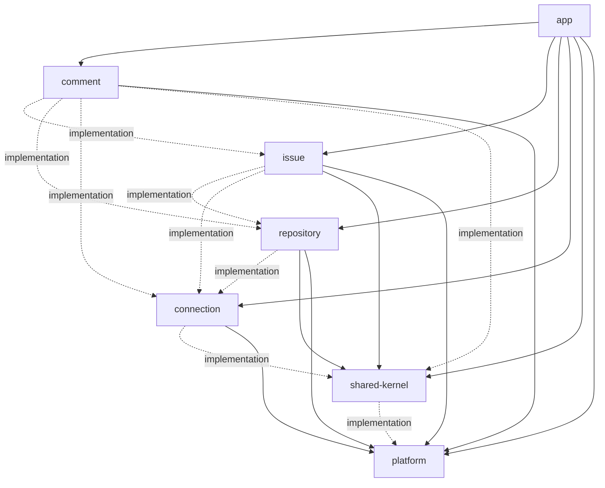

# Gradle 멀티 모듈 9~11차 리뷰 문서

## 1. 리뷰 범위

- 대상: 9차 Gradle 의존성 축소
- 대상: 10차 Spring/JPA scan 경계 명시
- 대상: 11차 설계 문서와 작업 기록 정리
- 제외: REST API 계약 변경
- 제외: shared-kernel 기존 패키지명 정리

## 2. 변경 요약

- `issue`의 `repository` 의존을 `api`에서 `implementation`으로 전환
- `comment`의 `issue`, `shared-kernel` 의존을 `api`에서 `implementation`으로 전환
- `shared-kernel`의 `platform` 의존을 `api`에서 `implementation`으로 전환
- `ModuleBoundaryTest`에 Gradle `api` scope 검증 추가
- 각 업무 모듈에 Spring/JPA configuration 추가
- shared-kernel repository scan에서 repository 모듈 internal repository 중복 등록 제외

## 3. 최종 의존성 그래프

## 4. 리뷰 포인트

- `api` 의존이 public facade/DTO 시그니처에 필요한 모듈로만 남았는지 확인
- app main code가 업무 모듈의 `internal` 패키지를 직접 import하지 않는지 확인
- 모듈별 `@EntityScan`, `@EnableJpaRepositories` 범위가 중복 등록 없이 동작하는지 확인
- shared-kernel의 `SyncStateRepository` scan 제외 규칙이 repository 모듈 internal repository만 제외하는지 확인
- 외부 REST JSON 필드와 URL 계약이 변경되지 않았는지 확인

## 5. 검증 결과

- 명령: `.\gradlew.bat clean :app:bootJar test`
- 결과: 성공
- 확인: app bootJar 생성 성공
- 확인: app / connection / platform 테스트 성공
- 확인: facade bean 등록과 JPA managed entity 등록 테스트 성공
- 확인: Gradle 의존 방향과 `api` scope 경계 테스트 성공

## 6. 잔여 리스크

- shared-kernel은 아직 `com.jw.github_issue_manager.domain`, `repository`, `service` 구 패키지를 사용한다.
- 이 패키지 구조 때문에 shared-kernel repository scan에서 repository 모듈 internal repository를 제외하는 보정이 필요하다.
- 후속으로 shared-kernel 내부 패키지를 `shared.internal.*` 계열로 이동하면 scan 제외 규칙을 줄일 수 있다.
